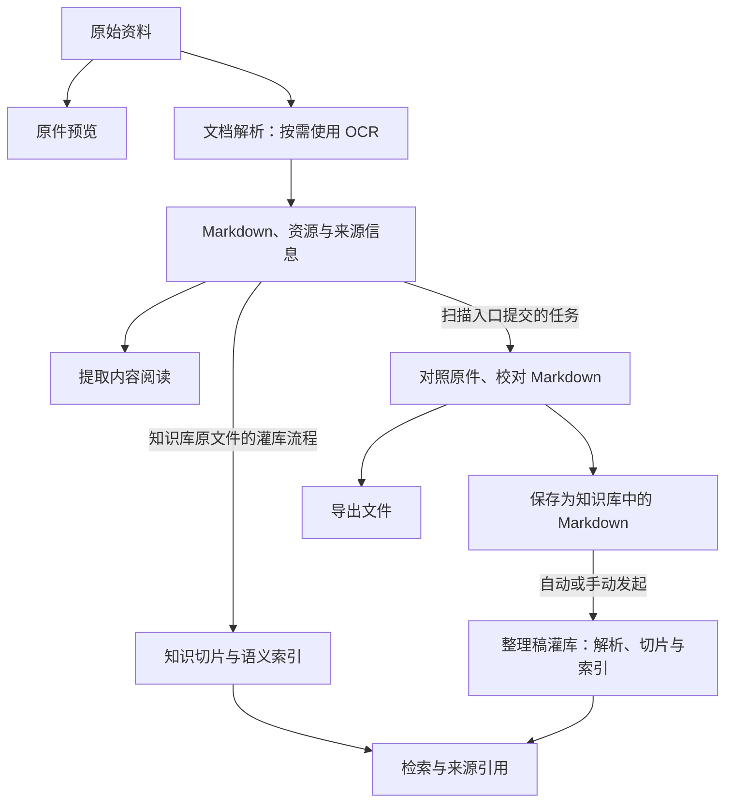
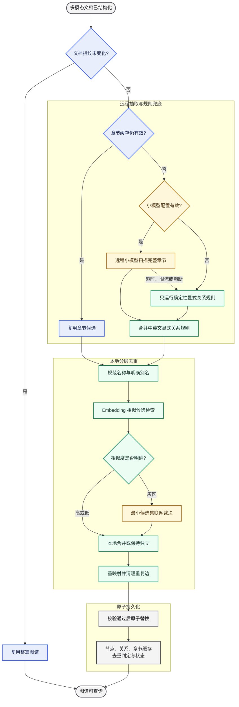
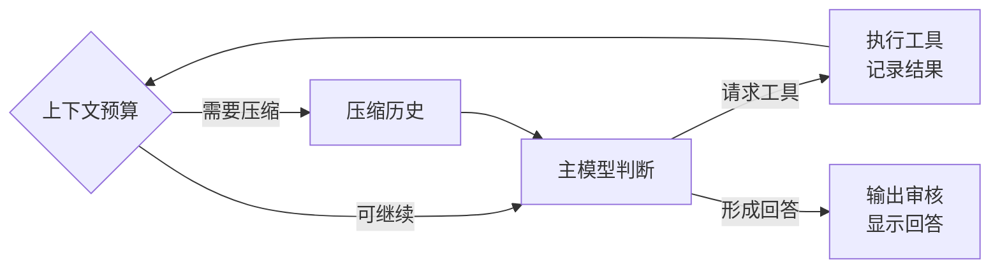
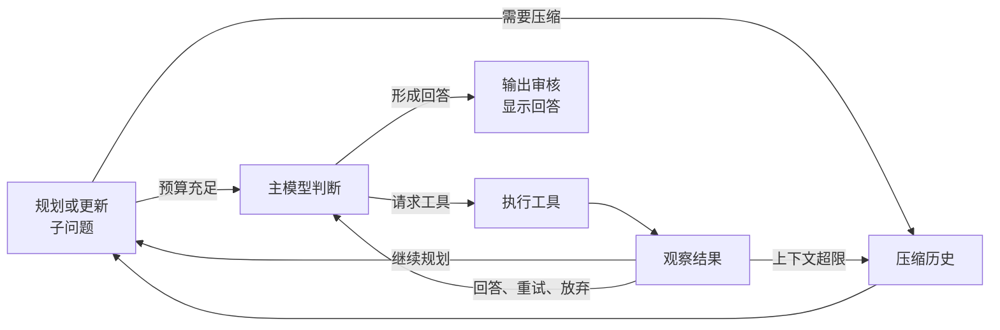
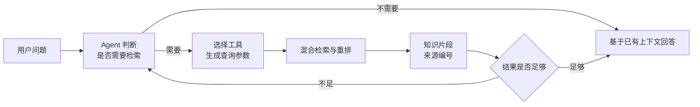
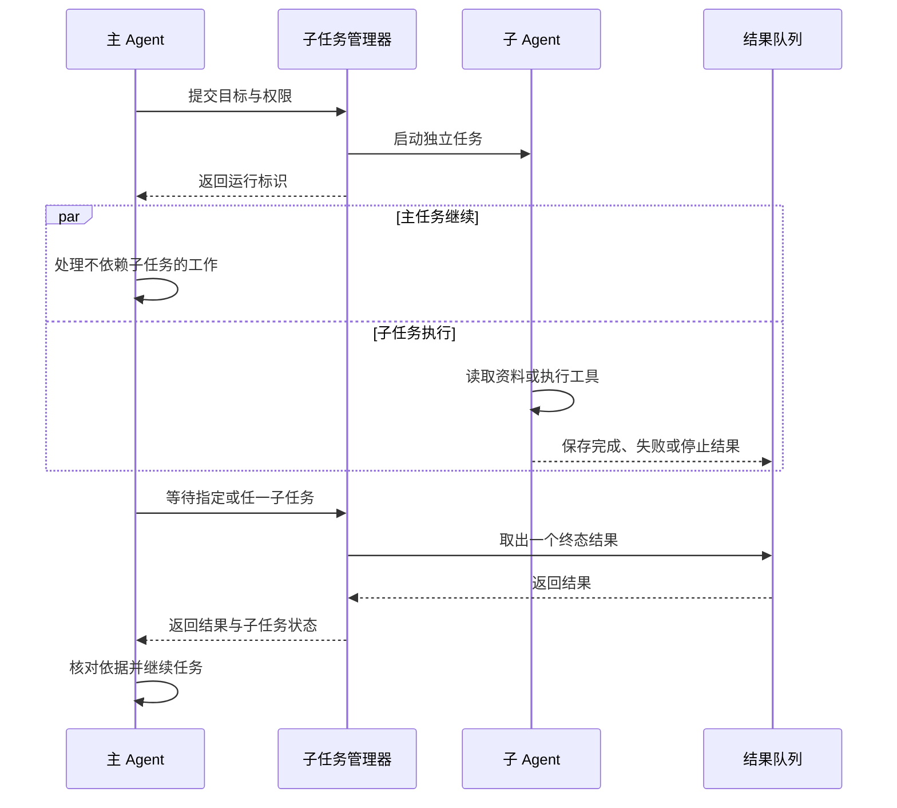
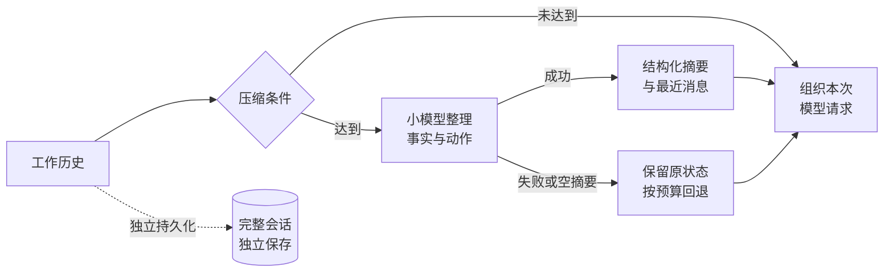
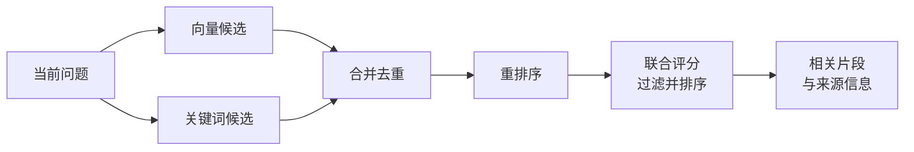
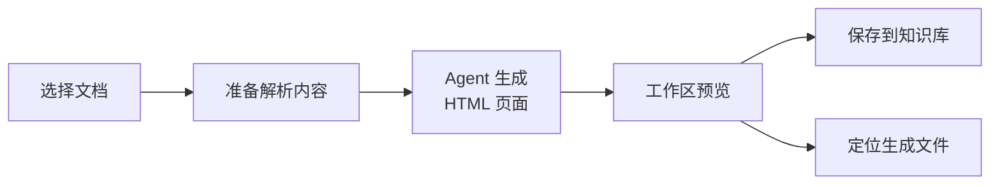

# MetaWeave 元织
> 持续引入，持续联系，持续理解，持续执行
> 日期: 2026.9.13
  [](https://github.com/xiao-Huahuo/MetaWeave/releases/latest)          [](https://github.com/deepseek-ai/deepseek-harness/commit/47f943859bef60e4160492346772ded9b24f765a)

## 0. 背景

- 保存了很多份神秘资料，表格也好，论文也好，组件也好，脚本也罢，这些资料的知识完全无法组织，甚至很难依靠传统的生成式AI来整理，更遑论快速摘要？
- 手上有三四份充满各种格式内容的文件夹，每天向里面丢东西，结果就是十分混乱，一到找重要相关资料的时候就找不到？
- AI原地操作文件又慢又蠢，还频繁丢失记忆，无法形成一套以个人为中心的知识网络，也无法喂养出一只听话又有记忆的小助手？
- 各厂家的的软件各自独立，难以打造一份集成各个知识软件，并用AI Agent作为中心的一体化智慧平台？

元织将解决以上的所有问题。

### 相关文档链接
#### 启动与开发
- 启动,构建与部署: [DEVELOPMENT.md](docs/DEVELOPMENT.md)
- 开发规范: [开发规范.md](开发规范.md)
#### 系统设计
- 总体架构设计: [ARCHITECTURE.md](docs/ARCHITECTURE.md)
##### 后端
- 部分业务工作流流程图: [WORKFLOW.md](docs/WORKFLOW.md)
- AGENT工具明细: [TOOLS.md](docs/TOOLS.md)
##### 前端
- 前端UI/UX设计规范: [DESIGN.md](docs/DESIGN.md)
#### 变更
- TODO: [TODO.md](TODO.md)
- 变更历史: [change_history/](docs/change_history/README.md)
#### 接口与扩展
- OPENAPI文档: [metaweave.openapi.json](docs/api/MetaWeave.openapi.json)
- MCP 接入: [MCP.md](docs/MCP.md)
- gRPC: [agent_service.proto](protos/agent_service.proto)

### 章节索引

`MetaWeave Wiki`  
`├── ` [1. 项目概述](#1.%20%E9%A1%B9%E7%9B%AE%E6%A6%82%E8%BF%B0)  
`│   ├── ` [1.1 MetaWeave 是什么](#1.1%20MetaWeave%20%E6%98%AF%E4%BB%80%E4%B9%88)  
`│   ├── ` [1.2 核心能力与整体结构](#1.2%20%E6%A0%B8%E5%BF%83%E8%83%BD%E5%8A%9B%E4%B8%8E%E6%95%B4%E4%BD%93%E7%BB%93%E6%9E%84)  
`│   │   ├── ` [1.2.1 核心能力](#1.2.1%20%E6%A0%B8%E5%BF%83%E8%83%BD%E5%8A%9B)  
`│   │   └── ` [1.2.2 部分功能参考平台或技术来源](#1.2.2%20%E9%83%A8%E5%88%86%E5%8A%9F%E8%83%BD%E5%8F%82%E8%80%83%E5%B9%B3%E5%8F%B0%E6%88%96%E6%8A%80%E6%9C%AF%E6%9D%A5%E6%BA%90)  
`│   └── ` [1.3 基本概念表](#1.3%20%E5%9F%BA%E6%9C%AC%E6%A6%82%E5%BF%B5%E8%A1%A8)  
`│       ├── ` [1.3.1 资料、格式与数据存储](#1.3.1%20%E8%B5%84%E6%96%99%E3%80%81%E6%A0%BC%E5%BC%8F%E4%B8%8E%E6%95%B0%E6%8D%AE%E5%AD%98%E5%82%A8)  
`│       ├── ` [1.3.2 检索与知识关联](#1.3.2%20%E6%A3%80%E7%B4%A2%E4%B8%8E%E7%9F%A5%E8%AF%86%E5%85%B3%E8%81%94)  
`│       ├── ` [1.3.3 模型、Agent 与上下文](#1.3.3%20%E6%A8%A1%E5%9E%8B%E3%80%81Agent%20%E4%B8%8E%E4%B8%8A%E4%B8%8B%E6%96%87)  
`│       └── ` [1.3.4 任务、扩展与权限](#1.3.4%20%E4%BB%BB%E5%8A%A1%E3%80%81%E6%89%A9%E5%B1%95%E4%B8%8E%E6%9D%83%E9%99%90)  
`├── ` [2. 知识库与资料组织](#2.%20%E7%9F%A5%E8%AF%86%E5%BA%93%E4%B8%8E%E8%B5%84%E6%96%99%E7%BB%84%E7%BB%87)  
`│   ├── ` [2.1 文件库](#2.1%20%E6%96%87%E4%BB%B6%E5%BA%93)  
`│   │   ├── ` [2.1.1 目录接入与浏览](#2.1.1%20%E7%9B%AE%E5%BD%95%E6%8E%A5%E5%85%A5%E4%B8%8E%E6%B5%8F%E8%A7%88)  
`│   │   ├── ` [2.1.2 文件整理与导入](#2.1.2%20%E6%96%87%E4%BB%B6%E6%95%B4%E7%90%86%E4%B8%8E%E5%AF%BC%E5%85%A5)  
`│   │   ├── ` [2.1.3 最近删除与恢复](#2.1.3%20%E6%9C%80%E8%BF%91%E5%88%A0%E9%99%A4%E4%B8%8E%E6%81%A2%E5%A4%8D)  
`│   │   ├── ` [2.1.4 灌库与索引管理](#2.1.4%20%E7%81%8C%E5%BA%93%E4%B8%8E%E7%B4%A2%E5%BC%95%E7%AE%A1%E7%90%86)  
`│   │   └── ` [2.1.5 阅读、知识关联与 Agent 使用](#2.1.5%20%E9%98%85%E8%AF%BB%E3%80%81%E7%9F%A5%E8%AF%86%E5%85%B3%E8%81%94%E4%B8%8E%20Agent%20%E4%BD%BF%E7%94%A8)  
`│   ├── ` [2.2 图书馆](#2.2%20%E5%9B%BE%E4%B9%A6%E9%A6%86)  
`│   │   ├── ` [2.2.1 图书与集锦](#2.2.1%20%E5%9B%BE%E4%B9%A6%E4%B8%8E%E9%9B%86%E9%94%A6)  
`│   │   ├── ` [2.2.2 添加资料](#2.2.2%20%E6%B7%BB%E5%8A%A0%E8%B5%84%E6%96%99)  
`│   │   ├── ` [2.2.3 封面、视图与查找](#2.2.3%20%E5%B0%81%E9%9D%A2%E3%80%81%E8%A7%86%E5%9B%BE%E4%B8%8E%E6%9F%A5%E6%89%BE)  
`│   │   ├── ` [2.2.4 信息编辑与阅读](#2.2.4%20%E4%BF%A1%E6%81%AF%E7%BC%96%E8%BE%91%E4%B8%8E%E9%98%85%E8%AF%BB)  
`│   │   ├── ` [2.2.5 集锦整理与文件管理](#2.2.5%20%E9%9B%86%E9%94%A6%E6%95%B4%E7%90%86%E4%B8%8E%E6%96%87%E4%BB%B6%E7%AE%A1%E7%90%86)  
`│   │   └── ` [2.2.6 检索、结构图谱与 Agent 使用](#2.2.6%20%E6%A3%80%E7%B4%A2%E3%80%81%E7%BB%93%E6%9E%84%E5%9B%BE%E8%B0%B1%E4%B8%8E%20Agent%20%E4%BD%BF%E7%94%A8)  
`│   ├── ` [2.3 智能表格](#2.3%20%E6%99%BA%E8%83%BD%E8%A1%A8%E6%A0%BC)  
`│   │   ├── ` [2.3.1 智能表格与普通表格](#2.3.1%20%E6%99%BA%E8%83%BD%E8%A1%A8%E6%A0%BC%E4%B8%8E%E6%99%AE%E9%80%9A%E8%A1%A8%E6%A0%BC)  
`│   │   ├── ` [2.3.2 上传文献与提取内容](#2.3.2%20%E4%B8%8A%E4%BC%A0%E6%96%87%E7%8C%AE%E4%B8%8E%E6%8F%90%E5%8F%96%E5%86%85%E5%AE%B9)  
`│   │   ├── ` [2.3.3 字段设计与信息组织](#2.3.3%20%E5%AD%97%E6%AE%B5%E8%AE%BE%E8%AE%A1%E4%B8%8E%E4%BF%A1%E6%81%AF%E7%BB%84%E7%BB%87)  
`│   │   ├── ` [2.3.4 智能填充与结果核对](#2.3.4%20%E6%99%BA%E8%83%BD%E5%A1%AB%E5%85%85%E4%B8%8E%E7%BB%93%E6%9E%9C%E6%A0%B8%E5%AF%B9)  
`│   │   ├── ` [2.3.5 表格编辑与筛选](#2.3.5%20%E8%A1%A8%E6%A0%BC%E7%BC%96%E8%BE%91%E4%B8%8E%E7%AD%9B%E9%80%89)  
`│   │   └── ` [2.3.6 导出、保存与 Agent 使用](#2.3.6%20%E5%AF%BC%E5%87%BA%E3%80%81%E4%BF%9D%E5%AD%98%E4%B8%8E%20Agent%20%E4%BD%BF%E7%94%A8)  
`│   ├── ` [2.4 文献库](#2.4%20%E6%96%87%E7%8C%AE%E5%BA%93)  
`│   │   ├── ` [2.4.1 文献来源与表格关系](#2.4.1%20%E6%96%87%E7%8C%AE%E6%9D%A5%E6%BA%90%E4%B8%8E%E8%A1%A8%E6%A0%BC%E5%85%B3%E7%B3%BB)  
`│   │   ├── ` [2.4.2 浏览、查找与阅读](#2.4.2%20%E6%B5%8F%E8%A7%88%E3%80%81%E6%9F%A5%E6%89%BE%E4%B8%8E%E9%98%85%E8%AF%BB)  
`│   │   ├── ` [2.4.3 在阅读中整理字段](#2.4.3%20%E5%9C%A8%E9%98%85%E8%AF%BB%E4%B8%AD%E6%95%B4%E7%90%86%E5%AD%97%E6%AE%B5)  
`│   │   ├── ` [2.4.4 新增文献与替换文件](#2.4.4%20%E6%96%B0%E5%A2%9E%E6%96%87%E7%8C%AE%E4%B8%8E%E6%9B%BF%E6%8D%A2%E6%96%87%E4%BB%B6)  
`│   │   └── ` [2.4.5 文件管理与共享记录](#2.4.5%20%E6%96%87%E4%BB%B6%E7%AE%A1%E7%90%86%E4%B8%8E%E5%85%B1%E4%BA%AB%E8%AE%B0%E5%BD%95)  
`│   ├── ` [2.5 组件库](#2.5%20%E7%BB%84%E4%BB%B6%E5%BA%93)  
`│   │   ├── ` [2.5.1 组件类型与分类](#2.5.1%20%E7%BB%84%E4%BB%B6%E7%B1%BB%E5%9E%8B%E4%B8%8E%E5%88%86%E7%B1%BB)  
`│   │   ├── ` [2.5.2 添加组件与绘图脚本](#2.5.2%20%E6%B7%BB%E5%8A%A0%E7%BB%84%E4%BB%B6%E4%B8%8E%E7%BB%98%E5%9B%BE%E8%84%9A%E6%9C%AC)  
`│   │   ├── ` [2.5.3 浏览、预览与源码复用](#2.5.3%20%E6%B5%8F%E8%A7%88%E3%80%81%E9%A2%84%E8%A7%88%E4%B8%8E%E6%BA%90%E7%A0%81%E5%A4%8D%E7%94%A8)  
`│   │   ├── ` [2.5.4 预览方式与支持范围](#2.5.4%20%E9%A2%84%E8%A7%88%E6%96%B9%E5%BC%8F%E4%B8%8E%E6%94%AF%E6%8C%81%E8%8C%83%E5%9B%B4)  
`│   │   └── ` [2.5.5 文件保存与 Agent 使用](#2.5.5%20%E6%96%87%E4%BB%B6%E4%BF%9D%E5%AD%98%E4%B8%8E%20Agent%20%E4%BD%BF%E7%94%A8)  
`│   └── ` [2.6 密码库](#2.6%20%E5%AF%86%E7%A0%81%E5%BA%93)  
`│       ├── ` [2.6.1 主密码与解锁](#2.6.1%20%E4%B8%BB%E5%AF%86%E7%A0%81%E4%B8%8E%E8%A7%A3%E9%94%81)  
`│       ├── ` [2.6.2 条目类型与字段](#2.6.2%20%E6%9D%A1%E7%9B%AE%E7%B1%BB%E5%9E%8B%E4%B8%8E%E5%AD%97%E6%AE%B5)  
`│       ├── ` [2.6.3 查找、编辑与回收站](#2.6.3%20%E6%9F%A5%E6%89%BE%E3%80%81%E7%BC%96%E8%BE%91%E4%B8%8E%E5%9B%9E%E6%94%B6%E7%AB%99)  
`│       ├── ` [2.6.4 导入与导出](#2.6.4%20%E5%AF%BC%E5%85%A5%E4%B8%8E%E5%AF%BC%E5%87%BA)  
`│       └── ` [2.6.5 密码调整与数据保存](#2.6.5%20%E5%AF%86%E7%A0%81%E8%B0%83%E6%95%B4%E4%B8%8E%E6%95%B0%E6%8D%AE%E4%BF%9D%E5%AD%98)  
`├── ` [3. 文档处理与阅读编辑](#3.%20%E6%96%87%E6%A1%A3%E5%A4%84%E7%90%86%E4%B8%8E%E9%98%85%E8%AF%BB%E7%BC%96%E8%BE%91)  
`│   ├── ` [3.1 文档处理的整体流程](#3.1%20%E6%96%87%E6%A1%A3%E5%A4%84%E7%90%86%E7%9A%84%E6%95%B4%E4%BD%93%E6%B5%81%E7%A8%8B)  
`│   │   ├── ` [3.1.1 解析、OCR、灌库、扫描与预览](#3.1.1%20%E8%A7%A3%E6%9E%90%E3%80%81OCR%E3%80%81%E7%81%8C%E5%BA%93%E3%80%81%E6%89%AB%E6%8F%8F%E4%B8%8E%E9%A2%84%E8%A7%88)  
`│   │   └── ` [3.1.2 内容流向与使用入口](#3.1.2%20%E5%86%85%E5%AE%B9%E6%B5%81%E5%90%91%E4%B8%8E%E4%BD%BF%E7%94%A8%E5%85%A5%E5%8F%A3)  
`│   ├── ` [3.2 文档解析与 OCR](#3.2%20%E6%96%87%E6%A1%A3%E8%A7%A3%E6%9E%90%E4%B8%8E%20OCR)  
`│   │   ├── ` [3.2.1 解析的对象与产物](#3.2.1%20%E8%A7%A3%E6%9E%90%E7%9A%84%E5%AF%B9%E8%B1%A1%E4%B8%8E%E4%BA%A7%E7%89%A9)  
`│   │   ├── ` [3.2.2 直接提取与图像文字识别](#3.2.2%20%E7%9B%B4%E6%8E%A5%E6%8F%90%E5%8F%96%E4%B8%8E%E5%9B%BE%E5%83%8F%E6%96%87%E5%AD%97%E8%AF%86%E5%88%AB)  
`│   │   ├── ` [3.2.3 本地解析与 PaddleOCR](#3.2.3%20%E6%9C%AC%E5%9C%B0%E8%A7%A3%E6%9E%90%E4%B8%8E%20PaddleOCR)  
`│   │   ├── ` [3.2.4 联网解析与 MinerU](#3.2.4%20%E8%81%94%E7%BD%91%E8%A7%A3%E6%9E%90%E4%B8%8E%20MinerU)  
`│   │   └── ` [3.2.5 会话图片的识别与视觉描述](#3.2.5%20%E4%BC%9A%E8%AF%9D%E5%9B%BE%E7%89%87%E7%9A%84%E8%AF%86%E5%88%AB%E4%B8%8E%E8%A7%86%E8%A7%89%E6%8F%8F%E8%BF%B0)  
`│   ├── ` [3.3 知识灌库与索引更新](#3.3%20%E7%9F%A5%E8%AF%86%E7%81%8C%E5%BA%93%E4%B8%8E%E7%B4%A2%E5%BC%95%E6%9B%B4%E6%96%B0)  
`│   │   ├── ` [3.3.1 灌库入口与处理范围](#3.3.1%20%E7%81%8C%E5%BA%93%E5%85%A5%E5%8F%A3%E4%B8%8E%E5%A4%84%E7%90%86%E8%8C%83%E5%9B%B4)  
`│   │   ├── ` [3.3.2 从解析内容到知识切片](#3.3.2%20%E4%BB%8E%E8%A7%A3%E6%9E%90%E5%86%85%E5%AE%B9%E5%88%B0%E7%9F%A5%E8%AF%86%E5%88%87%E7%89%87)  
`│   │   ├── ` [3.3.3 处理进度与重新灌库](#3.3.3%20%E5%A4%84%E7%90%86%E8%BF%9B%E5%BA%A6%E4%B8%8E%E9%87%8D%E6%96%B0%E7%81%8C%E5%BA%93)  
`│   │   └── ` [3.3.4 原始资料与处理结果的保存](#3.3.4%20%E5%8E%9F%E5%A7%8B%E8%B5%84%E6%96%99%E4%B8%8E%E5%A4%84%E7%90%86%E7%BB%93%E6%9E%9C%E7%9A%84%E4%BF%9D%E5%AD%98)  
`│   ├── ` [3.4 扫描器与批量扫描](#3.4%20%E6%89%AB%E6%8F%8F%E5%99%A8%E4%B8%8E%E6%89%B9%E9%87%8F%E6%89%AB%E6%8F%8F)  
`│   │   ├── ` [3.4.1 加入待处理资料](#3.4.1%20%E5%8A%A0%E5%85%A5%E5%BE%85%E5%A4%84%E7%90%86%E8%B5%84%E6%96%99)  
`│   │   ├── ` [3.4.2 为扫描任务选择解析设置](#3.4.2%20%E4%B8%BA%E6%89%AB%E6%8F%8F%E4%BB%BB%E5%8A%A1%E9%80%89%E6%8B%A9%E8%A7%A3%E6%9E%90%E8%AE%BE%E7%BD%AE)  
`│   │   ├── ` [3.4.3 对照原件与编辑结果](#3.4.3%20%E5%AF%B9%E7%85%A7%E5%8E%9F%E4%BB%B6%E4%B8%8E%E7%BC%96%E8%BE%91%E7%BB%93%E6%9E%9C)  
`│   │   ├── ` [3.4.4 保存、导出与扫描历史](#3.4.4%20%E4%BF%9D%E5%AD%98%E3%80%81%E5%AF%BC%E5%87%BA%E4%B8%8E%E6%89%AB%E6%8F%8F%E5%8E%86%E5%8F%B2)  
`│   │   └── ` [3.4.5 批量扫描与队列](#3.4.5%20%E6%89%B9%E9%87%8F%E6%89%AB%E6%8F%8F%E4%B8%8E%E9%98%9F%E5%88%97)  
`│   ├── ` [3.5 多格式预览与编辑](#3.5%20%E5%A4%9A%E6%A0%BC%E5%BC%8F%E9%A2%84%E8%A7%88%E4%B8%8E%E7%BC%96%E8%BE%91)  
`│   │   ├── ` [3.5.1 支持的文件与阅读方式](#3.5.1%20%E6%94%AF%E6%8C%81%E7%9A%84%E6%96%87%E4%BB%B6%E4%B8%8E%E9%98%85%E8%AF%BB%E6%96%B9%E5%BC%8F)  
`│   │   ├── ` [3.5.2 工作区与模式切换](#3.5.2%20%E5%B7%A5%E4%BD%9C%E5%8C%BA%E4%B8%8E%E6%A8%A1%E5%BC%8F%E5%88%87%E6%8D%A2)  
`│   │   ├── ` [3.5.3 文字、公式与表格编辑](#3.5.3%20%E6%96%87%E5%AD%97%E3%80%81%E5%85%AC%E5%BC%8F%E4%B8%8E%E8%A1%A8%E6%A0%BC%E7%BC%96%E8%BE%91)  
`│   │   ├── ` [3.5.4 文档原件与多媒体阅读](#3.5.4%20%E6%96%87%E6%A1%A3%E5%8E%9F%E4%BB%B6%E4%B8%8E%E5%A4%9A%E5%AA%92%E4%BD%93%E9%98%85%E8%AF%BB)  
`│   │   └── ` [3.5.5 提取内容阅读与文件保存](#3.5.5%20%E6%8F%90%E5%8F%96%E5%86%85%E5%AE%B9%E9%98%85%E8%AF%BB%E4%B8%8E%E6%96%87%E4%BB%B6%E4%BF%9D%E5%AD%98)  
`│   ├── ` [3.6 Markdown 链接与嵌入](#3.6%20Markdown%20%E9%93%BE%E6%8E%A5%E4%B8%8E%E5%B5%8C%E5%85%A5)  
`│   │   ├── ` [3.6.1 Wiki 链接与位置引用](#3.6.1%20Wiki%20%E9%93%BE%E6%8E%A5%E4%B8%8E%E4%BD%8D%E7%BD%AE%E5%BC%95%E7%94%A8)  
`│   │   ├── ` [3.6.2 插入链接与候选提示](#3.6.2%20%E6%8F%92%E5%85%A5%E9%93%BE%E6%8E%A5%E4%B8%8E%E5%80%99%E9%80%89%E6%8F%90%E7%A4%BA)  
`│   │   ├── ` [3.6.3 内容嵌入与复用](#3.6.3%20%E5%86%85%E5%AE%B9%E5%B5%8C%E5%85%A5%E4%B8%8E%E5%A4%8D%E7%94%A8)  
`│   │   └── ` [3.6.4 反向链接与文档关系](#3.6.4%20%E5%8F%8D%E5%90%91%E9%93%BE%E6%8E%A5%E4%B8%8E%E6%96%87%E6%A1%A3%E5%85%B3%E7%B3%BB)  
`│   └── ` [3.7 LaTeX 编辑与编译](#3.7%20LaTeX%20%E7%BC%96%E8%BE%91%E4%B8%8E%E7%BC%96%E8%AF%91)  
`│       ├── ` [3.7.1 准备编译环境](#3.7.1%20%E5%87%86%E5%A4%87%E7%BC%96%E8%AF%91%E7%8E%AF%E5%A2%83)  
`│       ├── ` [3.7.2 编辑、编译与 PDF 对照](#3.7.2%20%E7%BC%96%E8%BE%91%E3%80%81%E7%BC%96%E8%AF%91%E4%B8%8E%20PDF%20%E5%AF%B9%E7%85%A7)  
`│       ├── ` [3.7.3 主文件与编译引擎声明](#3.7.3%20%E4%B8%BB%E6%96%87%E4%BB%B6%E4%B8%8E%E7%BC%96%E8%AF%91%E5%BC%95%E6%93%8E%E5%A3%B0%E6%98%8E)  
`│       └── ` [3.7.4 编译反馈与产物保存](#3.7.4%20%E7%BC%96%E8%AF%91%E5%8F%8D%E9%A6%88%E4%B8%8E%E4%BA%A7%E7%89%A9%E4%BF%9D%E5%AD%98)  
`├── ` [4. 搜索与知识关联](#4.%20%E6%90%9C%E7%B4%A2%E4%B8%8E%E7%9F%A5%E8%AF%86%E5%85%B3%E8%81%94)  
`│   ├── ` [4.1 全库联合搜索](#4.1%20%E5%85%A8%E5%BA%93%E8%81%94%E5%90%88%E6%90%9C%E7%B4%A2)  
`│   │   ├── ` [4.1.1 四个来源与搜索范围](#4.1.1%20%E5%9B%9B%E4%B8%AA%E6%9D%A5%E6%BA%90%E4%B8%8E%E6%90%9C%E7%B4%A2%E8%8C%83%E5%9B%B4)  
`│   │   └── ` [4.1.2 发起搜索与调整条件](#4.1.2%20%E5%8F%91%E8%B5%B7%E6%90%9C%E7%B4%A2%E4%B8%8E%E8%B0%83%E6%95%B4%E6%9D%A1%E4%BB%B6)  
`│   ├── ` [4.2 标题、内容与语义搜索](#4.2%20%E6%A0%87%E9%A2%98%E3%80%81%E5%86%85%E5%AE%B9%E4%B8%8E%E8%AF%AD%E4%B9%89%E6%90%9C%E7%B4%A2)  
`│   │   ├── ` [4.2.1 按名称、文字或含义查找](#4.2.1%20%E6%8C%89%E5%90%8D%E7%A7%B0%E3%80%81%E6%96%87%E5%AD%97%E6%88%96%E5%90%AB%E4%B9%89%E6%9F%A5%E6%89%BE)  
`│   │   ├── ` [4.2.2 各来源中实际搜索的内容](#4.2.2%20%E5%90%84%E6%9D%A5%E6%BA%90%E4%B8%AD%E5%AE%9E%E9%99%85%E6%90%9C%E7%B4%A2%E7%9A%84%E5%86%85%E5%AE%B9)  
`│   │   ├── ` [4.2.3 语义索引与检索过程](#4.2.3%20%E8%AF%AD%E4%B9%89%E7%B4%A2%E5%BC%95%E4%B8%8E%E6%A3%80%E7%B4%A2%E8%BF%87%E7%A8%8B)  
`│   │   └── ` [4.2.4 多通道命中的合并](#4.2.4%20%E5%A4%9A%E9%80%9A%E9%81%93%E5%91%BD%E4%B8%AD%E7%9A%84%E5%90%88%E5%B9%B6)  
`│   ├── ` [4.3 搜索结果的查看与编辑](#4.3%20%E6%90%9C%E7%B4%A2%E7%BB%93%E6%9E%9C%E7%9A%84%E6%9F%A5%E7%9C%8B%E4%B8%8E%E7%BC%96%E8%BE%91)  
`│   │   ├── ` [4.3.1 统一样式与分裂样式](#4.3.1%20%E7%BB%9F%E4%B8%80%E6%A0%B7%E5%BC%8F%E4%B8%8E%E5%88%86%E8%A3%82%E6%A0%B7%E5%BC%8F)  
`│   │   ├── ` [4.3.2 在右侧打开与编辑资料](#4.3.2%20%E5%9C%A8%E5%8F%B3%E4%BE%A7%E6%89%93%E5%BC%80%E4%B8%8E%E7%BC%96%E8%BE%91%E8%B5%84%E6%96%99)  
`│   │   └── ` [4.3.3 保存修改与交给 Agent 继续处理](#4.3.3%20%E4%BF%9D%E5%AD%98%E4%BF%AE%E6%94%B9%E4%B8%8E%E4%BA%A4%E7%BB%99%20Agent%20%E7%BB%A7%E7%BB%AD%E5%A4%84%E7%90%86)  
`│   ├── ` [4.4 语义知识图谱](#4.4%20%E8%AF%AD%E4%B9%89%E7%9F%A5%E8%AF%86%E5%9B%BE%E8%B0%B1)  
`│   │   ├── ` [4.4.1 文档、实体与关系](#4.4.1%20%E6%96%87%E6%A1%A3%E3%80%81%E5%AE%9E%E4%BD%93%E4%B8%8E%E5%85%B3%E7%B3%BB)  
`│   │   ├── ` [4.4.2 发起抽取与查看进度](#4.4.2%20%E5%8F%91%E8%B5%B7%E6%8A%BD%E5%8F%96%E4%B8%8E%E6%9F%A5%E7%9C%8B%E8%BF%9B%E5%BA%A6)  
`│   │   ├── ` [4.4.3 知识图谱抽取流程](#4.4.3%20%E7%9F%A5%E8%AF%86%E5%9B%BE%E8%B0%B1%E6%8A%BD%E5%8F%96%E6%B5%81%E7%A8%8B)  
`│   │   ├── ` [4.4.4 浏览节点与查找关联资料](#4.4.4%20%E6%B5%8F%E8%A7%88%E8%8A%82%E7%82%B9%E4%B8%8E%E6%9F%A5%E6%89%BE%E5%85%B3%E8%81%94%E8%B5%84%E6%96%99)  
`│   │   ├── ` [4.4.5 图谱去重与内容维护](#4.4.5%20%E5%9B%BE%E8%B0%B1%E5%8E%BB%E9%87%8D%E4%B8%8E%E5%86%85%E5%AE%B9%E7%BB%B4%E6%8A%A4)  
`│   │   └── ` [4.4.6 通过 Agent 查询图谱](#4.4.6%20%E9%80%9A%E8%BF%87%20Agent%20%E6%9F%A5%E8%AF%A2%E5%9B%BE%E8%B0%B1)  
`│   ├── ` [4.5 文件树与图书馆结构图谱](#4.5%20%E6%96%87%E4%BB%B6%E6%A0%91%E4%B8%8E%E5%9B%BE%E4%B9%A6%E9%A6%86%E7%BB%93%E6%9E%84%E5%9B%BE%E8%B0%B1)  
`│   │   ├── ` [4.5.1 文件树图谱](#4.5.1%20%E6%96%87%E4%BB%B6%E6%A0%91%E5%9B%BE%E8%B0%B1)  
`│   │   ├── ` [4.5.2 图书馆结构图谱](#4.5.2%20%E5%9B%BE%E4%B9%A6%E9%A6%86%E7%BB%93%E6%9E%84%E5%9B%BE%E8%B0%B1)  
`│   │   └── ` [4.5.3 按标签查看与调整视野](#4.5.3%20%E6%8C%89%E6%A0%87%E7%AD%BE%E6%9F%A5%E7%9C%8B%E4%B8%8E%E8%B0%83%E6%95%B4%E8%A7%86%E9%87%8E)  
`│   └── ` [4.6 双向链接图谱](#4.6%20%E5%8F%8C%E5%90%91%E9%93%BE%E6%8E%A5%E5%9B%BE%E8%B0%B1)  
`│       ├── ` [4.6.1 从文档链接生成图谱](#4.6.1%20%E4%BB%8E%E6%96%87%E6%A1%A3%E9%93%BE%E6%8E%A5%E7%94%9F%E6%88%90%E5%9B%BE%E8%B0%B1)  
`│       ├── ` [4.6.2 查看引用与继续阅读](#4.6.2%20%E6%9F%A5%E7%9C%8B%E5%BC%95%E7%94%A8%E4%B8%8E%E7%BB%A7%E7%BB%AD%E9%98%85%E8%AF%BB)  
`│       └── ` [4.6.3 结合语义图谱整理知识](#4.6.3%20%E7%BB%93%E5%90%88%E8%AF%AD%E4%B9%89%E5%9B%BE%E8%B0%B1%E6%95%B4%E7%90%86%E7%9F%A5%E8%AF%86)  
`├── ` [5. MetaWeave Agent 智能体](#5.%20MetaWeave%20Agent%20%E6%99%BA%E8%83%BD%E4%BD%93)  
`│   ├── ` [5.1 模型说明](#5.1%20%E6%A8%A1%E5%9E%8B%E8%AF%B4%E6%98%8E)  
`│   │   ├── ` [5.1.1 主模型、小模型与本地模型](#5.1.1%20%E4%B8%BB%E6%A8%A1%E5%9E%8B%E3%80%81%E5%B0%8F%E6%A8%A1%E5%9E%8B%E4%B8%8E%E6%9C%AC%E5%9C%B0%E6%A8%A1%E5%9E%8B)  
`│   │   ├── ` [5.1.2 模型接口与容量设置](#5.1.2%20%E6%A8%A1%E5%9E%8B%E6%8E%A5%E5%8F%A3%E4%B8%8E%E5%AE%B9%E9%87%8F%E8%AE%BE%E7%BD%AE)  
`│   │   └── ` [5.1.3 思考内容与流式输出](#5.1.3%20%E6%80%9D%E8%80%83%E5%86%85%E5%AE%B9%E4%B8%8E%E6%B5%81%E5%BC%8F%E8%BE%93%E5%87%BA)  
`│   ├── ` [5.2 智能体状态转移设计](#5.2%20%E6%99%BA%E8%83%BD%E4%BD%93%E7%8A%B6%E6%80%81%E8%BD%AC%E7%A7%BB%E8%AE%BE%E8%AE%A1)  
`│   │   ├── ` [5.2.1 模式选择](#5.2.1%20%E6%A8%A1%E5%BC%8F%E9%80%89%E6%8B%A9)  
`│   │   ├── ` [5.2.2 ReAct 执行循环](#5.2.2%20ReAct%20%E6%89%A7%E8%A1%8C%E5%BE%AA%E7%8E%AF)  
`│   │   ├── ` [5.2.3 Plan 规划与观察](#5.2.3%20Plan%20%E8%A7%84%E5%88%92%E4%B8%8E%E8%A7%82%E5%AF%9F)  
`│   │   ├── ` [5.2.4 工具调用与实际操作](#5.2.4%20%E5%B7%A5%E5%85%B7%E8%B0%83%E7%94%A8%E4%B8%8E%E5%AE%9E%E9%99%85%E6%93%8D%E4%BD%9C)  
`│   │   └── ` [5.2.5 Agentic RAG](#5.2.5%20Agentic%20RAG)  
`│   ├── ` [5.3 多 Agent 能力](#5.3%20%E5%A4%9A%20Agent%20%E8%83%BD%E5%8A%9B)  
`│   │   ├── ` [5.3.1 主 Agent 与子任务](#5.3.1%20%E4%B8%BB%20Agent%20%E4%B8%8E%E5%AD%90%E4%BB%BB%E5%8A%A1)  
`│   │   ├── ` [5.3.2 前台等待与后台并行](#5.3.2%20%E5%89%8D%E5%8F%B0%E7%AD%89%E5%BE%85%E4%B8%8E%E5%90%8E%E5%8F%B0%E5%B9%B6%E8%A1%8C)  
`│   │   ├── ` [5.3.3 子任务状态与过程查看](#5.3.3%20%E5%AD%90%E4%BB%BB%E5%8A%A1%E7%8A%B6%E6%80%81%E4%B8%8E%E8%BF%87%E7%A8%8B%E6%9F%A5%E7%9C%8B)  
`│   │   ├── ` [5.3.4 DSH 特殊子 Agent](#5.3.4%20DSH%20%E7%89%B9%E6%AE%8A%E5%AD%90%20Agent)  
`│   │   └── ` [5.3.5 Agent 任务队列](#5.3.5%20Agent%20%E4%BB%BB%E5%8A%A1%E9%98%9F%E5%88%97)  
`│   ├── ` [5.4 可观测性与可定制性](#5.4%20%E5%8F%AF%E8%A7%82%E6%B5%8B%E6%80%A7%E4%B8%8E%E5%8F%AF%E5%AE%9A%E5%88%B6%E6%80%A7)  
`│   │   ├── ` [5.4.1 对话内观测](#5.4.1%20%E5%AF%B9%E8%AF%9D%E5%86%85%E8%A7%82%E6%B5%8B)  
`│   │   ├── ` [5.4.2 观测面板](#5.4.2%20%E8%A7%82%E6%B5%8B%E9%9D%A2%E6%9D%BF)  
`│   │   └── ` [5.4.3 用户指令、记忆与工具设置](#5.4.3%20%E7%94%A8%E6%88%B7%E6%8C%87%E4%BB%A4%E3%80%81%E8%AE%B0%E5%BF%86%E4%B8%8E%E5%B7%A5%E5%85%B7%E8%AE%BE%E7%BD%AE)  
`│   ├── ` [5.5 引用溯源](#5.5%20%E5%BC%95%E7%94%A8%E6%BA%AF%E6%BA%90)  
`│   │   ├── ` [5.5.1 来源编号](#5.5.1%20%E6%9D%A5%E6%BA%90%E7%BC%96%E5%8F%B7)  
`│   │   ├── ` [5.5.2 采用来源与展示规则](#5.5.2%20%E9%87%87%E7%94%A8%E6%9D%A5%E6%BA%90%E4%B8%8E%E5%B1%95%E7%A4%BA%E8%A7%84%E5%88%99)  
`│   │   └── ` [5.5.3 打开来源与历史记录](#5.5.3%20%E6%89%93%E5%BC%80%E6%9D%A5%E6%BA%90%E4%B8%8E%E5%8E%86%E5%8F%B2%E8%AE%B0%E5%BD%95)  
`│   ├── ` [5.6 安全设施](#5.6%20%E5%AE%89%E5%85%A8%E8%AE%BE%E6%96%BD)  
`│   │   ├── ` [5.6.1 输入与输出审核](#5.6.1%20%E8%BE%93%E5%85%A5%E4%B8%8E%E8%BE%93%E5%87%BA%E5%AE%A1%E6%A0%B8)  
`│   │   └── ` [5.6.2 文件权限与终端沙盒](#5.6.2%20%E6%96%87%E4%BB%B6%E6%9D%83%E9%99%90%E4%B8%8E%E7%BB%88%E7%AB%AF%E6%B2%99%E7%9B%92)  
`│   ├── ` [5.7 多级队列与限流](#5.7%20%E5%A4%9A%E7%BA%A7%E9%98%9F%E5%88%97%E4%B8%8E%E9%99%90%E6%B5%81)  
`│   │   ├── ` [5.7.1 模型任务的优先级与分工](#5.7.1%20%E6%A8%A1%E5%9E%8B%E4%BB%BB%E5%8A%A1%E7%9A%84%E4%BC%98%E5%85%88%E7%BA%A7%E4%B8%8E%E5%88%86%E5%B7%A5)  
`│   │   └── ` [5.7.2 等待、重试与熔断](#5.7.2%20%E7%AD%89%E5%BE%85%E3%80%81%E9%87%8D%E8%AF%95%E4%B8%8E%E7%86%94%E6%96%AD)  
`│   ├── ` [5.8 上下文](#5.8%20%E4%B8%8A%E4%B8%8B%E6%96%87)  
`│   │   ├── ` [5.8.1 一次调用可以参考的内容](#5.8.1%20%E4%B8%80%E6%AC%A1%E8%B0%83%E7%94%A8%E5%8F%AF%E4%BB%A5%E5%8F%82%E8%80%83%E7%9A%84%E5%86%85%E5%AE%B9)  
`│   │   ├── ` [5.8.2 资料检索、文件读取与会话附件](#5.8.2%20%E8%B5%84%E6%96%99%E6%A3%80%E7%B4%A2%E3%80%81%E6%96%87%E4%BB%B6%E8%AF%BB%E5%8F%96%E4%B8%8E%E4%BC%9A%E8%AF%9D%E9%99%84%E4%BB%B6)  
`│   │   ├── ` [5.8.3 动态上下文拼装](#5.8.3%20%E5%8A%A8%E6%80%81%E4%B8%8A%E4%B8%8B%E6%96%87%E6%8B%BC%E8%A3%85)  
`│   │   ├── ` [5.8.4 上下文压缩机制](#5.8.4%20%E4%B8%8A%E4%B8%8B%E6%96%87%E5%8E%8B%E7%BC%A9%E6%9C%BA%E5%88%B6)  
`│   │   └── ` [5.8.5 会话任务列表与进度恢复](#5.8.5%20%E4%BC%9A%E8%AF%9D%E4%BB%BB%E5%8A%A1%E5%88%97%E8%A1%A8%E4%B8%8E%E8%BF%9B%E5%BA%A6%E6%81%A2%E5%A4%8D)  
`│   ├── ` [5.9 长期记忆与语义召回](#5.9%20%E9%95%BF%E6%9C%9F%E8%AE%B0%E5%BF%86%E4%B8%8E%E8%AF%AD%E4%B9%89%E5%8F%AC%E5%9B%9E)  
`│   │   ├── ` [5.9.1 记忆类型与写入来源](#5.9.1%20%E8%AE%B0%E5%BF%86%E7%B1%BB%E5%9E%8B%E4%B8%8E%E5%86%99%E5%85%A5%E6%9D%A5%E6%BA%90)  
`│   │   ├── ` [5.9.2 混合召回与重排序](#5.9.2%20%E6%B7%B7%E5%90%88%E5%8F%AC%E5%9B%9E%E4%B8%8E%E9%87%8D%E6%8E%92%E5%BA%8F)  
`│   │   ├── ` [5.9.3 相关性、时效性与最终评分](#5.9.3%20%E7%9B%B8%E5%85%B3%E6%80%A7%E3%80%81%E6%97%B6%E6%95%88%E6%80%A7%E4%B8%8E%E6%9C%80%E7%BB%88%E8%AF%84%E5%88%86)  
`│   │   └── ` [5.9.4 信息时效性与冲突处理](#5.9.4%20%E4%BF%A1%E6%81%AF%E6%97%B6%E6%95%88%E6%80%A7%E4%B8%8E%E5%86%B2%E7%AA%81%E5%A4%84%E7%90%86)  
`│   ├── ` [5.10 Skill](#5.10%20Skill)  
`│   │   ├── ` [5.10.1 技能说明与目录](#5.10.1%20%E6%8A%80%E8%83%BD%E8%AF%B4%E6%98%8E%E4%B8%8E%E7%9B%AE%E5%BD%95)  
`│   │   ├── ` [5.10.2 自动选择与本轮使用](#5.10.2%20%E8%87%AA%E5%8A%A8%E9%80%89%E6%8B%A9%E4%B8%8E%E6%9C%AC%E8%BD%AE%E4%BD%BF%E7%94%A8)  
`│   │   └── ` [5.10.3 管理与扩展](#5.10.3%20%E7%AE%A1%E7%90%86%E4%B8%8E%E6%89%A9%E5%B1%95)  
`│   └── ` [5.11 待办与定时任务](#5.11%20%E5%BE%85%E5%8A%9E%E4%B8%8E%E5%AE%9A%E6%97%B6%E4%BB%BB%E5%8A%A1)  
`│       ├── ` [5.11.1 待办事项](#5.11.1%20%E5%BE%85%E5%8A%9E%E4%BA%8B%E9%A1%B9)  
`│       ├── ` [5.11.2 创建定时与循环任务](#5.11.2%20%E5%88%9B%E5%BB%BA%E5%AE%9A%E6%97%B6%E4%B8%8E%E5%BE%AA%E7%8E%AF%E4%BB%BB%E5%8A%A1)  
`│       └── ` [5.11.3 到点执行与结果管理](#5.11.3%20%E5%88%B0%E7%82%B9%E6%89%A7%E8%A1%8C%E4%B8%8E%E7%BB%93%E6%9E%9C%E7%AE%A1%E7%90%86)  
`├── ` [6. 工作区工具与工作记录](#6.%20%E5%B7%A5%E4%BD%9C%E5%8C%BA%E5%B7%A5%E5%85%B7%E4%B8%8E%E5%B7%A5%E4%BD%9C%E8%AE%B0%E5%BD%95)  
`│   ├── ` [6.1 内置浏览器](#6.1%20%E5%86%85%E7%BD%AE%E6%B5%8F%E8%A7%88%E5%99%A8)  
`│   │   ├── ` [6.1.1 打开网页与搜索](#6.1.1%20%E6%89%93%E5%BC%80%E7%BD%91%E9%A1%B5%E4%B8%8E%E6%90%9C%E7%B4%A2)  
`│   │   ├── ` [6.1.2 页面浏览与侧栏阅读](#6.1.2%20%E9%A1%B5%E9%9D%A2%E6%B5%8F%E8%A7%88%E4%B8%8E%E4%BE%A7%E6%A0%8F%E9%98%85%E8%AF%BB)  
`│   │   └── ` [6.1.3 主页、代理与资料保存](#6.1.3%20%E4%B8%BB%E9%A1%B5%E3%80%81%E4%BB%A3%E7%90%86%E4%B8%8E%E8%B5%84%E6%96%99%E4%BF%9D%E5%AD%98)  
`│   ├── ` [6.2 Git 版本管理](#6.2%20Git%20%E7%89%88%E6%9C%AC%E7%AE%A1%E7%90%86)  
`│   │   ├── ` [6.2.1 当前知识库的版本记录](#6.2.1%20%E5%BD%93%E5%89%8D%E7%9F%A5%E8%AF%86%E5%BA%93%E7%9A%84%E7%89%88%E6%9C%AC%E8%AE%B0%E5%BD%95)  
`│   │   ├── ` [6.2.2 查看修改与创建提交](#6.2.2%20%E6%9F%A5%E7%9C%8B%E4%BF%AE%E6%94%B9%E4%B8%8E%E5%88%9B%E5%BB%BA%E6%8F%90%E4%BA%A4)  
`│   │   ├── ` [6.2.3 历史、分支与远程推送](#6.2.3%20%E5%8E%86%E5%8F%B2%E3%80%81%E5%88%86%E6%94%AF%E4%B8%8E%E8%BF%9C%E7%A8%8B%E6%8E%A8%E9%80%81)  
`│   │   ├── ` [6.2.4 回滚与知识索引更新](#6.2.4%20%E5%9B%9E%E6%BB%9A%E4%B8%8E%E7%9F%A5%E8%AF%86%E7%B4%A2%E5%BC%95%E6%9B%B4%E6%96%B0)  
`│   │   └── ` [6.2.5 版本记录与备份范围](#6.2.5%20%E7%89%88%E6%9C%AC%E8%AE%B0%E5%BD%95%E4%B8%8E%E5%A4%87%E4%BB%BD%E8%8C%83%E5%9B%B4)  
`│   ├── ` [6.3 Markdown 与文档的 HTML 可视化](#6.3%20Markdown%20%E4%B8%8E%E6%96%87%E6%A1%A3%E7%9A%84%20HTML%20%E5%8F%AF%E8%A7%86%E5%8C%96)  
`│   │   ├── ` [6.3.1 选择文档与发起任务](#6.3.1%20%E9%80%89%E6%8B%A9%E6%96%87%E6%A1%A3%E4%B8%8E%E5%8F%91%E8%B5%B7%E4%BB%BB%E5%8A%A1)  
`│   │   ├── ` [6.3.2 内容模式与展示选项](#6.3.2%20%E5%86%85%E5%AE%B9%E6%A8%A1%E5%BC%8F%E4%B8%8E%E5%B1%95%E7%A4%BA%E9%80%89%E9%A1%B9)  
`│   │   ├── ` [6.3.3 执行进度与页面展示](#6.3.3%20%E6%89%A7%E8%A1%8C%E8%BF%9B%E5%BA%A6%E4%B8%8E%E9%A1%B5%E9%9D%A2%E5%B1%95%E7%A4%BA)  
`│   │   └── ` [6.3.4 保存与继续使用](#6.3.4%20%E4%BF%9D%E5%AD%98%E4%B8%8E%E7%BB%A7%E7%BB%AD%E4%BD%BF%E7%94%A8)  
`│   ├── ` [6.4 收藏与快速访问](#6.4%20%E6%94%B6%E8%97%8F%E4%B8%8E%E5%BF%AB%E9%80%9F%E8%AE%BF%E9%97%AE)  
`│   │   ├── ` [6.4.1 收藏资料与会话](#6.4.1%20%E6%94%B6%E8%97%8F%E8%B5%84%E6%96%99%E4%B8%8E%E4%BC%9A%E8%AF%9D)  
`│   │   ├── ` [6.4.2 在工作中找回常用内容](#6.4.2%20%E5%9C%A8%E5%B7%A5%E4%BD%9C%E4%B8%AD%E6%89%BE%E5%9B%9E%E5%B8%B8%E7%94%A8%E5%86%85%E5%AE%B9)  
`│   │   └── ` [6.4.3 隐私标记](#6.4.3%20%E9%9A%90%E7%A7%81%E6%A0%87%E8%AE%B0)  
`│   ├── ` [6.5 Dashboard 统计](#6.5%20Dashboard%20%E7%BB%9F%E8%AE%A1)  
`│   │   ├── ` [6.5.1 查看范围与数据更新](#6.5.1%20%E6%9F%A5%E7%9C%8B%E8%8C%83%E5%9B%B4%E4%B8%8E%E6%95%B0%E6%8D%AE%E6%9B%B4%E6%96%B0)  
`│   │   ├── ` [6.5.2 AgenticRAG 填充率、相关性与置信度](#6.5.2%20AgenticRAG%20%E5%A1%AB%E5%85%85%E7%8E%87%E3%80%81%E7%9B%B8%E5%85%B3%E6%80%A7%E4%B8%8E%E7%BD%AE%E4%BF%A1%E5%BA%A6)  
`│   │   ├── ` [6.5.3 Token 用量](#6.5.3%20Token%20%E7%94%A8%E9%87%8F)  
`│   │   ├── ` [6.5.4 知识库规模与每日活跃](#6.5.4%20%E7%9F%A5%E8%AF%86%E5%BA%93%E8%A7%84%E6%A8%A1%E4%B8%8E%E6%AF%8F%E6%97%A5%E6%B4%BB%E8%B7%83)  
`│   │   └── ` [6.5.5 Agent 回复耗时](#6.5.5%20Agent%20%E5%9B%9E%E5%A4%8D%E8%80%97%E6%97%B6)  
`│   └── ` [6.6 工作区布局与外观](#6.6%20%E5%B7%A5%E4%BD%9C%E5%8C%BA%E5%B8%83%E5%B1%80%E4%B8%8E%E5%A4%96%E8%A7%82)  
`│       ├── ` [6.6.1 导航与页面切换](#6.6.1%20%E5%AF%BC%E8%88%AA%E4%B8%8E%E9%A1%B5%E9%9D%A2%E5%88%87%E6%8D%A2)  
`│       ├── ` [6.6.2 侧栏、分屏与窄屏布局](#6.6.2%20%E4%BE%A7%E6%A0%8F%E3%80%81%E5%88%86%E5%B1%8F%E4%B8%8E%E7%AA%84%E5%B1%8F%E5%B8%83%E5%B1%80)  
`│       ├── ` [6.6.3 主题、字体与背景](#6.6.3%20%E4%B8%BB%E9%A2%98%E3%80%81%E5%AD%97%E4%BD%93%E4%B8%8E%E8%83%8C%E6%99%AF)  
`│       └── ` [6.6.4 悬浮窗口](#6.6.4%20%E6%82%AC%E6%B5%AE%E7%AA%97%E5%8F%A3)  
`├── ` [7. 用户设置](#7.%20%E7%94%A8%E6%88%B7%E8%AE%BE%E7%BD%AE)  
`│   ├── ` [7.1 基础设置](#7.1%20%E5%9F%BA%E7%A1%80%E8%AE%BE%E7%BD%AE)  
`│   │   ├── ` [7.1.1 知识库名称与目录](#7.1.1%20%E7%9F%A5%E8%AF%86%E5%BA%93%E5%90%8D%E7%A7%B0%E4%B8%8E%E7%9B%AE%E5%BD%95)  
`│   │   ├── ` [7.1.2 Markdown 粘贴图片目录](#7.1.2%20Markdown%20%E7%B2%98%E8%B4%B4%E5%9B%BE%E7%89%87%E7%9B%AE%E5%BD%95)  
`│   │   ├── ` [7.1.3 文件监听与自动灌库](#7.1.3%20%E6%96%87%E4%BB%B6%E7%9B%91%E5%90%AC%E4%B8%8E%E8%87%AA%E5%8A%A8%E7%81%8C%E5%BA%93)  
`│   │   ├── ` [7.1.4 识图与 DSH coding agent](#7.1.4%20%E8%AF%86%E5%9B%BE%E4%B8%8E%20DSH%20coding%20agent)  
`│   │   ├── ` [7.1.5 屏蔽区与文件类型](#7.1.5%20%E5%B1%8F%E8%94%BD%E5%8C%BA%E4%B8%8E%E6%96%87%E4%BB%B6%E7%B1%BB%E5%9E%8B)  
`│   │   └── ` [7.1.6 当前身份](#7.1.6%20%E5%BD%93%E5%89%8D%E8%BA%AB%E4%BB%BD)  
`│   ├── ` [7.2 外观](#7.2%20%E5%A4%96%E8%A7%82)  
`│   │   ├── ` [7.2.1 主题模式与配色](#7.2.1%20%E4%B8%BB%E9%A2%98%E6%A8%A1%E5%BC%8F%E4%B8%8E%E9%85%8D%E8%89%B2)  
`│   │   ├── ` [7.2.2 标签颜色与背景封面](#7.2.2%20%E6%A0%87%E7%AD%BE%E9%A2%9C%E8%89%B2%E4%B8%8E%E8%83%8C%E6%99%AF%E5%B0%81%E9%9D%A2)  
`│   │   ├── ` [7.2.3 侧边栏与反向链接显示](#7.2.3%20%E4%BE%A7%E8%BE%B9%E6%A0%8F%E4%B8%8E%E5%8F%8D%E5%90%91%E9%93%BE%E6%8E%A5%E6%98%BE%E7%A4%BA)  
`│   │   └── ` [7.2.4 界面字体、正文字体与字号](#7.2.4%20%E7%95%8C%E9%9D%A2%E5%AD%97%E4%BD%93%E3%80%81%E6%AD%A3%E6%96%87%E5%AD%97%E4%BD%93%E4%B8%8E%E5%AD%97%E5%8F%B7)  
`│   ├── ` [7.3 LLM 配置](#7.3%20LLM%20%E9%85%8D%E7%BD%AE)  
`│   │   ├── ` [7.3.1 当前生效的模型](#7.3.1%20%E5%BD%93%E5%89%8D%E7%94%9F%E6%95%88%E7%9A%84%E6%A8%A1%E5%9E%8B)  
`│   │   ├── ` [7.3.2 大模型接口与容量](#7.3.2%20%E5%A4%A7%E6%A8%A1%E5%9E%8B%E6%8E%A5%E5%8F%A3%E4%B8%8E%E5%AE%B9%E9%87%8F)  
`│   │   ├── ` [7.3.3 小模型接口与继承](#7.3.3%20%E5%B0%8F%E6%A8%A1%E5%9E%8B%E6%8E%A5%E5%8F%A3%E4%B8%8E%E7%BB%A7%E6%89%BF)<br>
`│   │   ├── ` [7.3.4 视觉模型接口与继承](#7.3.4%20%E8%A7%86%E8%A7%89%E6%A8%A1%E5%9E%8B%E6%8E%A5%E5%8F%A3%E4%B8%8E%E7%BB%A7%E6%89%BF)<br>
`│   │   └── ` [7.3.5 已保存的配置](#7.3.5%20%E5%B7%B2%E4%BF%9D%E5%AD%98%E7%9A%84%E9%85%8D%E7%BD%AE)<br>
`│   ├── ` [7.4 OCR/VLM 设置](#7.4%20OCR%2FVLM%20%E8%AE%BE%E7%BD%AE)  
`│   │   ├── ` [7.4.1 当前生效配置与 OCR、VLM 开关](#7.4.1%20%E5%BD%93%E5%89%8D%E7%94%9F%E6%95%88%E9%85%8D%E7%BD%AE%E4%B8%8E%20OCR%E3%80%81VLM%20%E5%BC%80%E5%85%B3)  
`│   │   ├── ` [7.4.2 MinerU 精准 API 与处理限额](#7.4.2%20MinerU%20%E7%B2%BE%E5%87%86%20API%20%E4%B8%8E%E5%A4%84%E7%90%86%E9%99%90%E9%A2%9D)  
`│   │   └── ` [7.4.3 已保存的配置](#7.4.3%20%E5%B7%B2%E4%BF%9D%E5%AD%98%E7%9A%84%E9%85%8D%E7%BD%AE)  
`│   ├── ` [7.5 终端沙盒](#7.5%20%E7%BB%88%E7%AB%AF%E6%B2%99%E7%9B%92)  
`│   │   ├── ` [7.5.1 启用状态与工作区](#7.5.1%20%E5%90%AF%E7%94%A8%E7%8A%B6%E6%80%81%E4%B8%8E%E5%B7%A5%E4%BD%9C%E5%8C%BA)  
`│   │   ├── ` [7.5.2 超时、输出与指令段限制](#7.5.2%20%E8%B6%85%E6%97%B6%E3%80%81%E8%BE%93%E5%87%BA%E4%B8%8E%E6%8C%87%E4%BB%A4%E6%AE%B5%E9%99%90%E5%88%B6)  
`│   │   └── ` [7.5.3 禁止程序与各终端允许程序](#7.5.3%20%E7%A6%81%E6%AD%A2%E7%A8%8B%E5%BA%8F%E4%B8%8E%E5%90%84%E7%BB%88%E7%AB%AF%E5%85%81%E8%AE%B8%E7%A8%8B%E5%BA%8F)  
`│   ├── ` [7.6 联网配置](#7.6%20%E8%81%94%E7%BD%91%E9%85%8D%E7%BD%AE)  
`│   │   ├── ` [7.6.1 联网搜索开关、代理与结果数量](#7.6.1%20%E8%81%94%E7%BD%91%E6%90%9C%E7%B4%A2%E5%BC%80%E5%85%B3%E3%80%81%E4%BB%A3%E7%90%86%E4%B8%8E%E7%BB%93%E6%9E%9C%E6%95%B0%E9%87%8F)  
`│   │   └── ` [7.6.2 内置浏览器主页与代理](#7.6.2%20%E5%86%85%E7%BD%AE%E6%B5%8F%E8%A7%88%E5%99%A8%E4%B8%BB%E9%A1%B5%E4%B8%8E%E4%BB%A3%E7%90%86)  
`│   ├── ` [7.7 记忆与指令](#7.7%20%E8%AE%B0%E5%BF%86%E4%B8%8E%E6%8C%87%E4%BB%A4)  
`│   │   ├── ` [7.7.1 长期记忆开关](#7.7.1%20%E9%95%BF%E6%9C%9F%E8%AE%B0%E5%BF%86%E5%BC%80%E5%85%B3)  
`│   │   ├── ` [7.7.2 系统提示](#7.7.2%20%E7%B3%BB%E7%BB%9F%E6%8F%90%E7%A4%BA)  
`│   │   ├── ` [7.7.3 记忆注入](#7.7.3%20%E8%AE%B0%E5%BF%86%E6%B3%A8%E5%85%A5)  
`│   │   └── ` [7.7.4 索引、图谱与收藏状态显示](#7.7.4%20%E7%B4%A2%E5%BC%95%E3%80%81%E5%9B%BE%E8%B0%B1%E4%B8%8E%E6%94%B6%E8%97%8F%E7%8A%B6%E6%80%81%E6%98%BE%E7%A4%BA)  
`│   ├── ` [7.8 图谱](#7.8%20%E5%9B%BE%E8%B0%B1)  
`│   │   └── ` [7.8.1 图谱节点上限](#7.8.1%20%E5%9B%BE%E8%B0%B1%E8%8A%82%E7%82%B9%E4%B8%8A%E9%99%90)  
`│   ├── ` [7.9 密码与安全](#7.9%20%E5%AF%86%E7%A0%81%E4%B8%8E%E5%AE%89%E5%85%A8)  
`│   │   ├── ` [7.9.1 密码库](#7.9.1%20%E5%AF%86%E7%A0%81%E5%BA%93)  
`│   │   ├── ` [7.9.2 安全审核词库与总开关](#7.9.2%20%E5%AE%89%E5%85%A8%E5%AE%A1%E6%A0%B8%E8%AF%8D%E5%BA%93%E4%B8%8E%E6%80%BB%E5%BC%80%E5%85%B3)  
`│   │   └── ` [7.9.3 风险分类与词条管理](#7.9.3%20%E9%A3%8E%E9%99%A9%E5%88%86%E7%B1%BB%E4%B8%8E%E8%AF%8D%E6%9D%A1%E7%AE%A1%E7%90%86)  
`│   ├── ` [7.10 存储管理](#7.10%20%E5%AD%98%E5%82%A8%E7%AE%A1%E7%90%86)  
`│   │   ├── ` [7.10.1 容量统计与自动下载](#7.10.1%20%E5%AE%B9%E9%87%8F%E7%BB%9F%E8%AE%A1%E4%B8%8E%E8%87%AA%E5%8A%A8%E4%B8%8B%E8%BD%BD)  
`│   │   ├── ` [7.10.2 模型管理](#7.10.2%20%E6%A8%A1%E5%9E%8B%E7%AE%A1%E7%90%86)  
`│   │   ├── ` [7.10.3 编译管理](#7.10.3%20%E7%BC%96%E8%AF%91%E7%AE%A1%E7%90%86)  
`│   │   ├── ` [7.10.4 SDK 管理](#7.10.4%20SDK%20%E7%AE%A1%E7%90%86)  
`│   │   └── ` [7.10.5 存储路径与分类清理](#7.10.5%20%E5%AD%98%E5%82%A8%E8%B7%AF%E5%BE%84%E4%B8%8E%E5%88%86%E7%B1%BB%E6%B8%85%E7%90%86)  
`│   ├── ` [7.11 悬浮窗](#7.11%20%E6%82%AC%E6%B5%AE%E7%AA%97)  
`│   │   ├── ` [7.11.1 置顶模式](#7.11.1%20%E7%BD%AE%E9%A1%B6%E6%A8%A1%E5%BC%8F)  
`│   │   └── ` [7.11.2 启动小窗](#7.11.2%20%E5%90%AF%E5%8A%A8%E5%B0%8F%E7%AA%97)  
`│   ├── ` [7.12 Skills](#7.12%20Skills)  
`│   │   ├── ` [7.12.1 技能概览与启用状态](#7.12.1%20%E6%8A%80%E8%83%BD%E6%A6%82%E8%A7%88%E4%B8%8E%E5%90%AF%E7%94%A8%E7%8A%B6%E6%80%81)  
`│   │   ├── ` [7.12.2 定制技能](#7.12.2%20%E5%AE%9A%E5%88%B6%E6%8A%80%E8%83%BD)  
`│   │   └── ` [7.12.3 技能规范与参考说明](#7.12.3%20%E6%8A%80%E8%83%BD%E8%A7%84%E8%8C%83%E4%B8%8E%E5%8F%82%E8%80%83%E8%AF%B4%E6%98%8E)  
`│   └── ` [7.13 MCP](#7.13%20MCP)  
`└── ` [8. 技术栈与软硬件环境](#8.%20%E6%8A%80%E6%9C%AF%E6%A0%88%E4%B8%8E%E8%BD%AF%E7%A1%AC%E4%BB%B6%E7%8E%AF%E5%A2%83)<br>
`    ├── ` [8.1 技术栈](#8.1%20%E6%8A%80%E6%9C%AF%E6%A0%88)<br>
`    ├── ` [8.2 项目结构](#8.2%20%E9%A1%B9%E7%9B%AE%E7%BB%93%E6%9E%84)<br>
`    │   ├── ` [8.2.1 源码与发行资源](#8.2.1%20%E6%BA%90%E7%A0%81%E4%B8%8E%E5%8F%91%E8%A1%8C%E8%B5%84%E6%BA%90)<br>
`    │   └── ` [8.2.2 运行数据与知识库目录](#8.2.2%20%E8%BF%90%E8%A1%8C%E6%95%B0%E6%8D%AE%E4%B8%8E%E7%9F%A5%E8%AF%86%E5%BA%93%E7%9B%AE%E5%BD%95)<br>
`    ├── ` [8.3 开发态环境](#8.3%20%E5%BC%80%E5%8F%91%E6%80%81%E7%8E%AF%E5%A2%83)<br>
`    │   ├── ` [8.3.1 软件依赖](#8.3.1%20%E8%BD%AF%E4%BB%B6%E4%BE%9D%E8%B5%96)<br>
`    │   ├── ` [8.3.2 硬件与平台范围](#8.3.2%20%E7%A1%AC%E4%BB%B6%E4%B8%8E%E5%B9%B3%E5%8F%B0%E8%8C%83%E5%9B%B4)<br>
`    │   └── ` [8.3.3 开发进程与端口](#8.3.3%20%E5%BC%80%E5%8F%91%E8%BF%9B%E7%A8%8B%E4%B8%8E%E7%AB%AF%E5%8F%A3)<br>
`    └── ` [8.4 生产环境](#8.4%20%E7%94%9F%E4%BA%A7%E7%8E%AF%E5%A2%83)<br>
`        ├── ` [8.4.1 支持平台与硬件要求](#8.4.1%20%E6%94%AF%E6%8C%81%E5%B9%B3%E5%8F%B0%E4%B8%8E%E7%A1%AC%E4%BB%B6%E8%A6%81%E6%B1%82)<br>
`        ├── ` [8.4.2 安装包与运行组件](#8.4.2%20%E5%AE%89%E8%A3%85%E5%8C%85%E4%B8%8E%E8%BF%90%E8%A1%8C%E7%BB%84%E4%BB%B6)<br>
`        └── ` [8.4.3 本机服务与外部连接](#8.4.3%20%E6%9C%AC%E6%9C%BA%E6%9C%8D%E5%8A%A1%E4%B8%8E%E5%A4%96%E9%83%A8%E8%BF%9E%E6%8E%A5)<br>

## 1. 项目概述

### 1.1 MetaWeave 是什么
元织（MetaWeave）是一款Agent-Native的本地优先个人知识操作系统。系统兼容了多个文件管理与知识库操作平台的基本能力，以AI Agent为操作中枢，将文件、科研文献、智能表格、组件和语义知识图谱等异构知识形态进行“编织”，形成高度集成的元知识智慧工作台。
### 1.2 核心能力与整体结构
#### 1.2.1 核心能力
元织依据知识的生命周期（阅读 - 组织 - 检索 - 集成） 来建立全链路功能：
1. **阅读**： 多模态预览，多模态+Markdown+Latex联合工作区，文档扫描器（MinerU/本地PaddleOCR）
2. **组织**： 六种组织形态的知识库，Git版本管理
3. **检索**： AgenticRAG，四库三通道联合检索，语义知识图谱，Markdown双向链接
4. **集成**： AI Agent中央调度能力（记忆+工具+安全+引用溯源），知识库数据可视化
#### 1.2.2 部分功能参考平台或技术来源
- **[Obsidian](https://obsidian.md/)**：参考其 Markdown 编辑工作区、文档链接、反向链接查询与链接图谱，让独立文件能够通过引用建立联系，形成可持续整理的个人知识网络。
	
- **[飞书](https://www.feishu.cn/product/base)**：参考多维表格的字段组织与交互方式，将文本、标签等字段与智能填充结合，用于文献信息提取、分类整理和横向比较。
    
- **[Codex](https://openai.com/zh-Hans-CN/codex/)**：参考以任务为中心的 Agent 交互方式，包括工具执行过程、文件变更展示和多 Agent 协作，使用户能够在对话中发起工作，并持续查看执行过程与结果。
    
- **[MinerU](https://mineru.net/)**：接入其文档解析能力，提取文档中的正文、表格、公式与图片等内容，转换为后续阅读、检索和 Agent 使用所需的结构化资料。
	
- **[Microsoft Office](https://www.microsoft.com/zh-cn/microsoft-365)**：参考 Word、Excel、PowerPoint 对不同文档类型的阅读与呈现方式，用于设计文字文档、电子表格和演示文稿等多格式文件的预览界面。
	
- **[ima](https://ima.qq.com/)**：参考以知识库连接资料阅读与 AI 问答的产品思路，让收集的内容可以继续用于理解、整理和写作。
    
- **[小红书](https://www.xiaohongshu.com/explore)**：参考以封面和卡片为主的视觉浏览方式，用于图书馆的资料展示，让文件、文本和网页收藏更容易被辨认、浏览与重新发现。
	
- **[Uiverse](https://uiverse.io/)**：参考并复用社区提供的开源界面组件，涵盖按钮、输入控件、加载效果与交互动效，并结合 MetaWeave 的工作区布局和全局主题进行适配。
	
- **[Google Chrome](https://www.google.com/chrome/)**：参考其地址栏、页面导航与浏览交互，用于内置浏览器的设计，方便用户在工作区中打开网页、阅读在线资料和查看引用来源。
	
- **[Git](https://git-scm.com/)**：集成其版本管理能力，用于查看文件变更、保存提交记录、管理分支与同步远程仓库，帮助用户追踪知识库的修改过程，并在需要时恢复历史版本。
### 1.3 基本概念表

以下按资料、检索、Agent 与任务管理分组说明本文中反复出现的概念，可在阅读后续章节时按需查阅。具体功能、处理流程与使用方式将在对应章节展开。

#### 1.3.1 资料、格式与数据存储

| 概念                         | 说明                                                                                     |
| -------------------------- | -------------------------------------------------------------------------------------- |
| **本地优先（Local-first）**      | 原始资料与主要应用数据保存在本机，用户可以自行管理。使用远程模型、联网解析或外部工具时，相关内容仍可能发送至所配置的服务。                          |
| **Agent 原生（Agent-Native）** | 以 Agent 参与资料处理和任务执行为核心组织功能，使阅读、检索、编辑与工具操作能够在同一套工作流程中配合。                                |
| **知识库**                    | 用户选定的本地资料目录，以及与该目录关联的索引和管理记录，是 MetaWeave 组织与使用知识的基本范围。                                 |
| **资料组织形态**                 | 资料在工作区中的不同管理方式，包括文件库、图书馆、智能表格、文献库、组件库和密码库。其中，智能表格与文献库共享文献记录。                           |
| **多模态**                    | 内容包含文字、图片等不同信息形式。一份 PDF 或演示文稿也可能同时包含正文、表格、公式与图像，需要按内容特点分别处理。                           |
| **Markdown**               | 一种使用普通文本表达标题、列表、链接、代码等结构的文档格式。MetaWeave 使用它编辑笔记，也将其作为多种文档解析后的共同内容格式。                   |
| **LaTeX**                  | 一种用于文档排版和数学表达的语言。数学公式可以在 Markdown 中渲染，完整的 LaTeX 文档则需要通过编译器生成 PDF。                      |
| **OCR（文字识别）**              | 从图片或扫描页面中提取文字的技术。结构化文档识别还会结合版面分析，处理阅读顺序、表格与公式等内容。                                      |
| **VLM（视觉语言模型）**            | 能够结合图像与文字进行理解的模型，可用于图片内容解释和复杂文档解析。                                                     |
| **Markdown 中间层**           | 从原始文档提取并转换得到的 Markdown 内容，供阅读、检索和 Agent 使用。它与原始文件分别保存。                                 |
| **灌库／知识入库**                | 将知识库资料解析、切片并建立检索索引的过程，使其内容能够参与知识库语义检索。文件进入目录并不代表已完成灌库；部分读取或上传操作会按需自动触发处理。              |
| **知识切片（Chunk）**            | 从较长资料中划分出的内容片段，通常结合章节、段落和长度限制生成，并保留来源信息，作为检索的基本单位。                                     |
| **知识库受管目录（`.mw/`）**        | 位于知识库内部、由 MetaWeave 管理的目录，保存解析结果、资源文件，以及图书馆、表格、组件等功能的受管内容。其中既有可重新生成的数据，也有需要保留和备份的用户内容。 |
| **应用数据目录（`runtime/`）**     | 保存会话、设置、记忆、数据库、模型等应用数据的目录，与用户选定的知识库目录分开管理。它包含需要保留的持久数据，完整备份时应一并考虑。                     |

#### 1.3.2 检索与知识关联

| 概念 | 说明 |
| --- | --- |
| **索引（Index）** | 为快速查找资料而建立的数据结构。它记录内容与来源之间的对应关系，并需要随资料变化更新。 |
| **向量表示（Embedding）** | 将文本等内容转换成一组数值，以便计算内容之间的相似程度。它是语义检索的重要基础。 |
| **语义检索** | 根据含义寻找相关内容的检索方式，可以补充文件名与原文关键词匹配，帮助用户找到措辞不同但意思相关的资料。 |
| **四库三通道联合检索** | 四库指文件库、图书馆、组件库和文献库，三通道指标题、内容与语义搜索。用户可以选择资料来源和搜索方式，在同一入口查找不同形态的内容。 |
| **召回与混合检索** | 召回是从资料中初步找出可能相关的候选内容；混合检索结合向量相似度与关键词匹配，合并、去重后再进行重排序。它描述检索内部的处理方式。 |
| **重排序（ReRank）** | 对初步检索到的候选内容再次评估相关性，调整排列顺序，帮助筛选更适合当前问题的资料。 |
| **AgenticRAG（检索增强生成）** | 先检索相关资料，再将资料交给模型参考并生成回答的方法。检索结果为回答提供依据，但仍需要核对原文与结论。 |
| **知识图谱** | 用节点与连线表达对象及其关系的结构。语义知识图谱中的节点可以表示文档、人物、概念等，连线表示它们之间的关系。 |
| **Wiki 链接与反向链接** | Wiki 链接使用 `[[文档名称]]` 等写法引用另一份资料；反向链接用于查看哪些文档引用了当前文档。两者共同支持沿引用关系浏览资料。 |
| **引用溯源** | 将回答中的内容与实际使用的文件、网页或附件对应起来，方便用户打开来源并核对依据。 |

#### 1.3.3 模型、Agent 与上下文

| 概念               | 说明                                                                              |
| ---------------- | ------------------------------------------------------------------------------- |
| **大语言模型（LLM）**   | 根据输入内容理解和生成语言的模型。在 MetaWeave 中，模型参与问答、摘要、信息提取、任务判断等工作。                          |
| **主模型与小模型**      | 主模型承担主要对话、推理与任务执行中的判断，小模型承担任务分类、路由和部分辅助处理。两者表示工作分工，可以配置为同一个模型，并不分别等同于远程模型与本地模型。 |
| **Agent（智能体）**   | 能够结合模型判断与工具调用执行任务的助手。它可以获取资料、观察执行结果，并继续采取后续操作。                                  |
| **Agent 运行模式**   | Agent 处理请求的不同方式：Simple 用于直接回答，ReAct 在判断与工具操作之间循环，Plan 先制定计划再执行，Auto 自动选择处理路径。   |
| **会话（Session）**  | 持续保存的一组对话与执行记录，可以包含消息、附件、工具结果和任务状态。                                             |
| **会话附件**         | 添加到某个会话、供当前任务读取或分析的临时文件。上传只保存原件，不自动解析或加入长期知识库；Agent 需要内容时调用工具按需处理。               |
| **上下文（Context）** | 模型在一次调用中能够参考的内容，包括当前问题、规则、历史消息、资料片段和工具结果等。它不一定包含完整会话历史。                         |
| **Token**        | 模型处理文本时使用的计量单位，不等同于汉字数或单词数。模型容量、输入输出长度和部分服务费用通常以 Token 计量。                      |
| **上下文窗口与预算**     | 上下文窗口是模型一次调用可容纳的 Token 总量；上下文预算是在该限制内，为规则、历史、资料、工具结果和输出分配的额度。完整会话记录可以超过单次调用的容量。 |
| **上下文压缩**        | 将较长历史整理为摘要，并保留当前任务所需信息的过程，用于控制模型输入规模；完整会话记录独立保存。                                |
| **长期记忆**         | 从会话中整理或由用户添加、可供以后继续使用的信息。系统按相关性和有效状态召回，用户也可以查看与管理。                              |
| **用户规则**         | 用户明确设置、希望 Agent 持续遵循的要求，例如语言偏好、工作习惯或操作约束。它与按需检索的普通记忆采用不同的使用方式。                  |

#### 1.3.4 任务、扩展与权限

| 概念 | 说明 |
| --- | --- |
| **会话任务列表** | 同一会话中，一项工作拆分出的步骤及其完成状态，用于跟踪 Agent 当前任务的执行进度。 |
| **Agent 任务队列** | 对多个独立 Agent 任务安排执行顺序的机制，可结合优先级与并发限制调度；任务分别在各自会话中执行。 |
| **待办事项与自动化任务** | 待办事项用于记录和跟踪需要完成的事情；自动化任务按设定时间或周期发起 Agent 工作。定时执行依赖应用后台服务保持运行。 |
| **工具（Tool）** | Agent 可以调用的具体操作，例如搜索资料、读取文件、修改内容或创建任务。实际可用范围受配置与权限约束。 |
| **Skill（技能）** | 围绕某类任务组织的可复用工作说明，可以包含步骤、参考资料、脚本和模板，供 Agent 按需使用。 |
| **MCP** | AI 应用连接外部工具与资源的一种通用协议，用于接入内置能力之外的工具服务。 |
| **子 Agent** | 由主 Agent 创建、承担指定子任务的执行单元，使用独立上下文，并在授权范围内工作，完成后向主 Agent 返回结果。 |
| **DSH Runtime SDK** | 基于 DeepSeek Harness 的代码子 Agent 运行组件，可由主 Agent 委派编程任务；使用前需要完成运行时初始化并启用相关能力。这里的 Runtime 指执行环境，与应用数据目录 `runtime/` 含义不同。 |
| **终端沙盒** | 对 Agent 的命令执行、写入位置和可用程序施加限制的机制，具体允许范围由权限模式与配置决定。 |
| **入库屏蔽** | 阻止指定文件或目录参与知识入库与索引构建的设置，用于控制资料的处理范围。它与仅控制界面展示的隐私标记分别管理。 |
| **隐私标记** | 用于控制资料在常规界面中的显示与隐藏。隐藏不等于加密，也不能据此判断资料已被排除在索引或 Agent 的读取范围之外。 |

## 2. 知识库与资料组织

### 2.1 文件库

文件库直接使用本地文件和文件夹来管理资料，保留原有的目录层级与文件格式。论文、工作文档、图片、笔记和代码可以放在一起，继续按项目或主题整理，也可以在 MetaWeave 中阅读、编辑，并交给 Agent 使用。这里的新建、移动、重命名和删除操作，都会作用于本地目录中的实际文件。

#### 2.1.1 目录接入与浏览

在基础设置中选择本地目录，就可以把它作为当前知识库，已有文件和子文件夹会按原来的位置显示。文件资源管理器也提供切换知识库目录的入口。开启“文件监听”后，在其他软件中修改文件，文件树也会随之更新；需要时可以手动刷新目录。

浏览资料时，可以按手头的工作选择入口：

- **左侧文件树**适合边读边切换资料。可以展开或收起目录，按文件名搜索，也可以从最近浏览记录中找回刚才打开的文档。
- **文件资源管理器**适合集中浏览和整理，提供详细列表和小、中、大图标视图。列表中可以查看文件类型、大小、修改日期和入库日期，大图标视图可以显示图片缩略图。顶部路径支持逐级跳转，也可以返回上一级，或在访问过的目录之间前进、后退。

两处入口都支持按名称、修改时间、入库时间或大小排序，也可以通过“我的收藏”和“我的隐私”筛选资料。入库、图谱、收藏与隐私状态列可以按需显示，隐私标记的显示规则与保护范围见 [6.4.3 隐私标记](#643-隐私标记)。

#### 2.1.2 文件整理与导入

文件树和资源管理器共用右键菜单，常用的整理操作都可以在这里找到：

- 在选定目录中新建文件或文件夹，为已有资料重命名。
- 复制、剪切和粘贴文件。整理多个文件时，可以连续选择或逐个加选，再批量复制、移动或删除。
- 将文件树中选中的文件和文件夹拖到目标目录，调整它们的存放位置。
- 通过“用默认程序打开”或“在文件夹中显示”，在其他软件中继续处理。需要引用文件位置时，还可以复制文件名、完整路径或相对于知识库根目录的路径。

在桌面端，可以把系统文件管理器中的文件或文件夹拖入文件库，也可以通过系统剪贴板粘贴到目标目录。导入遇到同名文件时，可以选择**覆盖、跳过或重命名**；库内复制或移动遇到同名项时，会自动调整名称。导入完成后，文件会出现在所选目录中，完成入库后正文便可用于语义检索。

#### 2.1.3 最近删除与恢复

从文件库删除的文件和文件夹会进入资源管理器的“最近删除”，其中记录原路径、删除时间、保留期限、类型和大小。默认保留 **90 天**，期限内可以恢复到原位置，也可以选择彻底删除。恢复时如果原位置已有同名项，系统会自动调整恢复文件的名称，保留已有内容；超过保留期限的条目会在清理时移除。

删除文件时，系统也会清理其关联索引。恢复后会尝试重建索引与图谱，并提示处理结果。

#### 2.1.4 灌库与索引管理

文件放进目录后，就可以按其格式浏览和处理；要让正文参与知识库语义检索，还需要完成灌库。MetaWeave 默认按需处理，也可以在基础设置中开启上传后的自动灌库。右键菜单支持灌入单个文件或整个文件夹，文件夹灌库会递归处理其中符合条件的文件；需要重新处理全库时，使用顶部命令栏的重新灌库入口。完整的处理流程与知识切片的生成过程见 [3.3 知识灌库与索引更新](#33-知识灌库与索引更新)。

可以从文件树和资源管理器的状态图标判断文件是否已经入库：

| 状态 | 含义 |
| --- | --- |
| 已进入向量库，绿色 | 已建立用于语义检索的知识索引。 |
| 未进入向量库，红色 | 可发起灌库或重新处理，并从灌库任务反馈中查看结果。 |
| 已屏蔽，灰色 | 文件继续在本地保存，灌库任务根据屏蔽规则或文件类型跳过。 |

有些资料只需要保存，可以通过右键菜单屏蔽单个文件或文件夹，也可以在基础设置的“屏蔽区”中按目录、文件名或文件类型配置规则。文件夹屏蔽会作用于其子目录；已经灌库的文件被屏蔽后，相关知识切片也会被移除。屏蔽会保留原始文件，取消屏蔽后可以重新灌库。

文件内容或路径变化后，可以重新灌库更新检索内容与来源位置。Agent 按需读取知识库文件时，如果发现解析结果缺失或过期，也会触发对应文件的处理；这一过程仍受支持格式和屏蔽规则约束。

#### 2.1.5 阅读、知识关联与 Agent 使用

打开文件后，编辑区会根据文件类型提供相应的预览或编辑方式。Markdown、文本和代码可以直接编辑，多模态文档可以使用原件预览或解析后的 Markdown 阅读入口，具体支持范围见 [3.5 多格式预览与编辑](#35-多格式预览与编辑)。Agent 可以结合当前文档位置按需读取内容，用于摘要、问答和编辑任务，具体读取方式见 [5.8.2 资料检索、文件读取与会话附件](#582-资料检索文件读取与会话附件)。

找资料时，也可以利用搜索和文档之间的联系：

- 将文件库选为 [4.1 全库联合搜索](#41-全库联合搜索) 的检索来源，从搜索结果打开对应文件。
- 在 Markdown 资料之间使用 Wiki 链接建立引用，通过反向链接查看哪些文档引用了当前文件，语法和嵌入方式见 [3.6 Markdown 链接与嵌入](#36-markdown-链接与嵌入)。
- 从文件右键菜单对单个文件或文件夹发起语义图谱抽取，在 [4.4 语义知识图谱](#44-语义知识图谱) 中查看资料之间的关联。图谱状态与入库状态分别显示。

右键菜单中的 HTML 可视化会调用 Agent，将文档内容组织成可阅读的网页，见 [6.3 Markdown 与文档的 HTML 可视化](#63-markdown-与文档的-html-可视化)。知识库使用 Git 管理时，文件树和资源管理器也会显示文件变更状态，版本记录与同步操作见 [6.2 Git 版本管理](#62-git-版本管理)。

### 2.2 图书馆

图书馆用封面、标题、描述和标签展示资料，适合把需要反复浏览的内容按主题收集起来。论文、图片、文字记录、脚本和网页收藏都可以成为一张资料卡片，浏览时先辨认封面和说明，再打开对应内容阅读。

#### 2.2.1 图书与集锦

图书馆中有两类条目：

- **图书**对应一份具体资料。“图书”在这里是资料的统称，可以是一篇论文、一张图片、一段脚本，也可以是一个网页地址。每份资料可以填写自己的标题、描述和多个标签。
- **集锦**用于收纳图书，也可以包含其他集锦。例如，一个“课程资料”集锦可以再分成“讲义”和“延伸阅读”，把文件与网页放在各自所属的分组中。集锦本身也可以设置封面、描述和标签。

双击集锦就能进入其中，顶部路径显示当前所在层级，可以直接跳回某一级，也可以使用前进、后退和返回上级按钮切换位置。集锦表示资料放在哪里，标签则补充资料的主题或用途，一篇文档可以同时带有“教程”和“待读”等标签。

#### 2.2.2 添加资料

通过顶部的“新增文件”入口或右键菜单，可以打开新增图书窗口，选择资料来源，并补充标题、描述、标签和封面。不同来源会按下列方式保存：

| 来源 | 添加方式与保存内容 |
| --- | --- |
| 文件 | 选择或拖入一份本地文件，复制到图书馆的受管目录，再创建对应图书。 |
| 文本 | 直接输入文字，保存为 Markdown 文件，适合记录摘录、阅读笔记或简短说明。 |
| 脚本 | 输入代码并指定文件后缀，保存为相应的代码文件，便于后续阅读、修改和使用。 |
| 网页 | 输入网页地址，保存 URL 及标题、描述、标签等信息，阅读时再打开原网页。 |

要快速加入单个文件，也可以直接把它拖到图书馆页面，系统会在当前集锦中创建图书，之后再补充说明和标签。新增集锦时只需填写集锦信息，进入集锦后就可以继续添加资料或子集锦。

网页收藏将访问地址与资料说明保存在一起，便于回到来源继续阅读。正文也可以另存为文本或文件加入图书馆，形成可长期保留的本地资料。

#### 2.2.3 封面、视图与查找

图书馆提供卡片和条形两种视图，可以通过顶部按钮切换：

- **卡片视图**突出封面，适合浏览图片、文档封面或带有自定义配图的资料。卡片上的展开按钮可以显示来源和描述，底部提供日期，以及关联文件的入库状态和图谱状态。
- **条形视图**把缩略图、标题、来源、标签和描述横向排列，适合在同一屏中浏览更多文字信息。集锦会显示其中的条目数量。

封面可以使用文件类型图标、标题文字、描述文字或上传的图片；资料本身是图片时，也可以直接使用原图。新增图书的默认封面采用标题文字，图片资料则默认使用原图。后续可以在编辑窗口中更换封面及其显示方式。

顶部“查找”框匹配当前层级内条目的标题、描述、文件名、路径和网页地址，筛选菜单可以按资料类型或标签缩小范围。列表优先显示集锦，再按标题排列；需要跨集锦查找时，可以使用全库联合搜索。常用资料可以收藏，隐私条目通过“我的隐私”查看，相关显示规则见 [6.4.3 隐私标记](#643-隐私标记)。

#### 2.2.4 信息编辑与阅读

右键菜单中的“编辑”会打开图书编辑窗口。窗口分为“元信息”和“元文件”两个入口，分别处理资料说明与实际内容：

- 在“元信息”中修改标题、描述、标签和封面。标签可以从已有标签中选择，也可以输入新标签；普通图书卡片的标题和描述还支持双击后直接编辑。
- 在“元文件”中查看资料本身。文本和代码可以直接修改并保存，图片可以预览，其他文件提供编辑区侧边栏的打开入口，网页地址则可以在右侧内置浏览器中打开。

只想查看资料信息时，可以通过右键“详细信息”打开侧栏，查看来源、日期、大小、描述和标签；集锦的详情还会列出内部条目。不同文件的阅读与编辑范围见 [3.5 多格式预览与编辑](#35-多格式预览与编辑)，网页阅读方式见 [6.1 内置浏览器](#61-内置浏览器)。

图书的下载按钮和“导出真实文件”菜单可以导出关联的本地文件。“导出封面”用于保存已上传的封面图片，或当前作为封面的原始图片，方便在其他地方继续使用。

#### 2.2.5 集锦整理与文件管理

图书馆中的文件、文本和脚本保存在当前知识库的 `.mw/library/` 下，集锦对应其中的真实文件夹。新增资料会保存到当前集锦的目录，标题会转换为可用的文件名，保留原文件后缀；遇到非法字符或重名时，系统会调整名称，避免覆盖已有文件。

整理资料时，卡片与真实文件之间保持对应关系：

- 将图书或集锦拖到另一个集锦上，可以调整它们的归属，关联文件或文件夹也会移动到对应目录。
- 修改文件类图书的标题会同步调整文件名；重命名集锦会调整文件夹名称，并更新内部资料的路径记录。
- 通过 Agent 将已有知识库文件加入图书馆时，该文件会被移入目标集锦的受管目录。

图书馆的“删除”操作会移除卡片记录，**保留本地真实文件**。多选后可以批量移出条目；移出整个集锦时，其内部图书和子集锦的记录也会一起移除，已有目录和文件继续保留。

如果在外部手动移动或删除了图书关联的文件，卡片会保留并显示“缺失”，可以据此找回文件或重新加入资料。完整备份还需要保留卡片记录、标签和封面等应用数据，保存范围见 [6.2.5 版本记录与备份范围](#625-版本记录与备份范围)。

#### 2.2.6 检索、结构图谱与 Agent 使用

图书馆可以作为 [4.1 全库联合搜索](#41-全库联合搜索) 的检索来源，跨集锦查找资料。条目的标题、描述、标签和来源信息可以参与搜索，网页条目使用已保存的地址和资料说明。关联文件完成解析和入库后，正文也可用于检索，具体搜索方式见 [4.2 标题、内容与语义搜索](#42-标题内容与语义搜索)。

集锦与图书的归属关系还可以在图书馆结构图谱中查看，便于了解资料的分组和嵌套层级，见 [4.5 文件树与图书馆结构图谱](#45-文件树与图书馆结构图谱)。

Agent 可以查询图书馆条目和已有标签，按要求创建集锦、加入文件或网页，补充描述和标签，也可以移动或移出已有条目。例如，可以让 Agent 将指定的课程文件整理到“课程资料”集锦，并补充便于查找的描述。实际可执行的操作受工具配置和权限约束，见 [5.2.4 工具调用与实际操作](#524-工具调用与实际操作)。

### 2.3 智能表格

智能表格把资料整理成可以逐项比较的记录。一行对应一条记录，一列对应一个字段，也就是希望持续记录的某一类信息。整理文献时，可以让每行关联一篇论文，再用作者、研究方法、主要结果和阅读进度等字段，把分散在原文中的信息放到同一张表中查看。

#### 2.3.1 智能表格与普通表格

新建表格时可以选择两种类型，并为不同主题分别建立表格：

- **智能表格**围绕文献组织记录，每行可以关联一份原始文件，提取其中的内容，并用 AI 填充指定字段。默认包含序号、文献上传、文献内容、图表和标题，后续可以按整理需要增添字段。
- **普通表格**用于手动维护一般记录，可以添加文本、标签、是/否、星级和日期等字段，适合整理清单、比较资料或记录进展。

智能表格中的文献还会出现在 [2.4 文献库](#24-文献库)。两个入口共用同一份记录：在表格中横向比较多篇文献，在文献库中逐篇打开原文、检查字段。

#### 2.3.2 上传文献与提取内容

在某一行的“文献上传”单元格中选择文件，系统会将文件保存到这张表的附件目录，再进行解析和字段生成。这个过程包含几个相互衔接的步骤：

1. **关联原始文件。** 每行保存一份文献的文件名和位置，之后可以从表格打开原文件阅读，也可以下载文件。
2. **提取文献内容。** 解析得到的文字进入“文献内容”字段，作为智能填充的依据；PDF 解析时抽取出的图片可以集中显示在“图表”字段中。
3. **生成智能字段。** 系统依据当前表格的字段定义，填充标题及其他智能字段。添加了摘要、作者或研究方法等列后，也可以再次发起填充。

“文献内容”和“图表”用于呈现提取结果，原文仍通过阅读工作区查看。可以按文件格式与文档质量选择解析方式，扫描版文档可以通过文字识别提取内容。处理方式与配置见 [3.2 文档解析与 OCR](#32-文档解析与-ocr)。

在表格的阅读侧栏中修改并保存可编辑的文献文件后，系统会重新入库，并刷新当前表格中对应记录的提取内容与智能字段。

#### 2.3.3 字段设计与信息组织

字段决定这张表按什么标准整理资料，字段类型决定内容的输入、展示和填充方式。内置字段覆盖文献的基本信息、研究内容和阅读管理，可以直接选择；需要记录自己的关注点时，也可以创建自定义字段，填写名称、类型和辅助描述。

| 字段类型         | 内容与交互方式                                                      |
| ------------ | ------------------------------------------------------------ |
| 文本           | 保存普通文字，支持直接输入、编辑和保存，适合记录说明、备注或自己的判断。                         |
| 智能填充文本（智能文本） | AI 根据已提取的文献内容、列标题和辅助描述，在后台生成文字。生成后可以直接编辑、保存，也可以重新生成当前单元格。    |
| 标签           | 用一个或多个标签组织信息，支持选择已有标签，以及编辑、添加和删除标签。                          |
| 智能标签         | 结合文献内容与字段配置生成一个或多个标签；设置可选标签后，AI 会从选项中选择。生成的标签可以继续编辑、增删或重新生成。 |
| 选择框（是/否）     | 在“是”与“否”之间切换，用于记录某个条件是否成立，例如是否完成核对。                          |
| 星级           | 通过 1 至 5 颗星标注重要程度，点击星级即可评分，并可随时调整。                           |
| 日期           | 通过日期与时间选择器填写具体日期和精确时间，适合记录阅读、整理或后续处理的时间安排。                   |

内置字段可以按整理目的选用：

- 查阅文献信息时，可以添加作者、期刊、年份、关键词、摘要、DOI 和 URL。DOI 是用于识别学术文献的持久标识，URL 则保存访问地址。
- 比较研究工作时，可以添加研究背景、研究内容、研究方法、研究结果、创新点、局限性和未来展望，让多篇文献在同一组问题下接受比较。
- 安排阅读时，可以添加文献类型、重要性和阅读进度。公式字段用于提取文献中的主要数学表达，以 LaTeX 显示，便于回到原文核对。

自定义智能字段的辅助描述会参与生成。例如，新增“实验数据”字段，并写明“记录数据集名称、样本规模和获取方式”，就能让这一列围绕具体问题提取信息。字段名称和描述可以继续修改，调整后可对相关单元格重新填充。

#### 2.3.4 智能填充与结果核对

智能填充依据这一行的文献内容、字段名称、辅助描述，以及标签字段的可选项生成结果。只需调整一处时，可以重新生成单个智能单元格；整理范围较大时，通过右键菜单按行、按列或对选中的单元格批量填充，也可以处理整张表的智能字段。单元格会显示等待、完成或失败状态，缺少可用正文时应先检查文件解析结果。

**成功重新生成可能覆盖手动修改的内容**；生成失败或返回空内容时，已有的有效文字会保留。

核对时，从文献上传列打开原文件，在阅读侧栏检查摘要、数据、公式和结论，再修正对应字段。自己的评价或补充说明适合另设普通文本字段，便于与 AI 提取内容分别维护。

#### 2.3.5 表格编辑与筛选

表格支持直接编辑单元格，也提供按记录和字段组织内容的操作：

- 新增或删除记录，调整行列顺序，拖动边界改变行高和列宽，让长摘要或较短的状态字段各有合适的显示空间。
- 选中多个单元格，使用右键菜单复制、粘贴或清空内容；行和列也有相应的批量操作入口。
- 通过查找框匹配表格内容，再用标签和最低星级筛选缩小范围，例如只查看某一类方法中被评为较重要的文献。

编辑会自动保存到应用数据库。字段属于整张表，新增、重命名或删除字段都会影响该表的所有记录，并反映在文献库中。

删除文献来源列会改变表格的用途：移除“文献上传”或“文献内容”中的任意一列时，这两列会一起移除，智能文本和智能标签转为普通字段，表格随之转为普通表格。其他字段中已有的文字继续保留，可以按普通表格继续编辑。

#### 2.3.6 导出、保存与 Agent 使用

导出菜单中的 Markdown 适合放入笔记或报告，CSV 可交给其他表格软件继续处理，ZIP 则同时包含这两种结果和保存表格结构的 JSON 文件。迁移时还要带上关联文献文件，导出表格本身不会代替附件备份。

表格结构、行和单元格保存在应用数据库中，附件位于当前知识库的 `.mw/forms/`。删除表格或在表格中删行会保留已有附件；文献库删除会同时处理原文件，操作区别见 [2.4.5 文件管理与共享记录](#245-文件管理与共享记录)，完整保存范围见 [6.2.5 版本记录与备份范围](#625-版本记录与备份范围)。

通过 Agent，可以创建和读取表格、修改字段及记录，先预览即将填充的位置，再按指定范围生成智能单元格。

导入已有表格也可以交给 Agent：符合表格结构的 JSON 可直接导入，CSV 则转换为普通表格，首行作为字段名，后续各行作为记录。相关工具与权限见 [5.2.4 工具调用与实际操作](#524-工具调用与实际操作)。

### 2.4 文献库

文献库围绕一篇文献展开阅读，把原始文件与整理后的字段放在同一个工作区中。左侧选择文献、查看和修改字段，右侧打开原文，适合在阅读过程中核对摘要、补充研究信息，再把阅读所得写回记录。

#### 2.4.1 文献来源与表格关系

在智能表格中上传文献后，就可以从文献库继续阅读。文献库汇总当前知识库中各张智能表格已关联文件的记录，可以查看全部文献或限定到某一张表；一篇文献仍对应来源表格的一行，标题、标签、重要性和其他字段都保存到这份共享记录中。各张表的整理结构也会保留，因此方法比较表可以关注数据与实验设计，综述阅读表可以记录研究范围和分类方式，进入文献库后仍按各自的字段阅读与编辑。

#### 2.4.2 浏览、查找与阅读

文献卡片显示缩略图、标题、文件名、内容摘要和入表时间，列表按所属表格分组。选择一篇文献后，右侧阅读区会打开关联文件，并记录最近浏览时间，方便之后继续阅读。

资料较多时，可以组合使用以下方式查找：

- 在查找框输入标题、文件名或内容摘要中的文字，定位相关卡片。
- 按所属表格、标签或最低星级筛选，只保留当前需要阅读的文献。
- 按标题、文献大小、入表时间或最近浏览排序，并切换升序、降序。

这里的查找基于列表保存的信息和内容摘要。需要搜索文献正文或跨库查找时，可以使用 [4.1 全库联合搜索](#41-全库联合搜索)。原文件的预览和编辑能力与其他工作区一致，具体范围见 [3.5 多格式预览与编辑](#35-多格式预览与编辑)。

#### 2.4.3 在阅读中整理字段

展开文献卡片后，可以把原文与摘要、研究方法、局限性等字段并排核对。文本、标签和星级等字段可以直接修改，文献内容和图表等提取字段用于查看解析结果；需要补充或重新整理时，使用以下操作：

- 对单个智能字段重新填充，或对整篇文献的智能字段统一生成。生成失败或得到空内容时，保留字段中已有的有效值。
- 从右键菜单清空指定字段；“清除无效字段”可清理生成失败的空字段状态，保留已经填写好的文字。
- 从“添加字段”入口补充内置或自定义字段。新增字段属于文献所在的整张表，其他文献也会出现这一字段。

添加字段会作用于整张来源表。例如，“评价指标”需要用于比较多篇论文时，可以添加为表格字段；只针对当前文献的判断，则写进这一行的备注或其他普通文本字段。

#### 2.4.4 新增文献与替换文件

新增文献前，先选择一张智能表格，确定这篇资料保存在哪里、需要填写哪些字段。随后选择文件，系统会上传、解析并尝试生成智能字段，在确认创建前展示记录供检查和修改；确认后，文献会同时出现在文献列表与来源表格中。

替换已有文献使用右键菜单中的重新上传功能，操作后会重新提取内容、生成字段，并删除原先关联的文件。

已有手动内容可能因此被覆盖或清空。重新上传前应保留仍需使用的整理结果，并确认新文件对应当前文献记录。

#### 2.4.5 文件管理与共享记录

文献右键菜单提供重命名、复制文献、复制名称或路径、在系统文件夹中定位，以及使用默认应用打开等入口，原文件也可以单独下载。常用文献可以收藏，隐私标记的作用范围见 [6.4.3 隐私标记](#643-隐私标记)。其中，复制和删除会同时影响记录与文件：

- **复制文献**会复制表格中的记录，并为关联文件建立副本，便于保留一份独立整理的版本。
- **删除文献**会移除来源表格中的对应行，并**永久删除关联的真实文件**。可以先下载保存需要留存的副本。

文献库与智能表格共享数据，删除记录或调整字段时，两处都会受到影响。需要保留原文件、只移除整理记录时，应使用智能表格中的删行操作；需要完整迁移阅读成果时，则应同时保存表格数据与附件文件，见 [6.2.5 版本记录与备份范围](#625-版本记录与备份范围)。

### 2.5 组件库

组件库用于保存可以反复使用的界面组件和绘图脚本，把代码与可辨认的展示内容放在一起。浏览按钮、卡片或输入控件时，可以直接查看交互效果；查找绘图脚本时，可以通过名称、语言和封面辨认用途，再打开源码继续使用。

#### 2.5.1 组件类型与分类

组件库支持三种内容形式：

| 内容形式 | 保存与展示方式 |
| --- | --- |
| Vue 组件 | 保存单文件组件，即把模板、脚本和样式写在同一个 `.vue` 文件中的组件，支持编译后交互预览。 |
| HTML 组件 | 保存独立 HTML 页面或片段，使用其中的结构、样式和脚本展示效果。 |
| 绘图脚本 | 保存脚本原文，并记录语言和可选封面；浏览时显示封面或名称，打开后查看源码。 |

每个条目选择一个分类标签，侧栏的全部入口可跨分类浏览。界面组件的分类包括按钮、复选框、切换开关、卡片、加载效果、输入框、单选按钮、表单、图案和提示框，绘图代码使用“绘图脚本”分类。分类确定后，再用名称区分用途，例如同属加载效果的组件，可以分别叫“文件上传进度”和“对话等待提示”。

#### 2.5.2 添加组件与绘图脚本

添加界面组件时，打开“上传组件”，粘贴 Vue 或 HTML 代码，填写名称并选择分类，右侧会随输入显示预览。已有文件可以选择 `.vue`、`.html` 或 `.htm`，也可以一次选择多个文件，分别保存。

绘图脚本使用同一入口中的“绘图脚本”分类，需要粘贴源码并填写语言。可选 Python、R、MATLAB、JavaScript、Julia、Gnuplot，也可以输入其他语言名称；封面可上传脚本生成的示例图，不上传时用名称展示。保存的源码、语言和封面便于按用途查找，实际运行时可复制到相应环境，或在工具和权限允许时交给 Agent，见 [5.2.4 工具调用与实际操作](#524-工具调用与实际操作)。

#### 2.5.3 浏览、预览与源码复用

组件列表以卡片排列，预览区域根据内容尺寸调整。可以在卡片中操作按钮、输入框或开关，查看状态变化，再打开详情中的较大预览区检查完整效果。详情同时展示已保存的源码，并提供复制代码入口。

日常整理可以从列表完成：

- 在侧栏按分类切换，通过查找框匹配组件名称。
- 收藏经常使用的组件，切换到收藏视图，集中浏览常用内容。
- 直接修改卡片标题，让名称随组件用途调整；通过删除入口清理已有组件。

组件也可以通过 [4.1 全库联合搜索](#41-全库联合搜索) 查找。在搜索结果侧栏中，可以编辑组件源码、查看预览并保存修改，具体操作见 [4.3 搜索结果的查看与编辑](#43-搜索结果的查看与编辑)。普通组件详情页主要用于查看、预览和复制源码。

#### 2.5.4 预览方式与支持范围

组件预览在隔离网页区域中运行，使用应用内置的 Vue 运行时。Vue 组件可以从 Vue 本身导入所需能力，从工程中提取时应将模板、脚本和样式整理成独立示例；预览采用离线方式，依靠内嵌脚本、样式、数据图片等资源，外部服务的交互效果可用示例数据展示。

单个源码支持保存约 200 万字符，其中约 100 万字符以内的 Vue 和 HTML 支持自动编译预览。更大的源码继续通过代码视图阅读和复制。

#### 2.5.5 文件保存与 Agent 使用

组件源码按分类保存在 `.mw/components/`，重命名会改动真实文件名，删除则永久移除源码文件。绘图脚本的语言信息和封面还依赖应用数据，迁移时一并保留，见 [6.2.5 版本记录与备份范围](#625-版本记录与备份范围)。

Agent 可以先按类型查询组件、读取源码和元信息，再创建 Vue 或 HTML 组件，或修改已有源码、标题和分类，并检查基本格式。

例如，找到保存过的加载组件后，可以让 Agent 修改显示文字并保存，再回到组件库检查效果。执行范围见 [5.2.4 工具调用与实际操作](#524-工具调用与实际操作)。

### 2.6 密码库

密码库提供独立解锁的条目管理界面，按登录信息、支付卡、身份和安全笔记组织记录。它有自己的主密码、锁定状态和回收站，使用方式与普通文件资料有所区别。

> **体验建议：** 当前建议使用测试数据体验密码库的条目管理流程。本地数据库保留了明文主密码副本，“设置 → 密码与安全”提供主密码读取和基于本地副本的调试重设入口。

#### 2.6.1 主密码与解锁

首次使用密码库时，设置至少 8 位的主密码并再次输入确认。以后用这组主密码解锁整个密码库，再查看和管理各登录条目分别保存的账号密码。解锁状态到期后需要重新输入主密码，也可以点击“锁定”主动结束；锁定只作用于密码库，其他工作区中的阅读与资料整理可以继续。

#### 2.6.2 条目类型与字段

新增条目时先选择类型，再填写该类型需要的信息。每种类型都有名称，用于在列表中辨认条目，其他字段按需补充。

| 条目类型 | 必填内容 | 可补充的信息 |
| --- | --- | --- |
| 登录 | 名称、密码 | 用户名、网站地址，适合按服务分别记录登录信息。 |
| 支付卡 | 名称、卡号 | 持卡人姓名、卡片品牌和安全码。 |
| 身份 | 名称、名字 | 称呼、用户名、公司、邮箱、电话、地址和邮政编码等。 |
| 安全笔记 | 名称、笔记内容 | 自由记录文字内容，例如说明、备忘或其他补充信息。 |

各类条目都可以补充备注、标签和图片。编辑窗口通过“添加字段”逐项展开可选内容，避免一次展示所有输入项；密码输入提供显示和隐藏切换，方便核对。修改完成后点击保存，才会更新对应条目。

#### 2.6.3 查找、编辑与回收站

解锁后，可以按关键词查找条目，再用类型或标签筛选。打开条目可以编辑，右键菜单支持复制名称或敏感字段、单独导出，多选后还能批量删除或导出。误删记录应在密码库自己的回收站中检查，它与文件库“最近删除”分开管理：

- 在普通列表中删除，将条目移入密码库自己的回收站，之后可以选择恢复。
- 在回收站中永久删除，会一并清除条目及关联图片。

#### 2.6.4 导入与导出

密码库支持导入 JSON 条目数组或包含条目列表的导出文件，按类型接收可识别字段，其他记录尝试转为安全笔记。导入后会显示导入、转换和失败数量，可以据此检查迁移结果。

导出可选择单个、多个或全部正常条目，生成包含字段信息的 JSON。**其中包含密码、卡号和笔记等敏感明文**，导出前界面会提示，文件应保存到可信位置；关联图片另存于应用资产中，完整迁移时需要与条目文件一起保留，见 [6.2.5 版本记录与备份范围](#625-版本记录与备份范围)。

#### 2.6.5 密码调整与数据保存

“设置 → 密码与安全”提供主密码相关操作。修改后，系统用新密码重新加密已有条目，并使旧解锁会话失效，之后需要重新解锁。条目保存在应用数据库中，图片保存在资产目录，迁移时应同时保存两者，具体位置见 [6.2.5 版本记录与备份范围](#625-版本记录与备份范围)。

## 3. 文档处理与阅读编辑

一份资料可以直接打开原件阅读，也可以提取内容供检索和 Agent 使用。解析后的文字需要校对时，扫描器提供可编辑草稿；需要查找正文时，灌库继续完成切片与索引。

### 3.1 文档处理的整体流程

#### 3.1.1 解析、OCR、灌库、扫描与预览

这些功能分别负责内容处理中的不同工作。解析是提取内容的过程，OCR 是其中用于识别图像文字的能力；灌库包含解析，并继续完成检索所需的处理。扫描器把解析结果交给用户校对和保存，预览则展示原件或处理结果。

| 概念 | 处理对象与作用 | 完成后得到什么 |
| --- | --- | --- |
| 文档解析 | 读取文件里的文字、表格、公式、图片及其组织结构，整理为统一内容。 | Markdown、图片资源，以及可用的章节和来源信息。 |
| OCR | 在解析图片或扫描页面时，将图像中的文字识别为文本。结合版面、表格和公式识别，可以恢复更完整的内容结构。 | 可以复制和处理的文字，以及后续整理所需的识别结果。 |
| 知识灌库 | 对知识库资料完成解析、切片和索引建立，让正文进入检索范围。 | 带有来源信息的知识切片与检索索引。 |
| 扫描器 | 接收文件或网页，调用解析能力，并提供原件对照、结果编辑、保存和导出操作。 | 扫描记录、可编辑的 Markdown 草稿及相关资源。 |
| 预览 | 按资料类型展示原件，或展示已经提取、整理好的内容。 | 可供阅读和核对的页面、表格、图片或文字视图。 |

“灌库”也称知识入库。文件保存进知识库目录后，可以打开原件阅读；完成灌库后，其中的正文便可以通过语义检索找到。语义检索按内容含义寻找相关资料，因此需要先从文件中取得文字，再建立相应索引。

#### 3.1.2 内容流向与使用入口

同一份资料可以直接阅读，也可以根据用途进入灌库或扫描流程。下图展示内容在这些功能之间的流向：



**灌库覆盖“解析 → 切片 → 建立索引”的完整过程。** 图中两条后续分支对应不同用途：直接灌库会把提取内容继续交给索引处理；扫描任务会先留下可编辑的结果，用户保存的 Markdown 再作为一份知识库资料进入灌库。

可以按手头的工作选择入口：

- **阅读原文**：从文件库等页面打开资料，使用原件预览查看页面、图片或表格。
- **让已有资料参与检索**：对知识库中的文件或文件夹发起灌库，系统按配置完成内容提取和索引建立。
- **先校对再使用**：把文件或网页交给扫描器，对照原件修改解析结果，再保存到知识库或导出。

例如，一篇扫描版论文可以先按 PDF 页面阅读；直接灌库时，解析过程通过 OCR 提取页面文字，再生成用于检索的知识切片。需要重点核对公式和表格时，可以先在扫描器中处理这篇论文，把修正后的 Markdown 保存进知识库，再对这份整理稿灌库。两种路径都使用文档解析能力，区别在于用户选择将原文提取内容还是校对后的整理稿用于检索。

### 3.2 文档解析与 OCR

文档解析从原始资料中取得可处理的内容。MetaWeave 将文件结构读取、图像文字识别和结果整理衔接起来，输出 Markdown 与相关资源；知识灌库和扫描器共用这部分能力，再分别处理检索索引与编辑草稿。

#### 3.2.1 解析的对象与产物

不同文件保存内容的方式各有特点。DOCX 记录段落、表格和内嵌图片，电子表格记录工作表与单元格，PDF 则把文字和图像安排在页面上。解析器会读取这些结构，提取正文、数据、公式和资源，再按照可用的标题、段落或页面顺序组织内容。

解析结果主要包括：

- **Markdown 正文**：用标题、段落、列表、表格、公式和图片引用组织提取内容。已有 Markdown 或纯文本资料也会整理为后续模块可读取的文档内容。
- **文档资源**：保存提取出的图片等文件，由 Markdown 中的链接引用，供继续阅读或整理。
- **结构与来源信息**：保留章节和文件来源；有相应识别结果时，还可以记录页码、区域坐标和内容块类型，便于对照原件。

供知识库后续功能共用的 Markdown 称为 **Markdown 中间层**。它保留原文中提取出的内容，与原始文件分别保存，智能字段填充、知识切片和图谱抽取可以继续读取它。

以论文为例，解析会提取论文的标题、段落、公式和表格，摘要或方法比较则由后续 Agent 任务利用这些内容完成。用户可以通过 PDF 查看原始排版，通过中间层检查提取到了哪些文字和结构。

#### 3.2.2 直接提取与图像文字识别

对于文件中已有的可读取文字，解析器可以直接提取。扫描版 PDF、照片或截图中的文字以图像形式保存，需要借助 **OCR（光学字符识别）** 转换为文本。同一份资料可以同时包含文字和图像，解析过程会按内容类型处理，再合并结果。

页面中的文字还需要按正确顺序组织。版面分析用来区分标题、正文、表格、公式和图片区域，表格识别恢复行列关系，公式识别生成 LaTeX 表达。这些处理与 OCR 配合，形成可继续阅读的文档内容：

- 图片中的文字可以整理进 Markdown，供复制、编辑和后续检索使用。
- 表格识别用于恢复行、列和合并单元格关系，较复杂的结构通过 HTML 表格保留。
- 公式可以整理为 LaTeX 表达，放入 Markdown 公式块中查看和核对。
- 带有页码与区域坐标的识别块可以在扫描器中与原件联动，方便逐块检查。

因此，开启 OCR 是为解析增加图像文字识别。MetaWeave 在本地使用 PaddleOCR 文档流水线，也可以选择 MinerU 联网解析；两者都能参与文档内容的提取与整理，下面分别介绍。

#### 3.2.3 本地解析与 PaddleOCR

本地解析器按文件格式读取文字、表格和媒体资源。需要识别图片或扫描页面时，OCR 设置会启用本地文档识别能力，识别结果再合并到 Markdown 中。

本地识别使用 PaddleOCR 的 **PP-StructureV3** 文档处理流水线。它将页面校正、版面分析和内容识别衔接起来，适合处理包含多种内容的页面。

| 处理环节 | 具体作用 |
| --- | --- |
| 页面与文字方向校正 | 调整页面方向、透视或弯曲，以及文字行的方向，准备后续识别所需的图像。 |
| 版面与阅读顺序分析 | 识别标题、正文、图片、表格和公式等区域，组织页面内的阅读顺序。 |
| 文字检测与识别 | 定位文字区域并识别中英文内容，结合识别置信度整理结果。 |
| 表格结构识别 | 按有线表格或无线表格选择处理方式，恢复行、列和单元格关系。 |
| 公式识别与内容合并 | 将公式转换为 LaTeX，再按页码和阅读顺序合并为 Markdown。 |

其中，识别置信度表示模型对识别结果的把握程度；有线表格带有明确的单元格边框，无线表格主要依靠文字的排列关系表达行列。了解这些信息后，可以更有针对性地检查识别结果，例如重点核对合并单元格、公式下标和密集排版区域。

这组模型由 MetaWeave 统一管理。选择本地 OCR 后，系统会准备所需模型并显示下载、加载和识别阶段；在模型管理中还可以查看各组成模型及其状态，见 [7.10 存储管理](#710-存储管理)。

#### 3.2.4 联网解析与 MinerU

联网解析使用 MinerU 精准 API，将支持的文档交给服务处理，取得 Markdown、资源和版面信息。先在“OCR/VLM 设置”中开启 VLM 并配置 API Key，再使用相应的联网处理入口。VLM 指视觉语言模型，用于理解文档中的文字与视觉结构。

MinerU 与本地解析是两种可选路径：

| 解析路径 | 内容如何处理 | 使用前的准备 |
| --- | --- | --- |
| 本地解析 | 由本地文档解析器读取文件结构；开启 OCR 后，结合 PaddleOCR 处理图像文字、表格和公式。 | 使用本地 OCR 时准备所需模型，界面会显示下载与加载进度。 |
| MinerU 联网解析 | 文档提交给 MinerU，服务按请求中的 OCR 等选项处理内容，并返回解析结果。 | 在 OCR/VLM 设置中配置服务授权，并保持网络连接。 |

选择本地路径时，内容识别在本机完成；选择联网路径时，由 MinerU 提供相应的解析结果。两种路径的输出都可以继续用于灌库或扫描结果整理。联网任务遇到网络连接问题时，系统可以切换到本地解析，并记录切换原因。

知识库灌库读取已保存的 OCR 与联网配置，扫描器则可以为每次任务分别设置。具体配置入口见 [7.4 OCR/VLM 设置](#74-ocrvlm-设置)。

#### 3.2.5 会话图片的识别与视觉描述

把图片作为 Agent 会话附件时，上传阶段只保存原图，不自动运行 OCR 或视觉模型。Agent 需要读取图片文字时调用 `read_file` 按需 OCR，需要理解对象、空间关系、布局或图表趋势时调用 `understand_image`。视觉工具会直接读取原图，并在已有 OCR 缓存时把文字作为辅助证据；开启“识图”前请确认允许图片发送到所配置的模型服务。

例如，一张实验流程图可以同时提供步骤中的文字，以及各步骤之间的排列和连接关系。Agent 可以结合这些信息继续解释图示、整理流程或回答相关问题，用户也可以回到原图核对说明。

会话附件的添加、读取和引用方式见 [5.8.2 资料检索、文件读取与会话附件](#582-资料检索文件读取与会话附件)。

### 3.3 知识灌库与索引更新

知识灌库让知识库文件的正文参与检索。它从解析原文件开始，生成统一内容，再将内容切分并建立索引。原文件继续按目录保存，搜索命中的是带有来源信息的知识片段，用户可以沿着引用回到对应资料。

#### 3.3.1 灌库入口与处理范围

已有知识库资料可以通过几种方式进入灌库：

| 入口 | 处理方式 |
| --- | --- |
| 文件或文件夹右键菜单 | 处理指定文件，或递归处理文件夹中符合条件的资料。 |
| 顶部命令栏的重新灌库 | 按当前知识库范围重新整理解析内容与索引。 |
| 上传后的自动灌库 | 在基础设置中开启后，让新上传的资料接着完成知识处理；扫描器保存到知识库的 Markdown 也会按这项设置继续灌库。 |
| Agent 按需读取 | 读取知识库文件时，发现解析结果需要补充或更新，会触发对应资料的处理。 |

处理范围按支持格式和屏蔽规则确定，可以用文件、目录或类型规则选择参与检索的资料。文件状态、屏蔽规则与菜单操作见 [2.1.4 灌库与索引管理](#214-灌库与索引管理)。

扫描器中编辑好的结果在保存后成为独立 Markdown。灌库读取这份 Markdown 的正文并建立索引，后续检索使用的是用户保存的整理稿；直接对原始 PDF 灌库，则使用从 PDF 提取的内容。

#### 3.3.2 从解析内容到知识切片

一次灌库依次处理文档内容与检索索引：

1. **取得解析内容。** 按 [3.2 文档解析与 OCR](#32-文档解析与-ocr) 中的方式提取原文，生成 Markdown 和结构化来源记录；已有匹配的解析结果时可以直接复用。
2. **生成知识切片。** 将长文档划分为适合单独检索的内容片段，先按章节组织，再根据长度继续划分。相邻切片保留一定重叠，使段落交界处仍有上下文。
3. **建立语义索引。** 由 Embedding 模型将切片转换为向量，并把正文和来源信息一同保存，供检索时查找与提问相关的内容。

Embedding 是把文字转换为数值表示的模型，生成的向量用于比较内容之间的语义相近程度。每个切片同时带有文档标题、章节和来源位置，检索返回片段时，便能说明它出自哪份资料。

例如，询问某篇论文使用了怎样的实验方法时，系统可以找到与问题相关的方法片段，并保留原文来源。全文继续作为完整文件保存，用户可以打开资料检查命中片段前后的内容。搜索方式见 [4.2 标题、内容与语义搜索](#42-标题内容与语义搜索)，引用展示见 [5.5 引用溯源](#55-引用溯源)。

#### 3.3.3 处理进度与重新灌库

灌库进度显示当前解析、切片与索引处理的阶段和反馈，文件状态用于判断是否已进入向量库。修改正文、移动路径或调整 OCR、解析配置后，可以重新灌库；系统会检查内容与配置，复用仍匹配的解析结果，更新变化部分。扫描器另存的 Markdown 修订稿也可以单独更新索引。是否更新成功，以这次任务的处理结果为准。

#### 3.3.4 原始资料与处理结果的保存

原始资料保存在知识库目录中，灌库生成的 Markdown、结构记录和资源集中放在当前知识库的 `.mw/` 下，检索切片和索引由知识检索存储管理。

| 内容 | 保存位置与作用 |
| --- | --- |
| 原始资料 | 按用户的知识库目录保存，继续用于原件阅读和文件管理。 |
| Markdown 中间层 | `.mw/md/`，按来源文件的目录组织，供提取内容阅读和后续知识处理使用。 |
| 结构化文档记录 | `.mw/frontmatter/`，以 JSON 保存章节、来源、内容位置和解析信息。这里的 frontmatter 是与文档配套的结构化记录。 |
| 文档资源 | `.mw/assets/`，保存解析过程中提取的图片等内容，由中间层中的链接引用。 |
| 知识切片与索引 | 保存正文片段、向量与来源信息，供知识库语义检索调用。 |

扫描器的工作草稿按扫描任务另行保存，其目录和保存到知识库的操作见 [3.4.4 保存、导出与扫描历史](#344-保存导出与扫描历史)。知识库文件与应用数据的整体备份范围见 [6.2.5 版本记录与备份范围](#625-版本记录与备份范围)。

### 3.4 扫描器与批量扫描

扫描器把文档解析做成了一个可对照、可编辑的工作页面：加入文件或网页，得到 Markdown，检查提取结果，再保存或导出。它调用 [3.2 文档解析与 OCR](#32-文档解析与-ocr) 中的处理能力，解析结果先保存在扫描任务中，适合整理临时资料或校对识别内容。

扫描完成后，可以继续在扫描器中阅读和编辑。需要让整理后的正文参与知识库检索时，使用“保存到知识库”，将当前草稿保存为独立 Markdown，再由自动或手动灌库建立索引。这条流程允许先修正文中的文字、表格和公式，再把确认后的内容交给搜索和 Agent 使用。

#### 3.4.1 加入待处理资料

选择或拖入文件，或输入一个网页地址，即可创建扫描任务，页面中的示例图片也可用于体验识别。文件上传后会在受管目录中保留原件副本，供结果页对照；网页任务先获取页面内容与可下载图片，保留来源地址，再生成 Markdown，图片资源可以随结果保存到本地。

提交后的任务列在左侧“最近解析”。点击可查看阶段与结果，也可以继续浏览其他记录，或终止指定的等待中、运行中任务。

#### 3.4.2 为扫描任务选择解析设置

上传区的“解析设置”控制本次任务的处理方式，两个选项分别对应识别需求与解析位置：

- **OCR**控制是否启用图像文字识别。处理扫描版论文、拍摄的讲义等资料时可以开启，结果页会提供识别后的文字版本。
- **联网**控制是否使用 MinerU，关闭时使用本地解析。默认值跟随当前 VLM 配置，开启时会检查连接与授权；本地 OCR 会检查并准备所需模型。

OCR 与联网可以分别设置，解析路径的选择依据见 [3.2.4 联网解析与 MinerU](#324-联网解析与-mineru)。

这里的选项按任务保存。可以为扫描版论文开启 OCR，为其他资料选择适合的处理方式；修改页面选项后，新的任务使用新选择，已提交的任务继续按各自保存的设置运行。网页来源仍会先获取网页及其资源，再进入所选解析流程。

联网任务会显示 MinerU 返回的处理阶段，本地任务会显示解析流水线的进度。记录中还保留解析器来源和切换原因，便于了解本次资料采用了哪种处理方式。

#### 3.4.3 对照原件与编辑结果

完成扫描后，结果页左右并排展示原件与 Markdown，中间分隔线可以调整两侧宽度。Markdown 一侧提供编辑、预览和分栏模式，可以边看原件边修正文字、标题和表格，草稿会随编辑保存；文本类原件也可以在左侧继续编辑。

带有版面坐标的 PDF 或图片支持识别区域联动。将指针移到原件或 Markdown 中的识别块上，可以看到对应区域高亮；点击后可以保持选中，方便逐块核对多栏排版、表格或公式。

开启 OCR 的任务可以在两种结果之间切换，两份草稿分别保存：

| 结果版本 | 阅读与整理重点 | 导出方式 |
| --- | --- | --- |
| OCR | 以识别出的文字、标题、表格和公式组织内容，适合校对、摘录和继续写作。 | 导出为 Markdown 文件。 |
| No OCR | 保留解析正文与图片资源引用，适合把文字和原始图片一起整理。 | 导出为包含 Markdown 与资源目录的 ZIP。 |

可以根据后续用途选择版本，例如把 OCR 文字整理为阅读笔记，或保留带图版本用于对照原始资料。复制全文、收藏和打开原文件夹等操作也可以直接在结果页完成。

#### 3.4.4 保存、导出与扫描历史

“保存到知识库”会把当前版本的 Markdown 写入知识库根目录，并按所选版本一并复制所需图片资源、调整引用路径。遇到同名文件时，可以选择覆盖、跳过或重命名；开启自动灌库后，保存的 Markdown 会接着进入知识索引，也可以之后手动发起灌库。

通过导出入口，可以把结果保存到工作区之外，继续交给其他笔记软件或文档工具使用。带图结果的 Markdown 与资源目录放在一起，即可保持相对图片链接的对应关系。

扫描器原件、草稿和解析资源位于当前知识库的 `.mw/scan/` 下，每个任务使用独立目录；任务状态、历史记录和收藏等信息保存在应用数据库中。删除扫描历史会一并清理对应收藏和该任务的受管目录。已经另存到知识库的 Markdown 与复制资源可以继续独立使用，备份范围见 [6.2.5 版本记录与备份范围](#625-版本记录与备份范围)。

#### 3.4.5 批量扫描与队列

多份资料可以通过扫描队列集中处理。新建任务时选择或拖入多个文件，也可以按每行一个地址的方式提交一组网页链接，系统会为每个来源分别建立任务。

队列按“等待扫描”“扫描中”“扫描完成”展示进展，任务卡片可以打开详情或处理结果。每项任务保留自己的 OCR 与联网设置，并显示处理阶段、完成情况或错误信息；需要调整工作安排时，可以终止指定任务。已终止和失败的任务保留在各自分区，可以继续查看状态与处理反馈。

完成列集中展示当天的结果，更早的完成记录归入历史页。当天完成的资料可以逐项保存或导出，也可以使用批量保存，将结果逐份写入知识库，或通过批量导出打包为一个 ZIP。单项结果与扫描器共用同一套阅读、编辑和保存操作，适合先集中处理，再逐篇核对。

### 3.5 多格式预览与编辑

阅读工作区负责展示资料并提供相应的编辑工具。原件预览用于查看 PDF 页面、图片、文档排版或表格；提取内容阅读用于查看解析生成的 Markdown；Markdown 预览则把笔记源码渲染为排版页面。预览所展示的对象不同，可以根据阅读目的切换。

从文件库、图书馆、文献库或搜索结果打开资料时，会复用相应的阅读与编辑能力。原件可以直接打开；文档的提取内容入口读取已有解析记录，准备这部分内容的过程见 [3.3 知识灌库与索引更新](#33-知识灌库与索引更新)。扫描器中的结果页使用自己的解析草稿，可以在扫描完成后直接核对。

#### 3.5.1 支持的文件与阅读方式

各类文件的阅读、编辑与内容提取能力如下。视频对应播放器操作，文字文档、表格和图片则可以按各自格式提取内容，具体能力以表中说明为准。

| 资料类型 | 常见格式 | 可用能力 |
| --- | --- | --- |
| Markdown | MD、Markdown | 编辑源码、渲染阅读，按标题组织内容，并使用文档链接和嵌入。 |
| LaTeX | TEX | 编辑排版源码，编译 PDF，并排查看源码与编译结果。 |
| 纯文本与代码 | TXT，以及 Python、JavaScript、TypeScript、C/C++、Java、Vue 等源码 | 读取和编辑文字，按支持的语言显示语法高亮，并将文本内容用于知识整理。 |
| 结构化文本 | JSON、JSONL、XML、HTML 等 | 提取可识别的字段或正文结构；HTML 解析会整理页面中的正文内容。 |
| 分隔符表格 | CSV、TSV | 按行列提取数据；CSV 还可以在文本与表格视图之间切换。 |
| 电子表格 | XLS、XLSX | 按工作表查看单元格内容，并提取表格中的文字与数据。 |
| 文字文档 | DOCX | 预览文档内容，提取段落、表格和内嵌图片。 |
| 演示文稿 | PPTX | 从幻灯片结构中提取文字和媒体，通过 Markdown 查看整理后的内容。 |
| PDF | PDF | 按页面阅读原件，提取正文；扫描页可以结合 OCR 识别文字、表格和公式。 |
| 图片 | PNG、JPG/JPEG、WEBP、GIF、SVG | 查看原图；PNG、JPG 等图片还可以结合 OCR 提取文字。 |
| 视频 | MP4、WebM、Ogg/Ogv、MOV、M4V | 使用内置播放器播放、暂停和调整播放位置。 |

CSV、TSV 这类表格文件用分隔符记录行列内容；XLS、XLSX 则可以包含多个工作表。它们都作为文件资料保存，按字段管理文献或一般记录的用法见 [2.3 智能表格](#23-智能表格)。

网页资料可以把 HTTP 或 HTTPS 地址交给 [3.4 扫描器与批量扫描](#34-扫描器与批量扫描)，提取页面内容并保存为 Markdown。

#### 3.5.2 工作区与模式切换

文件打开后，顶部标签页显示名称和当前模式，可以在多个已打开的文件之间切换。模式入口随文件类型变化：

- Markdown 提供“编辑”“预览”“分栏”。编辑模式处理源码，预览模式显示排版，分栏模式同时显示两者，中间分隔线可以调整宽度。
- 纯文本使用“文本”模式，代码使用“代码”模式；CSV 可以在“文本”和“表格”之间切换，通过文本修改数据，通过表格检查行列。
- DOCX、PDF 和图片提供原件预览与 Markdown 内容入口，PPTX 的整理结果通过 Markdown 查看，XLS、XLSX 则使用表格视图。
- LaTeX 提供源码、PDF 预览和分栏工作区，具体操作见 [3.7 LaTeX 编辑与编译](#37-latex-编辑与编译)。

Markdown 分栏模式会同步源码与预览的滚动位置，便于一边修改一边查看排版。目录树按标题层级列出章节，点击标题可以跳转到对应位置，阅读长文档时也可以跟随当前章节定位。

#### 3.5.3 文字、公式与表格编辑

Markdown 编辑器支持标题、列表、引用、代码块、表格和公式等常用内容。选中文字后，可以通过右键菜单调整格式，也可以使用快捷键完成加粗、倾斜等操作；查找替换、撤销和重做用于处理较长的修改。

常用内容有各自的编辑方式：

- **文字与段落**可以应用加粗、倾斜、删除线和高亮，或转换为不同级别的标题、有序列表、无序列表和引用段落。
- **代码与公式**可以使用行内形式或独立块，预览时按语言显示代码高亮，并渲染 LaTeX 数学表达。代码块还提供复制入口，方便继续使用其中的内容。
- **Markdown 表格**可以通过菜单插入，在源码中编辑单元格，并新增、删除或调整行列；预览中的表格边缘也提供增添行列和拖动调整顺序的操作，结果会写回 Markdown 源码。
- **图片**可以从剪贴板粘贴到编辑区，系统会把图片保存到配置的附件目录，并插入相对路径引用。附件目录按当前文档的位置组织，便于连同笔记一起保存。

预览中的图片可以打开大图，并在文档内的多张图片之间切换。原生 HTML 图片标签也可以作为图片块显示，媒体 iframe 则以适应工作区宽度的嵌入区域呈现。

#### 3.5.4 文档原件与多媒体阅读

PDF 的“Preview1”按连续页面展示，支持放大、缩小和重置缩放；“Preview2”提供内嵌 PDF 查看器。检查文字、公式或图像细节时，可以切换合适的原件阅读方式。

其他原件按格式显示：

- DOCX 展示文档转换的预览内容，包括段落、表格和图片。
- XLS、XLSX 按工作表显示单元格；CSV 的修改在文本模式中保存，再切回表格视图检查行列。
- 图片用独立查看器放大阅读，视频用内置播放器播放、暂停和调整进度。

需要在其他应用继续处理时，使用文件右键菜单的“用默认程序打开”。

#### 3.5.5 提取内容阅读与文件保存

文档的“Markdown”入口展示 [3.2.1](#321-解析的对象与产物) 中介绍的 Markdown 中间层源码，可以查看提取出的正文、图片引用、表格和公式。原件预览便于核对排版和图表，中间层阅读便于检查进入后续知识处理的文字。需要把提取结果改写为自己的资料时，可以通过扫描器编辑并保存为独立 Markdown，再回到工作区继续写作。

直接编辑 Markdown、文本、代码或 LaTeX 时，保存操作会把修改写回当前文件。标签页会标记待保存的修改，也可以使用 `Ctrl+S` 保存。新增内容可以继续灌库并参与检索；智能表格中关联文献的更新方式见 [2.3.2 上传文献与提取内容](#232-上传文献与提取内容)。

整理好的 Markdown 还可以用于生成阅读网页，页面生成与展示方式见 [6.3 Markdown 与文档的 HTML 可视化](#63-markdown-与文档的-html-可视化)。

### 3.6 Markdown 链接与嵌入

Markdown 文档之间可以通过链接建立引用，也可以直接嵌入其他笔记中的内容。链接用于从当前资料继续阅读相关资料，嵌入用于把已经整理好的内容放进当前阅读页面，反向链接则帮助查看一份文档被哪些笔记引用。

#### 3.6.1 Wiki 链接与位置引用

Wiki 链接使用双层方括号表示目标文件，可以附带显示名称或章节位置。常用写法如下，示例中的“阅读笔记”表示知识库内已有的 Markdown 文档：

| 写法 | 阅读时的作用 |
| --- | --- |
| `[[阅读笔记]]` | 打开对应文档。 |
| `[[阅读笔记\|方法概览]]` | 显示“方法概览”作为链接文字，打开时仍指向“阅读笔记”。 |
| `[[阅读笔记#研究方法]]` | 打开文档并定位到“研究方法”标题。 |
| `[[#研究方法]]` | 定位到当前文档中的“研究方法”标题。 |
| `[[课程资料/阅读笔记]]` | 用目录路径明确指定目标文档。 |
| `[[论文.pdf]]` | 打开知识库中的 PDF 文件，其他资料也可以按带后缀的文件名建立链接。 |

Markdown 目标可以省略文件后缀。同名资料分布在多个目录时，带上目录路径可以明确引用对象，也方便之后检查文档之间的关系。

需要定位到更细的内容时，可以为某一行文字添加块标识。块标识是附在文字末尾的名称，例如：

```markdown
本次实验使用同一组样本比较两种方法。 ^sample-note
```

其他文档可以通过 `[[阅读笔记#^sample-note]]` 引用这一位置。标题引用适合定位章节，块标识适合定位已经标记的一行说明。

#### 3.6.2 插入链接与候选提示

输入 `[[` 后，编辑器会列出知识库文件候选，继续输入名称或路径即可缩小范围，选中目标后完成链接；右键菜单也提供“插入 Wiki 链接”和“插入嵌入链接”。预览时点击即可打开目标，标题或块标识会进一步定位到相应内容，因此一篇综述可以链接多份阅读记录，并直接引用其中的方法或结果部分。

#### 3.6.3 内容嵌入与复用

在 Wiki 链接前加上感叹号，就可以把目标内容嵌入当前文档：

- `![[阅读笔记]]` 展示整篇 Markdown 内容。
- `![[阅读笔记#研究方法]]` 展示指定标题及其下属内容，适合引用一段完整的方法说明。
- `![[阅读笔记#^sample-note]]` 展示块标识对应的文字。
- `![[流程图.png]]` 展示知识库中的图片，可以配合正文解释流程或结构。

嵌入区域带有打开来源文件的入口，阅读时可以随时回到原文继续查看或修改。Markdown 内容支持最多五层嵌套嵌入，可以把已有笔记组合成专题资料；引用同一份方法说明时，各处嵌入都会从对应来源读取内容。

#### 3.6.4 反向链接与文档关系

打开一篇方法笔记，在编辑器右键菜单选择“显示反向链接”，便能查看哪些实验记录或专题整理引用了它。底部面板按来源 Markdown 文件列出引用，保留每处链接的原始写法，进入来源文件还可继续阅读使用这份笔记的上下文。需要集中查看文档引用与嵌入关系时，打开 [4.6 双向链接图谱](#46-双向链接图谱)。

### 3.7 LaTeX 编辑与编译

LaTeX 用源码描述文字、公式和排版，再通过编译生成 PDF，适合论文、报告和公式较多的文档。MetaWeave 可以直接编辑知识库中的 `.tex` 文件，并在同一工作区查看编译结果。

Markdown 中的数学公式由预览器渲染，LaTeX 工作区则将整份排版文档交给编译器生成 PDF。两种方式分别服务于笔记里的公式表达和完整文档的排版。

#### 3.7.1 准备编译环境

打开 `.tex` 文件后，MetaWeave 会检查本机 LaTeX 环境。已有发行版可以直接使用，Windows 桌面端也提供托管 MiKTeX 的安装入口：确认下载与安装后，页面显示阶段和进度，期间可以取消，失败后可以重试。发行版、版本、位置及可用引擎在“编译管理”中查看，见 [7.10 存储管理](#710-存储管理)。

编译可使用环境中的 pdfLaTeX、XeLaTeX 或 LuaLaTeX。文档可以声明引擎，未声明时由系统按可用情况选择。

#### 3.7.2 编辑、编译与 PDF 对照

可以按下面的顺序开始一份 LaTeX 文档：

1. 将主文件、章节文件、图片和参考文献等项目资料放在知识库中，打开需要编辑的 `.tex` 文件。
2. 在“代码”或“分栏”模式中修改源码，保存时会发起编译。切换到“预览”或“分栏”时，系统也会先保存当前内容，再编译 PDF。
3. 编译完成后查看 PDF。“分栏”模式将源码与 PDF 并排显示，可以调整两侧宽度，边修改边检查公式、分页和图表位置。

编译后的 PDF 使用现有的页面查看器，可以缩放阅读，并通过下载按钮保存一份 PDF 文件。适合在工作区中完成修改和检查，再把结果用于分享、提交或归档。

#### 3.7.3 主文件与编译引擎声明

多文件项目通常用一个主文件组织各章节。编辑章节文件时，可以在文件开头通过注释指定主文件的位置。例如，编辑 `chapters/method.tex` 时，下面的声明会将编译入口指向上一级目录的 `main.tex`：

```tex
% !TeX root = ../main.tex
```

主文件和章节文件都放在当前知识库内，路径相对于正在编辑的文件解析。这样可以在章节文件中继续写作，同时编译完整文档。

需要指定编译引擎时，可以在主文件开头添加声明，例如使用 XeLaTeX：

```tex
% !TeX program = xelatex
```

系统会读取文档开头的主文件与引擎声明，使用对应环境编译；环境中的 `latexmk` 可用于调度编译过程，也可以直接调用选定的引擎。这里的 `latexmk` 是帮助组织 LaTeX 构建的工具，其可用状态可以在编译管理中查看。

#### 3.7.4 编译反馈与产物保存

编译出错时，日志会保留输出，带文件名和行号的错误会整理为可点击条目。打开对应源码位置，修正语法、引用或资源路径后即可再次编译。生成的 PDF、日志与辅助文件按主文档保存在 `.mw/latex/`，源码、图片和参考文献仍留在原项目目录；交付时可以下载 PDF，需要继续编辑时则一并保存源文件与相关资源。

## 4. 搜索与知识关联

资料完成解析后，提取出的正文可以继续用于建立检索索引，也可以用于抽取实体与关系。搜索帮助用户从已有资料中找到相关内容，图谱则展示资料之间的联系，方便从一个文件、概念或主题继续阅读相关资料。

语义图谱从正文抽取实体与关系，文件树和图书馆图谱沿用资料层级，双向链接图谱读取 Markdown 引用，它们提供不同的查找线索。

### 4.1 全库联合搜索

全库联合搜索把文件库、图书馆、组件库和文献库放在同一个搜索入口中。输入一次查询，就可以查看所选来源中的相关资料，并在结果旁继续阅读或编辑。

#### 4.1.1 四个来源与搜索范围

搜索范围以当前活动知识库为基础，按用户选中的来源组织结果：

| 来源 | 搜索对象 | 结果对应的资料 |
| --- | --- | --- |
| 文件库 | 知识库目录中的文件。 | 笔记、代码、PDF、Office 文档等原始文件。 |
| 图书馆 | 各层集锦与图书条目。 | 收藏的文件、文本或网页资料，以及整理它们的集锦。 |
| 组件库 | 已保存的组件。 | 组件标题、分类和 Vue／HTML 源码。 |
| 文献库 | 文献表中的文献记录。 | 文献标题、字段内容和关联文献资料。 |

这里的“四库”对应搜索入口中的四个来源选项。文献来源按智能表格中的文献记录组织，具体的数据关系见 [2.3 智能表格](#23-智能表格) 和 [2.4 文献库](#24-文献库)。

在搜索框下拉菜单中，可以同时选择多个来源，也可以集中搜索其中一个来源，界面会保留至少一项选择。例如，找一段页面代码时可以选择组件库，比较同一主题的论文与阅读笔记时可以同时选择文献库和文件库。

文件结果使用文件路径定位，其他来源保留各自的条目身份。一个 PDF 同时保存在文件库并被收录到图书馆时，搜索结果可以分别提供原文件和图书条目的入口，便于选择阅读原文或修改收藏信息。

#### 4.1.2 发起搜索与调整条件

在全库搜索页的大搜索框中输入查询，或通过顶部命令栏进入搜索页，按回车或点击按钮即可提交。标题搜索始终执行，“内容搜索”和“语义搜索”由菜单分别控制；已有查询时，调整来源或搜索方式会按新条件更新结果。页面先显示加载状态，返回后展示结果数量、命中资料或处理反馈，最近的查询也会保留，便于之后重新查找。

### 4.2 标题、内容与语义搜索

“三通道”指标题、内容和语义三种查找方式。它们分别使用名称、具体文字和内容含义作为线索，同一份资料可以同时通过多个通道命中。

#### 4.2.1 按名称、文字或含义查找

| 搜索方式 | 如何匹配 | 适合使用的线索 |
| --- | --- | --- |
| 标题搜索 | 在文件名或条目标题中匹配输入文字。 | 已知文件名、论文题目、组件名称，或其中的一部分。 |
| 内容搜索 | 在可搜索正文、字段或源码中查找包含输入文字的位置。 | 原文中的术语、句子片段、函数名、标签或字段值。 |
| 语义搜索 | 比较查询与已索引内容的含义，再对相关候选排序。 | 只记得资料讨论的主题、用途或问题，希望用自己的话描述。 |

例如，查找一份已经命名为“检索方案”的笔记，可以使用标题搜索；查找原文中的“重排序”一词，可以开启内容搜索；寻找讨论“怎样提高资料查找准确度”的内容，可以开启语义搜索。

内容搜索适合核对具体文字，语义搜索适合寻找含义相关的资料。两种开关可以同时开启，结果中会保留实际命中的方式，方便判断资料与查询之间的联系。

#### 4.2.2 各来源中实际搜索的内容

不同资料保存的内容各有特点，三个通道按来源读取相应信息：

| 来源 | 标题搜索 | 内容搜索 | 语义搜索 |
| --- | --- | --- | --- |
| 文件库 | 文件名。 | 已解析正文索引与可以直接读取的磁盘文本。 | 灌库生成的知识切片。 |
| 图书馆 | 图书或集锦的显示标题。 | 描述、标签、来源名称、路径和网页地址；本地图书还会复用对应文件的正文命中。 | 标题及条目信息的语义索引；本地图书还会复用对应文件的向量命中。 |
| 组件库 | 组件标题。 | 固定分类与完整 Vue／HTML 源码。 | 标题、分类和源码切片。 |
| 文献库 | 文献标题，标题为空时使用附件文件名。 | 文献表标题与该行保存的文本单元格。 | 文献标题、字段及文献内容的切片。 |

图书馆中的网页收藏按已经保存的标题、描述、标签和 URL 等信息参与搜索。需要把网页正文纳入知识库检索时，可以先通过 [3.4 扫描器与批量扫描](#34-扫描器与批量扫描) 保存页面内容，再对保存后的资料灌库。

对于 PDF、图片等资料，解析质量会影响可搜索的正文。可以先检查 [3.5 多格式预览与编辑](#35-多格式预览与编辑) 中的提取内容入口，确认文字、表格和公式已经整理到文档内容中，再继续查找相关信息。

#### 4.2.3 语义索引与检索过程

文件库使用 [3.3 知识灌库与索引更新](#33-知识灌库与索引更新) 中生成的知识切片。图书馆条目信息、组件和文献记录则在语义查询时按内容变化建立或更新各自的索引，索引范围对应当前用户与活动知识库。

第一次查询或资料更新后，系统可能需要先准备相关切片与向量；内容保持一致时可以复用已有索引。修改文件正文后，可以重新灌库更新文件索引；修改图书信息、组件源码或文献字段后，后续语义查询会按保存的内容增量同步。

语义检索先从索引中取得相关片段，再筛选适合展示的结果：

1. 用 Embedding 模型把查询转换为向量，与资料向量比较，取得含义相近的候选片段。
2. 同时取得关键词匹配的候选，把两部分结果合并并去重。
3. 使用 ReRank 模型重新评估查询与各片段的相关程度，再结合评分和过滤规则确定返回结果。

ReRank 指重排序：它在已经找到的候选中进一步判断哪些内容更贴近当前查询。这里的向量与关键词候选共同组成语义检索内部的处理过程，页面上的“内容搜索”开关则单独控制前一节所述的文字匹配。

#### 4.2.4 多通道命中的合并

同一来源中的同一条资源命中多个通道时，会合并成一条结果，保留命中方式和最高相关度；同一文档的多个语义片段也归入对应文件入口。例如，一篇标题带“检索”、正文讨论重排序的笔记，可以同时显示标题、内容和语义命中标记，摘要提供相关文字，打开文件后再查看完整上下文。

### 4.3 搜索结果的查看与编辑

搜索结果保留来源、标题、位置和命中方式，点击后可以在右侧工作区打开资料。用户可以一边保留搜索列表，一边核对原文、修改条目信息或继续编辑内容。

#### 4.3.1 统一样式与分裂样式

结果页提供两种展示方式：

- **统一样式**将四个来源按相关度混排为纵向列表，每页显示 20 条。每条结果带有来源图标和库名，并展示标题、相关片段、位置和命中方式，适合连续比较不同来源。
- **分裂样式**按来源分别展示文件、图书、组件和文献区域。各区域使用对应的文件图标、封面卡片、组件预览或文献文件块，可以通过“显示更多”继续浏览，适合按资料形态辨认内容。

两种样式使用同一份搜索结果，切换时保留当前查询。文件、图书、组件和文献分别以蓝、黄、红、绿的来源图标区分，颜色与库名共同帮助辨认条目。

#### 4.3.2 在右侧打开与编辑资料

点击结果会打开对应的阅读或编辑界面，右侧面板可以调整宽度，也可以通过右上角按钮关闭：

| 结果来源 | 右侧工作区中的操作 |
| --- | --- |
| 文件库 | 使用文件阅读与编辑器。Markdown、文本和代码可以修改并保存，PDF、图片等使用相应预览。 |
| 图书馆 | 查看和修改标题、描述、标签与封面；本地文本图书可以继续编辑真实文件内容。 |
| 组件库 | 并排查看组件效果与源码，修改 Vue／HTML 后保存。 |
| 文献库 | 在“字段明细”和“内容”之间切换，分别修改文献信息或打开关联文档阅读。 |

例如，在搜索结果中找到一篇文献后，可以先查看其研究方法字段，再切换到“内容”检查原文。找到一个组件后，也可以直接检查运行效果和源码，再调整需要复用的部分。

#### 4.3.3 保存修改与交给 Agent 继续处理

保存图书、组件或文献后，当前结果会原位更新，可以继续处理下一条。索引更新方式见 [4.2.3 语义索引与检索过程](#423-语义索引与检索过程)，需要按新条件比较时再发起查询。

要把查找工作交给 Agent，使用搜索菜单中的“AI 帮你搜索”。系统会打开侧栏，将当前查询、来源以及内容和语义开关整理成搜索指令，之后可以继续要求读取或比较资料；工具执行与引用展示分别见 [5.2.4](#524-工具调用与实际操作) 和 [5.5](#55-引用溯源)。

### 4.4 语义知识图谱

知识图谱用节点表示资料或对象，用连线表示它们之间的关系。图谱面板可以切换“语义”“文件树”“图书馆”“双向链接”四种模式，各自展示的关系来源如下：

| 图谱模式 | 节点与连线的依据 | 适合观察的内容 |
| --- | --- | --- |
| 语义 | 正文中的实体、带证据的关系，以及文档对实体的提及。 | 多份资料围绕哪些对象相互联系。 |
| 文件树 | 知识库目录、子目录和文件之间的真实层级。 | 文件的保存位置与目录组织。 |
| 图书馆 | 集锦与资料条目的父子关系。 | 按主题整理后的收藏结构。 |
| 双向链接 | Markdown 中的 Wiki 链接与嵌入引用。 | 笔记之间已经建立的引用关系。 |

语义图谱从文档内容中抽取实体与关系，与用于查找正文片段的语义索引分别保存。两者共用解析后的文档内容：索引服务于内容检索，图谱服务于关系浏览与查询。

#### 4.4.1 文档、实体与关系

实体是正文中可以单独辨认和命名的对象，例如人物、组织、项目或概念。软件资料中还可以识别模块、类、函数、文件、配置和数据等对象。关系记录这些对象之间的联系，例如定义、包含、依赖、产出、使用、调用、配置、提及或相关。

语义图谱中保留两类节点和两种联系：

- **文档节点**代表资料来源，**实体节点**代表从正文中识别出的对象。
- **文档与实体之间的连线**表示该文档提到了这个对象，帮助找到讨论同一对象的多份资料。
- **实体与实体之间的连线**表示从正文中确认的语义关系，并保存对应的原文证据。

例如，一份设计说明写到“检索模块依赖向量索引”，可以形成“检索模块”“向量索引”两个实体及其依赖关系，同时把它们连接到来源文档。另一篇笔记也提到同一个向量索引时，两份资料可以通过共享实体建立联系，各自的关系仍保留相应文档的依据。

这里的证据指支持关系判断的原文短语。图谱中的连线可用于追踪资料联系，具体解释可以结合证据和完整原文核对。

#### 4.4.2 发起抽取与查看进度

图谱抽取可以处理单个文件、文件夹或选中的多份资料，也可以从顶部命令栏处理当前知识库。文件右键菜单根据状态提供“抽取图谱”或“重新抽取图谱”，文件夹提供批量入口。提交后，已有可用结构化内容的文件直接进入抽取队列，需要补充灌库的文件则先处理内容，每份完成后接着抽取图谱，整批资料因此可以按文件逐步推进。

等待、处理和完成状态都在图谱任务队列中查看，任务历史会保留，也可以中止指定任务。抽取结束后，在图谱面板点击“刷新”加载已保存的节点与关系。

#### 4.4.3 知识图谱抽取流程

图谱抽取采用远程小模型、确定性规则、增量复用和本地分层去重相结合的方式。下图沿用项目 `docs/WORKFLOW.md` 中的“知识图谱实体提取”流程，图中的几个术语可以先这样理解：

| 术语 | 在流程中的含义 |
| --- | --- |
| 文档指纹与章节缓存 | 指纹根据内容计算，用来判断资料是否变化；缓存保存已经处理过的章节结果，供再次抽取时复用。 |
| 候选与证据 | 候选是远程小模型或确定性规则提出的实体、关系及其原文证据。 |
| 灰区裁决 | 对去重阶段仍需确认的相似实体候选，再由远程小模型判断是否合并。 |
| 实体去重与重映射 | 将确认指向同一对象的名称合并，再把相关连线连接到统一的实体节点。 |
| 原子持久化 | 把本次通过校验的节点、关系、缓存和状态一起提交到数据库，使相关记录同步更新。 |



阅读这张图时，可以沿着内容处理的顺序理解：

1. **复用已有结果。** 先检查文档指纹，再检查章节缓存。在内容与缓存条件匹配的增量处理中，已完成的文档或章节可以直接复用，新增和变化章节进入后续抽取。
2. **抽取变化章节。** 有效的小模型配置负责扫描待处理正文，整理实体名称、类型、别名和关系；中英文显式关系规则始终补充可确定的结果。
3. **远程失败时保留规则结果。** 小模型未配置、超时或限流时，不清空已有图谱，只保存确定性规则能够确认的实体与关系。
4. **统一实体名称与关系。** 先按名称和明确别名合并，再用 Embedding 寻找语义相似的实体候选。明确的情况在本地处理，灰区候选进一步裁决，最后整理连线并清理重复关系。
5. **保存可查询图谱。** 通过校验后，将节点、关系、章节缓存、去重判定和处理状态写入本地数据库，供图谱浏览和后续查询使用。

[3.2.4 联网解析与 MinerU](#324-联网解析与-mineru) 用于前面的内容提取，把原始文档转换为 Markdown 等内容；图谱抽取使用 LLM 设置中的小模型处理变化章节，并在去重灰区确认相似实体。模型配置见 [7.3 LLM 配置](#73-llm-配置)，Embedding 与 ReRank 准备见 [7.10 存储管理](#710-存储管理)。

#### 4.4.4 浏览节点与查找关联资料

进入语义模式后，图谱读取已保存的节点和关系。实体按类型使用不同颜色，文档节点以空心轮廓显示，实体节点以实心形式显示；连接较多的实体会显示得更大，便于辨认多份资料共同讨论的对象。

图谱采用力导向布局，让相连节点与周围节点逐步调整位置。浏览时可以：

- 滚轮缩放，拖动画布平移，拖动节点观察局部关系。
- 使用“适应”把当前图谱放回合适的视野，使用“定格”暂停布局运动，“释放”后继续调整。
- 在“标签”和“悬停”之间切换文字显示方式，集中观察连线或节点名称。
- 打开节点面板，按名称搜索当前已加载的节点，选择节点后继续查看与它直接相连的节点。

文档节点可以通过右键菜单的“打开”进入阅读工作区，也可以双击打开。设置中的“图谱配置”可以调整一次加载的节点上限，便于按资料规模控制画面中的节点数量。

#### 4.4.5 图谱去重与内容维护

顶部“去重”检查库内可合并的实体并显示进度，名称和明确别名先在本地归一，相似候选再按前述流程判断。已确认的判定会保存，后续处理可复用。

节点右键菜单提供详情、复制名称及清理操作。删除实体会移除它及所连关系；对文档选择“清空节点”，则清理这份文档贡献的关系及由此失去关联的实体，保留文档节点和原文件。

修订资料后，常规增量抽取仍会复用有效的文档与章节缓存。

需要重新核对整篇抽取结果时，选择“重新抽取图谱”。这会跳过该文档的图谱与章节缓存，使用当前可用解析内容重新抽取，适合校正文档或调整抽取配置后的检查。

#### 4.4.6 通过 Agent 查询图谱

Agent 的图谱工具可以按名称、类型或元数据搜索节点，读取直接相连的邻接节点及关系，也能在指定深度内寻找两个节点之间步骤最少的已有关系链。例如，沿模块依赖关系查找配置与资料时，工具返回关联对象和保存的原文证据，Agent 再读取来源文档，解释关系并整理引用。具体操作见 [5.2.4 工具调用与实际操作](#524-工具调用与实际操作)。

### 4.5 文件树与图书馆结构图谱

结构图谱把已有的资料组织方式显示为节点与连线。文件树使用真实目录层级，图书馆使用集锦层级，适合查看资料如何分布、哪些内容集中在同一处，以及从哪个位置继续打开资料。

#### 4.5.1 文件树图谱

“文件树”图谱以知识库名称为根节点，按真实目录、子目录和文件的父子关系展开。可以从项目目录逐层查看保存了哪些笔记、源码与附件，单击节点看关联，双击文件进入阅读；新增、移动或整理文件后，点击“刷新”重新读取文件树。目录操作见 [2.1 文件库](#21-文件库)。

#### 4.5.2 图书馆结构图谱

“图书馆”图谱按集锦与资料的父子关系展开，使用条目的显示标题，适合查看一个主题分了哪些集锦、收录了哪些论文和笔记。双击集锦进入对应目录，本地资料节点可打开关联文件，整理方式见 [2.2 图书馆](#22-图书馆)。

#### 4.5.3 按标签查看与调整视野

图书馆图谱可以按标签筛选，显示匹配资料及其上级集锦；集锦本身带有该标签时，还会显示内部资料，保留上下层级。切回“全部”恢复整体结构。文件树与图书馆图谱都支持前述缩放、平移、适应、标签显示和定格，节点搜索则按名称定位资料，再沿层级连线查看归属。

### 4.6 双向链接图谱

双向链接图谱展示 Markdown 文档中已经写下的引用。普通 Wiki 链接指向其他文档或资源，嵌入链接把目标内容放入当前阅读页面；图谱把这些关系集中显示，便于查看哪些笔记相互引用。

#### 4.6.1 从文档链接生成图谱

“双向链接”模式读取知识库 Markdown 中的 `[[...]]` 与 `![[...]]`，将来源文档连接到可定位的真实文件，目标也可以是图片、PDF 等资源。普通引用和嵌入分别记录，同一对文件重复出现的同类链接会累计数量；章节或块引用在图中归到文件，需要阅读具体段落时再打开正文中的原始链接。语法见 [3.6 Markdown 链接与嵌入](#36-markdown-链接与嵌入)。

#### 4.6.2 查看引用与继续阅读

一篇综述引用几份阅读记录、嵌入一段方法说明后，图谱就能显示它们之间已保存的联系。点击节点打开文档或资源，还可以从原始链接继续阅读；新增或修改引用后使用“刷新”重读。顶部显示节点总数及引用、嵌入的累计数量，具体哪些笔记引用了当前内容、原文怎样写，可在 [3.6.4 反向链接与文档关系](#364-反向链接与文档关系) 中查看。

#### 4.6.3 结合语义图谱整理知识

双向链接由用户在文档中明确建立，适合记录引用、论证和阅读顺序；语义图谱从正文中抽取实体与关系，适合发现多份资料共同讨论的对象。阅读过程中可以先从语义图谱找到相关资料，再把确认有用的引用写进笔记，后续通过双向链接继续组织自己的知识。

## 5. MetaWeave Agent 智能体

MetaWeave 的 Agent 在会话中接收任务，结合当前资料、历史上下文和工具结果决定下一步操作。用户可以让它解释一份文档、比较多篇文献，也可以让它修改知识库文件、整理表格、查询图谱或执行代码任务。任务处理过程中，工作区保留对话、工具记录和来源入口，方便继续追问或检查已经发生的修改。

### 5.1 模型说明

#### 5.1.1 主模型、小模型与本地模型

主模型负责 ReAct 和 Plan 模式中的主要判断、工具选择与回答，小模型负责模式选择、规划、观察、摘要压缩和 Skill 路由等辅助工作，Simple 模式也使用小模型回答。两者是任务分工，可以配置为不同模型，也可以使用同一个模型接口。

| 配置情况 | 主模型任务 | 小模型任务 | 视觉模型任务 |
| --- | --- | --- | --- |
| 未配置可用的远程主模型 | 返回明确配置提示。 | 不执行。 | 仅完整配置独立视觉端点时可用于附件识图。 |
| 已配置远程主模型，未配置小模型或视觉模型 | 使用所配置的主模型。 | 复用主模型的名称、地址和授权信息。 | 复用主模型；该模型必须支持图片输入。 |
| 三类模型均独立配置 | 使用大模型接口。 | 使用小模型接口。 | 使用视觉模型接口。 |

系统不再下载或回退到本地语言模型。远程模型不可用时保留错误边界和重试，但不会静默切换到能力、速度和上下文不同的备用模型。

Embedding 和 ReRank 独立负责知识向量与候选排序，使用各自的模型配置和加载状态。检索和文档识别模型的管理入口见 [7.10 存储管理](#7.10%20%E5%AD%98%E5%82%A8%E7%AE%A1%E7%90%86)。

#### 5.1.2 模型接口与容量设置

在“设置 → LLM 配置”中分别填写主模型和小模型的名称、接口地址、API Key、上下文窗口与最大输出长度，调用时按模型角色读取。工具任务使用接口提供的工具调用能力，思考展示使用对应的思考返回字段，项目以 `deepseek-flash` 作为远程模型配置参考，同时支持用户选择的 OpenAI 兼容服务。

模型容量按服务提供方公布的窗口填写，设置页和服务级上限默认提供 1,000,000 Token 的配置值，模型容量缺省时沿用这一值进行预算分配。主模型和小模型分别保存自己的窗口与最大输出长度，观测面板展示调用实际使用的模型、参数和错误信息，便于核对设置是否生效，预算计算见 [5.8.3 动态上下文拼装](#5.8.3%20%E5%8A%A8%E6%80%81%E4%B8%8A%E4%B8%8B%E6%96%87%E6%8B%BC%E8%A3%85)。

#### 5.1.3 思考内容与流式输出

模型响应按思考内容、回答正文和工具调用分别处理，收到一个流式片段后，系统会逐项读取其中的内容：正文立即追加到回答区，思考内容进入对应的展开区域，工具调用则累积名称与参数，交给后续执行步骤。同一个片段包含多类内容时，各通道分别更新，用户可以在正文持续输出的同时查看思考和工具过程。

DeepSeek 接入会保留模型返回的思考字段，并在后续携带工具结果的请求中按接口约定一并回传，使同一次工具交互前后的模型消息保持对应。本地任务调度和 Redis 任务调度采用相同的思考与正文事件约定，前端沿用同一套显示方式。

每次模型调用结束后，系统把已经逐段收到的正文与最终正文进行比较，记录原始正文字符数、已流字符数、最终字符数和补齐字符数，同时统计正文片段数量、最大单片段长度，以及思考或工具信息与正文共同出现的次数。这些诊断数据以计数和一致性结果保存，连续输出完整时，终态补齐字符数为 0；前端还会按最终正文校正显示，并记录实际校正量，便于结合后端统计定位模型服务、代理或客户端在哪个环节产生了差异。

Simple、ReAct、Plan 决定整轮任务采用的执行步骤，思考通道则由本次模型接口和配置提供。检查回答过程时，可以先在对话中展开思考和轨迹，再到 [5.4.2 观测面板](#5.4.2%20%E8%A7%82%E6%B5%8B%E9%9D%A2%E6%9D%BF) 对照本次调用的请求快照和原始消息记录。

### 5.2 智能体状态转移设计

#### 5.2.1 模式选择

会话输入区提供 Auto、Simple、ReAct 和 Plan 四种选择，Auto 在每次用户输入后调用小模型决定执行路径，使同一会话能够先处理短问答，再继续调查资料或修改文件。

| 模式 | 执行方式 | 适用任务 |
| --- | --- | --- |
| Simple | 组织上下文后，由小模型直接回答，采用直接回答流程。 | 可以根据已有信息直接完成的短问答。 |
| ReAct | 主模型判断下一步，执行工具后再次判断。 | 搜索、读取或操作资料的任务。 |
| Plan | 小模型规划子问题，主模型执行，观察节点根据结果调整方向。 | 分步骤调查、比较资料或持续推进的工作。 |
| Auto | 小模型在上述三种路径中选择；路由调用失败或返回格式异常时使用本地规则。 | 希望系统按本轮请求选择处理方式。 |

Auto 路由器把外部信息获取、事实核验等请求分配到至少具备 ReAct 工具能力的路径，能够根据已有信息直接处理的请求则进入 Simple。显式选择模式时直接采用所选路径；已有活动会话任务列表，或 Simple 上下文达到压缩条件时，系统转入 ReAct，继续执行工具或整理历史。

#### 5.2.2 ReAct 执行循环

输入审核通过后，ReAct 检查上下文预算，再由主模型决定直接回答还是调用工具。工具结果写回工作上下文，模型便能在下一次调用中同时观察结果、决定下一步；预算不足时先压缩历史。



ReAct 的常规循环由主模型完成一次决策调用，工具结果在下一次决策中继续使用，模式路由、审核和压缩调用分别计入各自环节。Simple 则通过小模型直接完成回答，保留上下文组织、按配置生效的审核与回答展示，适合问候或根据已有简短内容作答。

#### 5.2.3 Plan 规划与观察

Plan 在输入审核和入口预算检查之后，先由小模型结合用户问题与已有会话状态整理子问题，再把当前处理位置、已覆盖内容和建议方向交给主模型。首次规划建立调查顺序，后续进入规划器时则会同时参考原计划、最近工具结果和观察记录，判断哪些子问题已有依据、哪些方向仍可继续探索。



规划状态记录子问题列表、当前项和处理阶段，处理阶段包括“规划中”“执行中”和“准备回答”；小模型认为已有资料足够时，会把这一判断与建议一起交给主模型。子问题状态随会话保存，后续 Plan 轮次能够沿用原来的调查位置，结合新增结果继续更新。对重复方向的调整来自规划器对已覆盖主题与执行历史的比较，由模型据此选择继续、改换方向或组织回答。

工具执行后，观察器整理新结果中的事实与线索，再从以下四种常规判断中选择后续步骤：

| 判断 | 后续动作 |
| --- | --- |
| 继续（continue） | 回到规划器，结合新结果更新子问题、当前进度与建议方向。 |
| 回答（answer） | 将已有材料交给主模型组织最终回复。 |
| 重试（retry） | 由主模型调整参数、搜索词或读取范围，再尝试当前方向。 |
| 放弃方向（abandon） | 结束当前调查方向，由主模型说明已有结果及待补充的资料。 |

例如，比较两篇文献时，规划器可以先安排分别读取研究方法，再检查评价指标是否对应；观察器发现其中一篇只读到了摘要后，可以建议继续补读正文，资料齐备后再转入回答。一次经过规划、决策和观察的循环通常包含两至三次模型调用，适合持续整理调查方向的任务，具体工具执行仍由主模型决定。

#### 5.2.4 工具调用与实际操作

模型提出工具名和参数，后端把操作交给相应业务服务：文件修改由知识库文件服务处理，文献信息填写由智能表格服务处理。开始、结束和结果都会记入会话，供后续判断，实际修改则可以回到对应页面检查。

| 操作范围 | Agent 可以执行的工作 |
| --- | --- |
| 资料查找与读取 | 搜索四库，读取知识文件和会话附件，取得当前文档与选中文件信息。 |
| 文件与知识处理 | 新建、局部修改、移动和删除知识文件，管理最近删除，发起灌库与图谱任务。 |
| 图书馆与文献整理 | 添加图书和集锦，调整资料信息，创建表格，读取文献并预览或执行智能填充。 |
| 组件与可视化 | 查找和修改组件源码，校验组件，展示生成的 Markdown HTML 页面。 |
| 代码与版本管理 | 在权限范围内执行终端指令，查看 Git 差异、提交记录，管理分支与同步操作。 |
| 记忆、任务与扩展 | 管理记忆和规则，维护会话任务列表，创建待办或自动化，使用 Skill 与子 Agent。 |
| 联网资料 | 搜索网页和图片，按任务下载资料；MCP 还可以接入外部工具。 |

工具可以在工具设置或观测面板中开关，主模型绑定本轮可用工具，也能通过“查看可用工具”读取名称与用途。实际操作仍受权限和运行状态约束。

密码库条目通过专门的解锁和管理界面处理，见 [2.6 密码库](#2.6%20%E5%AF%86%E7%A0%81%E5%BA%93)。

单轮工具调用的服务配置默认上限为 **4 次**，达到额度后，主模型基于已有结果形成本轮回答，后续工作携带会话与任务列表继续推进。工具额度按本轮调用计量，整项工作的进度由任务列表和最终交付共同记录。

#### 5.2.5 Agentic RAG

MetaWeave 把知识检索接入 Agent 的工具决策, 进入 ReAct 或 Plan 后，主模型先阅读用户问题和已有上下文，再决定是否调用 `get_knowledge_context`、`search_knowledge`、`read_file` 或 `web_search`。`read_file` 统一读取知识库文件与会话附件：知识库文件使用 Markdown 投影，会话附件首次读取时才解析并缓存。`get_knowledge_context` 对当前查询执行向量与关键词混合检索，经过重排后返回知识片段和来源编号。主模型读取结果后继续回答或发起下一次工具调用。



| Agentic RAG 行为 | MetaWeave 中的实现 |
| --- | --- |
| 决定检索时机 | 主模型在直接回答和调用检索工具之间选择。 |
| 选择资料来源 | Agent 按任务选择知识库语义检索、四库联合搜索、文件阅读或联网搜索。 |
| 调整检索方式 | 检索结果回到工作上下文，Agent 可以改写查询、更换工具或补读原文。 |
| 审视检索结果 | ReAct 由主模型在下一轮同时观察与决策；Plan 由观察器选择继续、回答、重试或放弃当前方向。 |
| 保留回答依据 | 知识工具为召回片段登记来源编号，回答按实际使用的编号挂载引用。 |

这一循环使检索词、工具和阅读范围能够随中间结果调整，构成 MetaWeave 的 AgenticRAG 知识检索路径。Simple 模式仍可使用上下文构建器自动召回的长期记忆，但是该部分没有工具决策循环。语义切片、混合检索与重排过程见 [4.2.3 语义索引与检索过程](#423-语义索引与检索过程)，回答与来源的对应方式见 [5.5 引用溯源](#55-引用溯源)。

### 5.3 多 Agent 能力

#### 5.3.1 主 Agent 与子任务

主 Agent 创建子任务时，会提供目标、类型、工具范围、权限及交付要求，子 Agent 在独立上下文中执行。比较两组项目资料时，可以分别安排只读调查，再由主 Agent 对照结果，补读尚需确认的原文。

| 子 Agent 类型 | 用途 | 启用条件与权限 |
| --- | --- | --- |
| explore | 调查资料、查找代码与整理依据。 | 原生执行器，强制使用只读权限。 |
| dsh | 修改代码、运行命令、Git、测试与构建。 | 开启 DSH，并指定工作区绝对路径。 |
| coding | DSH 关闭时执行代码任务。 | 使用 MetaWeave 原生执行器，使用指定的工作区绝对路径。 |

权限分配以父任务授权为上限，原生子 Agent 使用分配清单与父级范围共同允许的工具，DSH 使用自己的读取、搜索、编辑、终端、Git 和测试能力。任务组织采用主任务与直接子任务两层结构，子任务的创建和结果汇总由主 Agent 负责。

#### 5.3.2 前台等待与后台并行

前台子 Agent 由主 Agent 发起后直接等待结果，适合前后步骤存在明确依赖的任务；后台子 Agent 则先返回运行标识和状态，主 Agent 随后继续处理独立工作，并在使用子任务结果前进入汇合步骤。多个后台任务各自保留上下文，实际并行规模由子任务线程池和模型调度资源共同控制。



结果队列按父任务隔离，等待工具可以指定某几个子任务，也可以接收当前父任务范围内任意一个已结束的结果。队列中已经有匹配结果时立即返回，否则等待下一项完成或本次等待超时；每次最多取回一个终态结果，其他结果留在所属队列中，供后续继续收取。

主 Agent 收到结果后，会同时看到任务摘要、执行结果和相关状态，据此核对依据，再决定补读资料、继续追问或合并结论。目标范围内仍有任务处于“已创建”或“运行中”时，继续等待这些任务；等待超时后则先检查状态，沿用原任务继续收取结果。所有依赖任务进入完成、失败或停止状态后，主 Agent 汇总各项结果，形成父任务的回答。

#### 5.3.3 子任务状态与过程查看

子任务创建时可以指定名称，名称为空时按类型自动生成递增名称，头像则根据运行标识稳定分配，使同一任务在对话事件、侧栏和后续查看过程中保持相同身份。侧栏按任务目标合并展示，同一目标下的多次运行可以展开查看，每项保留自己的类型、前后台方式、权限和执行状态。

| 状态 | 进入条件与记录内容 |
| --- | --- |
| 已创建 | 子任务合同已经建立，记录目标、工具范围、工作区与父任务关系。 |
| 运行中 | 执行器开始处理任务，逐步产生对话、工具记录和过程信息。 |
| 已完成 | 本次执行返回结果，保存摘要与交付内容。 |
| 失败 | 执行过程中产生错误，保存错误信息及已经形成的过程记录。 |
| 已停止 | 执行器响应停止信号，结束本次运行。 |

创建、开始和结束等生命周期事件会写入主会话，并显示为可展开的事件条；子 Agent 侧栏每 2 秒刷新一次状态，原生子 Agent 的完整对话通过独立抽屉查看，DSH 的详细执行过程则在本机只读页面中打开。

后台子任务在主回答结束后完成时，终态事件仍会保存，界面刷新历史或轮询状态后补充相应结果。流内已经记录的事件与后续补充记录按任务及轮次对应，同一轮完成提醒采用一次领取的方式处理，便于持续查看晚到结果。

停止入口向指定子任务发送信号，执行器在协作检查点响应后结束运行，此前完成的文件操作继续保留在工作区，修改内容通过变更记录查看。后续要求通过 DSH 的同会话追问继续处理；运行中追加上下文的管理接口保留为扩展入口，现有执行器按已提交的任务要求推进。

#### 5.3.4 DSH 特殊子 Agent

“基础设置 → 启用 DSH”默认关闭，代码任务在此状态下使用 MetaWeave 原生 coding 类型；开启后，代码修改、命令、Git、测试与构建交给 DSH 类型处理。两类代码任务都使用明确的工作区绝对路径，并在父任务授权范围内执行。

DSH 子 Agent 复用稳定的 Harness 会话，主 Agent 可以在同一个子任务中继续追问，将新增要求与先前的代码调查、工具记录和执行结果联系起来。对话区展示创建、运行与结束事件，以及本次摘要和结果，完整过程通过同一 Runtime 提供的本机只读页面查看，页面以只读方式提供过程浏览。

Windows 发行包携带固定版本 Runtime，应用负责校验、解压和启动管理，进程由 Windows 作业对象托管，应用退出时统一回收。Runtime 安装与修复入口见 [7.10.4 SDK 管理](#7.10.4%20SDK%20%E7%AE%A1%E7%90%86)，固定 SDK 的生产和打包流程见 [启动、构建与部署文档](docs/DEVELOPMENT.md)。

#### 5.3.5 Agent 任务队列

Agent 任务队列用于安排多项独立工作，每项任务绑定自己的持久化会话，可以分别查看对话、任务进度和执行结果。主会话中的子 Agent 围绕父任务处理分工，任务队列中的各项工作则按自己的提示词运行，也可以在执行过程中创建子 Agent。例如，可以把不同项目的资料整理分别加入队列，逐项检查结果。

新建任务时填写提示词，通过拖放或文件选择器附加一个或多个文件，并选择“极高、高、中、低、随便做”五档优先级，默认使用“中”。调度器优先认领高优先级任务，同档任务按创建时间安排；用户可以设置最大并行数，默认允许同时处理 5 项。任务中的模型调用仍受 [5.7 多级队列与限流](#5.7%20%E5%A4%9A%E7%BA%A7%E9%98%9F%E5%88%97%E4%B8%8E%E9%99%90%E6%B5%81) 约束，当前队列执行使用沙盒权限。

看板按处理阶段分为三列：

| 状态 | 含义与可用操作 |
| --- | --- |
| 等待认领 | 任务尚未开始，可以修改提示词、附件和优先级，也可以删除。 |
| 处理中 | Agent 正在执行，可以查看会话、任务列表与子 Agent，或请求终止。 |
| 等待确认 | 本次执行已经结束，可以核对输出后确认，也可以补充提示词继续任务。 |

任务详情复用 Agent 工作区，展示对话、环境与变更、任务列表和子 Agent 信息。执行入口引导 Agent 先创建任务列表，卡片据此显示分段进度；成功与失败的执行均进入“等待确认”，具体结果在会话中分别记录。看板持续刷新状态并展示跨列移动，任务详情增量补入后台输出，已有对话继续保留显示。

补充提示词后，任务会携带原会话上下文重新排队。确认后的任务和已终止的任务进入历史记录，保存用户复核状态及完整执行过程，便于之后查阅。

### 5.4 可观测性与可定制性

#### 5.4.1 对话内观测

阅读回答时，可以使用“对话模式”，合并连续助手消息并默认折叠思考与轨迹；检查参数、状态和结果时，切到按节点与工具操作展开的“工具模式”。两种方式读取同一份会话记录。

执行期间可同时查看任务列表、子 Agent、环境与变更，停止或失败后也能据此确认处理到了哪一步。切换会话会保留各自的对话与运行状态，文件和表格的修改结果则继续到对应工作区核对。

#### 5.4.2 观测面板

Debug 页面载入当前会话的历史消息、上下文用量和模型请求快照，左侧轨迹随实际执行模式变化，右侧材料按模型调用顺序保存。切换会话后，页面重新读取相应记录，便于对照一次任务中的规划、工具执行和最终回答。

| 页签 | 主要内容与操作 |
| --- | --- |
| Agent 轨迹 | 查看思考、节点与工具过程，按调用次序切换真实模型请求。 |
| 多模态入库 | 浏览知识库文件，预览 Markdown、结构化结果、语义章节和最终切片。 |
| 记忆与知识 | 比较召回前后候选与评分，管理长期记忆和用户规则。 |
| 工具注册表 | 搜索实际注册的工具，查看用途、完整参数结构并调整启用状态。 |
| 全局常量 | 按配置类别查看服务级常量的说明、类型和完整值，支持搜索与只读浏览。 |
| API | 查看后端实时提供的 REST 路由、gRPC 方法及请求响应结构。 |

在“Agent 轨迹”中选择某次模型调用后，可以在可读格式与原始数据之间切换，查看实际提交的消息、完整工具定义、主小模型层级、模型名称、温度、超时和扩展参数。上下文预算记录与请求一并展示，能够核对输入预算、工具定义的占用和候选材料的保留情况，以及较大工具结果采用了完整正文、结构化结果、头尾片段还是内容引用。API Key 在快照输出时排除，消息正文与引用资料按实际请求保留，查看者可以直接核对模型当时得到的材料。

“多模态入库”提供独立的文件浏览器，支持前进、后退、返回上级与排序，列表同时显示文件处理状态。双击文件后，右侧依次呈现 Markdown 中间层、结构化结果、按标题划分的章节，以及带重叠窗口的最终切片，并显示章节数、切片数和窗口参数；已有且仍有效的结构化结果会直接复用。此处用于检查解析与切片效果，正式写入知识索引通过灌库入口完成。

“记忆与知识”把长期记忆与知识材料分别展示，查看候选时可以比较向量分、关键词分、匹配词、召回通道、重排序分和最终分数，追踪某条资料进入回答上下文的过程。页面还提供长期规则和自定义记忆的添加、查看与删除入口，规则和普通记忆的生效方式见 [5.9 长期记忆与语义召回](#5.9%20%E9%95%BF%E6%9C%9F%E8%AE%B0%E5%BF%86%E4%B8%8E%E8%AF%AD%E4%B9%89%E5%8F%AC%E5%9B%9E)。

工具注册表按类别展示工具数量、参数数量和启用状态，搜索后选择工具即可读取用途和完整参数结构，开关结果保存到当前用户的工具设置。全局常量采用类似的分类浏览方式，点击一项后在右侧查看解释、类型与当前完整值，用于核对服务配置；用户级设置仍通过相应设置页面维护。

API 页签从正在运行的后端读取接口清单，列出名称、方法、路径与运行状态。展开 REST 接口后可以查看查询参数、请求体、状态码和结构定义，展开 gRPC 方法则显示调用目标、单次或流式调用方式，以及输入输出消息结构。Dashboard 另按持久化记录统计 Token 用量、召回指标和耗时，统计口径见 [6.5 Dashboard 统计](#6.5%20Dashboard%20%E7%BB%9F%E8%AE%A1)。

#### 5.4.3 用户指令、记忆与工具设置

用户自定义系统提示词会追加到原有提示内容中，适合保存回答语言、资料使用方式和工作习惯；长期规则直接参与提示词组装，普通记忆则根据当前问题召回，用户可以分别添加、查看和删除相关记录。

工具开关决定模型本轮可选择的操作，Skill 提供特定任务的处理说明，会话权限在执行入口确定实际读写范围。修改这些设置后，后续调用按对应配置生效，具体入口集中在 [第 7 章](#7.%20%E7%94%A8%E6%88%B7%E8%AE%BE%E7%BD%AE)，长期记忆的写入和召回步骤见 [5.9](#5.9%20%E9%95%BF%E6%9C%9F%E8%AE%B0%E5%BF%86%E4%B8%8E%E8%AF%AD%E4%B9%89%E5%8F%AC%E5%9B%9E)。

### 5.5 引用溯源

#### 5.5.1 来源编号

Agent 回答中的引用把具体陈述与本轮采用的资料对应起来。编号放在相关事实或段落附近，消息下方的来源区域提供继续阅读的入口。

| 编号形式 | 来源 |
| --- | --- |
| `[1]`、`[2]` | 本轮自动召回的长期记忆。 |
| `[K1]`、`[K2]` | 主动读取的资料，或四库联合搜索采用的来源。 |
| `[N1]`、`[N2]` | 联网搜索采用的网页来源。 |
| `[A1]`、`[A2]` | 当前会话上传的附件。 |

例如，Agent 根据上传论文比较实验方法时，可以在相应结论后标注附件编号；继续搜索知识库中的阅读记录时，再用知识来源编号指出补充信息。两种编号帮助区分原始论文和自己的整理内容，便于核对各自支持了哪一部分判断。

#### 5.5.2 采用来源与展示规则

搜索阶段先登记候选来源，生成回答后，再根据正文中使用的编号整理消息下方的来源区域。每个编号对应本轮已经登记的文件、网页或附件，模型引用某条事实时，把编号放在相应句子或段落附近，读者可以直接沿着这条引用查看依据。

主动读取的本地文件可以登记为默认采用的材料，四库搜索结果则在被回答采用时挂载原生结果；网页来源通过正文中的明确引用进入来源列表。系统核对回答中的编号与本轮来源映射，保留能够对应的条目，再将文件、网页和附件按各自入口展示。

本地文件存在明确名称或标题线索时，系统还会对照已知来源补充匹配，帮助恢复遗漏的来源入口。历史消息各自保存采用来源的对应关系，用户既能从当前回答继续阅读，也能重新打开旧回答中记录的资料位置。

#### 5.5.3 打开来源与历史记录

点击知识引用或来源块，会按资料类型打开原生侧栏：

- 文件进入阅读编辑区，其他本地来源按格式打开或预览。
- 图书馆打开条目信息。
- 组件展示效果与源码。
- 文献打开字段或正文。
- 网页引用交给默认浏览器。

历史消息分别保存当时的来源信息和引用编号，打开引用时按记录的文件位置或网页地址读取当前内容；路径变化和网页状态通过对应打开结果反馈，便于结合历史记录继续查找资料。

### 5.6 安全设施

#### 5.6.1 输入与输出审核

Agent 的内容审核分布在用户输入和最终输出两个位置，输入阶段先从引用材料与问题的组合中取出用户实际提出的要求，再按这段要求进行词项检查和意图判断。阅读、总结或分析文件时，文档片段继续作为任务材料使用，审核对象与资料正文分别处理。

敏感词初检使用精确词项和正则规则匹配，默认词库围绕政治危险、色情、暴力、非法、垃圾广告、提示词注入和数据窃取组织分类，每类保存名称、风险等级与拦截开关。命中后会记录所属类别、匹配方式和风险等级，启用了拦截的分类直接转入拦截回复，其余请求继续进入后续判断；风险等级用于描述命中信息，实际初检分流采用分类的拦截设置。

| 审核阶段 | 处理内容 | 结果如何参与后续流程 |
| --- | --- | --- |
| 敏感词初检 | 检查用户问题中的词项和表达模式。 | 按分类拦截设置结束输入处理，或继续进行意图判断。 |
| 小模型意图审核 | 结合语义识别正常请求、恶意攻击、违法请求、信息窃取、骚扰滥用等类型。 | 输出通过、拦截或可疑判断，并附带置信度和理由。 |
| 最终输出审核 | 扫描准备返回的回答，定位命中的类别和片段。 | 按类别选择完整显示、替换回答或局部清洗。 |

意图审核按配置和输入类型选择处理方式，简短问候等低风险输入可以直接通过，其余请求交给小模型。模型判定拦截且置信度达到阈值时执行拦截，可疑判断以及低置信度的拦截结果则保留理由并继续；调用失败时记录为可疑结果，后续仍按这一状态处理。

拦截回复按触发类型分别生成，政治敏感类使用对应的说明与回应提示，一般风险类使用说明原因、过滤敏感细节的回复提示，均由小模型组织文字；模型调用失败时使用相应的静态后备文案。最终输出中的政治、色情、暴力或违法类命中会转为标准安全回复，广告、提示词注入或数据窃取类命中则对对应片段作脱敏替换，保留其余正文。

用户可以分别管理敏感词初检和审核总开关，也可以调整分类、精确词项与正则规则，操作入口见 [7.9.2 安全审核词库与总开关](#7.9.2%20%E5%AE%89%E5%85%A8%E5%AE%A1%E6%A0%B8%E8%AF%8D%E5%BA%93%E4%B8%8E%E6%80%BB%E5%BC%80%E5%85%B3) 和 [7.9.3 风险分类与词条管理](#7.9.3%20%E9%A3%8E%E9%99%A9%E5%88%86%E7%B1%BB%E4%B8%8E%E8%AF%8D%E6%9D%A1%E7%AE%A1%E7%90%86)。内容审核负责文本层面的处理，文件访问和终端执行另按会话权限检查。

#### 5.6.2 文件权限与终端沙盒

输入区提供只读、沙盒和完全访问三种权限，知识库文件工具围绕当前知识库处理资料，终端工具则使用单独的工作目录和程序规则。权限在实际执行入口生效，父任务为子 Agent 分配的范围同时受自身授权约束。

| 权限 | 知识库文件工具 | 终端读写范围 | 外部程序执行 |
| --- | --- | --- | --- |
| 只读 | 读取当前知识库中的文件。 | 使用内部读取指令查看本机路径，受操作系统权限约束。 | 外部程序通过沙盒或完全访问模式执行。 |
| 沙盒 | 在当前知识库内读取、创建、修改和整理文件。 | 读取本机路径，写入限定在终端工作区。 | 按允许程序、支持参数与工作区范围检查后执行。 |
| 完全访问 | 在当前知识库内读写文件。 | 在操作系统授权的路径范围内读写。 | 使用放宽的程序与参数范围，仍检查禁止程序列表和参数中的控制字符。 |

终端以非交互式任务执行，一次调用包含所选终端、工作目录和若干结构化指令段，每段说明操作或程序名称及其参数。内部指令由后端直接处理文件，外部程序按名称和参数数组启动；CMD、PowerShell 与 Bash 的设置决定相应允许程序清单，执行过程按既定参数运行。

| 内部操作 | 支持的处理方式 |
| --- | --- |
| 目录查看 | 取得当前工作位置，列出一个或多个目录，递归查看子目录，并按通配符筛选文件。 |
| 正文读取 | 读取文件全文，或只取开头、结尾的指定行数，适合先浏览日志和长文本。 |
| 信息统计 | 查看文件属性，统计行数、词数或文本规模，支持多个文件一起处理。 |
| 文件写入 | 写入新内容、追加正文、创建文件和目录，按授权位置保存。 |
| 批量整理 | 在同一指令段中处理多个路径，执行移动、重命名或删除等操作。 |

外部程序用于源码搜索、环境查询、测试、格式检查与构建等任务，沙盒按程序类型进一步核对参数：Python 和 Node 使用受支持的模块或工作区脚本，包管理器提供环境查询及规定的测试、构建入口，Git 按允许的子命令读取或处理仓库。完全访问采用单独放宽的参数策略，程序禁止列表仍统一作用于执行入口。

每段执行后返回输出、错误、退出状态和耗时，超时与输出长度按终端设置收紧，工具结果保留各段对应关系，Agent 可以据此继续读取文件或调整下一次操作。终端启用状态、工作区、超时、输出上限和程序清单在 [7.5 终端沙盒](#7.5%20%E7%BB%88%E7%AB%AF%E6%B2%99%E7%9B%92) 中设置；密码库与隐私标记分别通过 [2.6 密码库](#2.6%20%E5%AF%86%E7%A0%81%E5%BA%93) 和 [6.4.3 隐私标记](#6.4.3%20%E9%9A%90%E7%A7%81%E6%A0%87%E8%AE%B0) 管理。

### 5.7 多级队列与限流

#### 5.7.1 模型任务的优先级与分工

会话、子 Agent 和后台知识处理共享模型调用资源，调度器按任务类别排队，再分给主模型池或小模型池。优先级决定排队次序，模型池决定使用哪类模型、占用哪组额度，两者分别控制；规划、观察和同步压缩虽然使用小模型，但会阻塞当前回答，因此仍按前台任务调度，后台任务按摘要、事实整理等类别分队列，和前台 Agent 一起按任务优先级调度。

| 模型池 | 主要调用 | 独立控制的资源 |
| --- | --- | --- |
| 主模型池 | ReAct、Plan 的主决策与回答。 | 并发、超时、失败重试与熔断。 |
| 小模型池 | Simple 回答、模式路由、规划观察、摘要压缩、Skill 选择等。 | 独立的并发与失败处理配额。 |

即使两类任务使用同一模型服务，也分别占用调度额度，并受外部服务限流影响。默认队列在应用进程内运行，配置 Redis 后可用 Redis 队列传递任务。

#### 5.7.2 等待、重试与熔断

并发额度用尽时，请求先排队，已有调用结束后再继续；可恢复错误按策略重试，服务连续失败达到条件时，熔断器暂时停止新的尝试，经过恢复间隔后重新检查。超时、队列满载和服务调用失败会返回相应状态，等待与重试过程分别记录。并发限制按模型调用计算，与 [5.2.4](#5.2.4%20%E5%B7%A5%E5%85%B7%E8%B0%83%E7%94%A8%E4%B8%8E%E5%AE%9E%E9%99%85%E6%93%8D%E4%BD%9C) 的单轮工具次数分别计量，实际吞吐同时取决于本地配额和外部模型服务的限流。

### 5.8 上下文

#### 5.8.1 一次调用可以参考的内容

完整对话保存在会话中，模型每次读取的是为本次任务组织的工作上下文。当前问题和用户刚给出的要求优先保留，历史记忆、附件与检索资料用于补充依据，实际装入多少内容则由容量与预算决定。

| 内容 | 使用方式 |
| --- | --- |
| 当前问题与用户指令 | 保留本轮要完成的工作及持续生效的要求。 |
| 最近对话与工具结果 | 帮助理解追问，接续尚未结束的操作。 |
| 计划与会话任务列表 | 提供当前步骤、已完成内容和未完成事项。 |
| 压缩摘要 | 保存较早历史中的重要事实与动作状态。 |
| 长期记忆与知识片段 | 按相关性和有效状态补充可参考的信息。 |
| 会话附件与显式引用 | 提供用户本轮指定的文件或原文片段。 |
| Skill 与工具说明 | 说明当前任务的处理步骤及可用操作。 |

遇到资料冲突时，可以分别引用来源、检查更新时间，再确定当前任务应采用哪份内容。

#### 5.8.2 资料检索、文件读取与会话附件

启用长期记忆后，系统会在准备回答上下文时按当前问题召回相关记忆；知识库正文则由 Agent 围绕任务调用搜索或读取工具获取。主动搜索可以选择资料来源与查询方式，完整阅读则按文件路径取得 Markdown 中间层，并按范围继续读取正文，两种方式分别适合定位材料和深入检查内容。

处理“这份文件”一类指代时，Agent 先取得当前打开文档或选中文件的信息，确定资料位置后再读取相应内容。读取知识文件时，系统检查已有解析结果是否有效，符合支持格式与屏蔽规则的文件会在解析缺失或过期时重新处理，随后返回正文及其来源，供后续回答引用。

会话附件支持上传、拖放和图片粘贴。多个文件分别异步上传，后端只原子落盘并登记 `attachment://` 引用，不在上传请求中执行 OCR、文档解析或视觉调用。Agent 确实需要正文时才调用 `read_file`；首次解析结果会缓存，后续读取不重复执行。用户把附件转为长期资料时，可以通过保存附件到知识库的工具写入目标位置，再根据任务安排灌库，建立后续搜索使用的索引。

`read_file` 对知识库文件和会话附件使用同一份文档解析合同：按 OCR/VLM 设置优先选择 MinerU 或本地解析器，图片文字在明确读取时才执行 OCR。`understand_image` 独立负责图片视觉语义，不以前置 OCR 为条件。解析正文通过本次工具结果进入模型上下文，原件继续作为图片、公式和版面的查看入口。

较长资料可以按段读取，已经取得的工具结果也支持通过“读取工具结果”继续查看后续部分。检索摘要用于定位相关片段，解析正文用于连续阅读，原件用于核对图表和排版，Agent 可按任务在这些入口之间继续取材。

#### 5.8.3 动态上下文拼装

每次真实模型调用前，系统根据本次使用的主模型或小模型分别解析上下文窗口与最大输出长度，再计算此次请求的输入预算，使同一会话中的规划、工具决策、观察和回答能够按各自模型的容量组织材料。

设服务上限为 $C_s$，本次解析得到的模型窗口为 $C_m$，可选的请求级上限为 $C_r$，则有效窗口为：

$$
W=\min(C_s,C_m,C_r)
$$

请求级上限为空时，由服务上限与模型窗口共同决定有效窗口。输出预留优先使用本次明确指定的额度，其余情况默认按窗口的 6.5% 计算，并受模型最大输出和窗口剩余空间约束；安全边际默认按窗口的 2% 计算，用于覆盖计量与协议开销。扣除输出预留 $O$ 和安全边际 $S$ 后，输入预算及弹性内容预算为：

$$
B=W-O-S,\qquad P=\max(B-F,0)
$$

其中，$F$ 包含系统规则、当前用户请求、工具定义，以及已经合入固定提示的安全约定和任务说明等成本。系统先计入这些内容，再让其余历史、工具结果和相关材料共享 $P$；固定内容超出输入预算时，返回明确的容量错误，便于调整模型窗口或请求规模。

1. 系统先整理本次工作消息，将普通对话、压缩状态和工具交互转为候选组，工具请求与对应结果保持配对，在预算选择时作为关联内容一起处理。
2. 当前用户请求之后的工具执行周期优先装入，其余候选按近期顺序逐个检查；较早候选同时受单块预算比例约束，避免单个大结果占满剩余空间。
3. 候选完整内容超过可分配预算时，按内容类型尝试结构化结果、头尾片段和内容引用，把正文规模、来源位置与继续读取方式一并提供给模型。

| 表示 | 模型获得的内容 | 后续读取方式 |
| --- | --- | --- |
| 完整原文 | 当前候选的完整内容。 | 直接阅读并用于本轮判断。 |
| 结构化结果 | 工具状态、关键字段、摘要、错误及内容引用。 | 根据引用继续取得原结果。 |
| 头尾片段 | 开头、结尾及明确的省略说明。 | 按任务补读中间部分。 |
| 内容引用 | 原结果位置、原始规模和继续读取的方法。 | 通过读取工具结果取得所需范围。 |

某个候选经缩减后仍超出剩余预算时，系统继续检查其他候选，随后按原有时间顺序重新排列入选消息，检查工具配对，并对最终消息与工具定义重新计量。通过预算校验后，生成与实际请求对应的观测快照，记录保留方式、原始规模、选入规模和本次预算，再提交模型调用；最终计量超出预算时返回容量反馈。

Token 计量优先使用已识别模型的编码，兼容模型的编码信息缺省时采用通用编码回退。模型窗口来自当前配置，设置页和服务上限默认提供 1,000,000 Token 的配置值，主模型和小模型各自的容量由其设置决定。动态拼装只生成本次请求使用的材料表示，完整会话消息与工具原文继续独立保存。

#### 5.8.4 上下文压缩机制

动态拼装控制一次模型请求，压缩则整理跨轮累积的工作历史：当上下文达到触发线时，Agent 暂停主决策，由小模型读取已有压缩状态与当前历史，提取重要事实、已经执行的动作和待完成事项，再结合近期消息组成新的工作上下文。

默认触发线与压缩目标按输入预算 $B$ 的比例计算：

$$
T_{\mathrm{trigger}}=\operatorname{round}(0.80B),\qquad
T_{\mathrm{target}}=\operatorname{round}(0.45B)
$$

$B$ 已扣除输出预留和安全边际，目标设置在触发线之下，为后续工具结果留出空间；系统同时按预算保留近期消息，并处理工具调用与结果的配对关系。



摘要按重要事实、历史动作和待完成动作组织，多次压缩时同时参考上一版内容，对事实和动作执行保留、更新、新增或移除。每版压缩状态记录版本、生成时间和来源消息数量，后续调用能够区分已有状态与本次新整理的内容；会话任务列表、规划状态及其他运行信息仍通过各自的会话记录保存和恢复。

生成摘要后，系统根据目标预算组装“压缩状态与近期消息”，记录压缩前后 Token 数和保留消息数量，再交给后续请求拼装处理。小模型超时、失败或返回空摘要时，从原消息中选择预算内的近期内容继续执行，并保留已有压缩状态和数据库原始记录；压缩过程中收到取消信号时，返回取消状态。

界面随开始、完成、失败和取消事件更新处理状态，完成后刷新上下文用量，记录中还可以查看版本与压缩前后规模。启用长期记忆时，压缩摘要另行提交后台保存，携带所属会话、压缩版本、来源范围和内容指纹，支持来源追踪与重复内容检查，具体写入流程见 [5.9.1 记忆类型与写入来源](#5.9.1%20%E8%AE%B0%E5%BF%86%E7%B1%BB%E5%9E%8B%E4%B8%8E%E5%86%99%E5%85%A5%E6%9D%A5%E6%BA%90)。

#### 5.8.5 会话任务列表与进度恢复

会话任务列表用于保存一项工作的长期进度，创建后记录各列表项、当前处理位置和整体状态，随消息轮次继续保留，直到 Agent 主动结束列表。规划器的子问题用于选择调查方向，任务列表则把用户可见的工作步骤、完成状态和概要持续保存下来。

Agent 通过创建列表、完成列表项和结束列表三类操作维护进度，完成一项时写入结果概要，再更新当前处理位置。每轮开始时，系统重新把列表状态、当前项、已完成内容和概要提供给模型，已有活动任务列表的会话进入具备工具调用能力的路径，继续处理余下工作。

工具更新后的状态通过流式事件同步到侧栏，前端据此更新勾选和完成概要；切换会话或压缩旧历史后，系统仍可从独立保存的列表与规划状态恢复进度。任务队列也使用这份列表显示分段进度，普通待办和定时安排则在 [5.11 待办与定时任务](#5.11%20%E5%BE%85%E5%8A%9E%E4%B8%8E%E5%AE%9A%E6%97%B6%E4%BB%BB%E5%8A%A1) 中管理。

### 5.9 长期记忆与语义召回

#### 5.9.1 记忆类型与写入来源

长期记忆采用 AgenticRAG（检索增强生成）参与回答，系统先根据当前问题找出相关记录，再将选中的正文与来源交给模型，使保存的项目约定、用户偏好和事实能够跨会话参与后续任务。每次进入回答上下文的条目由当前问题的召回结果决定。

| 数据类型 | 内容如何产生 | 后续如何使用 |
| --- | --- | --- |
| 自定义记忆 | 用户在“记忆与知识”页手动添加的信息。 | 根据问题检索，保存供长期参考的背景和偏好。 |
| 重要事实摘要 | 上下文压缩整理出的重点信息，或 Agent 通过记忆写入工具保存的内容。 | 参与跨会话召回，供后续查找项目约定和工作要点。 |
| 会话摘要 | 会话摘要服务整理出的对话要点。 | 已有摘要参与检索，检索结果为空时补充当前会话摘要。 |
| 会话事实 | 从会话摘要中提取的结构化事实。 | 按事实类别维护新旧关系，并记录有效、已被替代或过期状态。 |
| 用户规则 | 用户明确保存的持续性要求。 | 通过独立的规则入口直接加入系统提示词。 |
| 知识切片 | 知识库资料入库时，按章节和段落切分的正文片段。 | 供知识检索使用，保留文件来源，与对话产生的记忆分别检索。 |

写入过程先确定正文和记忆类型，其中用户手动添加的内容可以直接作为一条记忆保存，压缩产生的摘要则由小模型整理事实、已执行动作和待办事项后提交后台。摘要保存前会检查来源内容的指纹，发现同一来源摘要已经存在时跳过重复写入。

向量化模型将正文转换为表示语义的数字向量后，本地数据库把正文与向量一并保存，同时记录记忆类型、所属用户、可用的会话与来源信息，以及时间和评分。生成的向量还会写入索引，支持后续按含义查找资料；索引查询失败或结果为空时，系统使用数据库内的向量进行回退检索。

长期记忆的写入由用户添加、Agent 主动保存和启用记忆后的压缩摘要保存触发，写入结果集中展示在“记忆与知识”页。会话摘要服务接到整理请求后，负责提取对话要点并生成结构化事实，已保存的摘要和事实继续参与后续检索。

回答语言、固定格式等持续性要求通过用户规则保存后，独立参与提示词组装并按已保存的内容持续生效；普通记忆则按相关性和召回条数选择进入本轮上下文的记录。

#### 5.9.2 混合召回与重排序

启用长期记忆后，系统在准备回答上下文时按当前问题召回，知识库正文则由 Agent 围绕当前任务调用检索工具获取。两者按各自的数据来源共用向量、关键词和重排序处理，其中向量候选寻找措辞不同、含义相近的内容，关键词候选保留项目名称、专有名词等直接线索。



1. **向量召回**先把当前问题转换为语义向量，在所属用户和指定记忆类型的范围内寻找含义相近的记录，并优先使用 ChromaDB 根据余弦距离换算相似分数，支持跨措辞查找同一主题的资料。查询失败、结果为空或候选分数均为零时，系统使用本地数据库中的向量逐条计算余弦相似度，并把分数归一到 0 至 1。

2. **关键词召回**从问题中提取英文词项、连续中文片段及其中的 2 至 4 字子串，经过停用词过滤和词长筛选后，用这些检索词选出包含较强关键词的近期记录，再计算正文对检索词的覆盖程度。较长词项获得较高权重，同一词重复出现时按限定次数增加分数，命中的词项数量也参与加分。预筛结果为空时，系统扩大到一批近期记录继续检查，再把实际匹配到关键词的内容加入候选。

3. **合并去重**以记忆记录的唯一标识为依据，将两路候选中指向同一条记忆的结果合为一项，保留一份正文及其命中通道、匹配词，各个独立记录继续保留各自的正文与来源。分数处理随命中情况分别计算，单路命中时沿用该路分数，双路命中时主要参考较高分，再结合两路平均分，并给予双路命中奖励。

关键词计分先把词长限制在 2 至 6 个字符后除以 6，作为该词的权重，同一词首次命中后，每次重复按该词权重的 0.08 增加匹配权重，最多计入两次重复。系统把包含重复奖励的匹配权重除以全部检索词的权重之和，得到覆盖分，再按命中词项数量每项增加 0.03，最多计入四项，最后将关键词分限制在 0 至 1。

设向量分为 $v$、关键词分为 $k$，双路命中的融合分为：

$$
m=\operatorname{clip}_{[0,1]}\left(0.6\max(v,k)+0.4\frac{v+k}{2}+0.05\right)
$$

其中，$\operatorname{clip}_{[0,1]}$ 表示把结果限制在 0 至 1；单路命中时，$m=\max(v,k)$。融合后的候选先按融合分排列，命中通道数、当前会话关联和更新时间等信息用于进一步区分结果。

4. **语义重排序**由本地交叉编码模型（CrossEncoder）将“当前问题与一条候选正文”放在一起比较，为每对文本计算统一到 0 至 1 的相关性分数，据此重新排列合并后的候选，并选出一批结果进入下一节的联合评分。系统同时提供基础排序，在重排序模型配置为空时依次比较融合分、命中通道数和重要性。

四库搜索页面通过标题、内容和语义开关选择搜索方式，具体说明见 [4.2](#4.2%20%E6%A0%87%E9%A2%98%E3%80%81%E5%86%85%E5%AE%B9%E4%B8%8E%E8%AF%AD%E4%B9%89%E6%90%9C%E7%B4%A2)；内部混合召回则负责检索候选的获取与排序。观测面板展示重排序前后的条目，支持查看资料的召回通道、匹配词和各阶段分数。

#### 5.9.3 相关性、时效性与最终评分

重排序后的候选依次经过联合评分、阈值过滤、最终排序和跨类型汇总，评分时结合内容与问题的相关程度、根据最近更新时间计算的时效性，以及写入时保存的来源权威性，得到用于筛选和排序的联合分数。

设相关性为 $r$、时效性为 $f$、来源权威性为 $a$，当前服务默认使用：

$$
q=\operatorname{clip}_{[0,1]}(0.5r+0.3f+0.2a),\qquad
f=\frac{1}{1+d/\tau}
$$

$d$ 表示距离记录最近更新时间的天数，时效参数 $\tau$ 默认 30 天，按这一参数计算，刚更新的记录时效分为 1，经过 30 天降为 0.5，经过 60 天约为 0.33。时效分随时间衰减，过期状态则按记录的有效期单独判断。

1. **计算联合分数**时，系统先根据排序方式确定相关性：启用模型重排序时取重排序分与融合分中的较高值，采用基础排序时取融合分、向量分和关键词分中的较高值；确定相关性后，系统统一按上面的权重加入时效性和来源权威性，得到限制在 0 至 1 的联合分数。

2. **按阈值过滤**时，系统保留联合分数达到生效阈值的候选，按实际匹配条数和请求数量上限返回结果；当前默认阈值为 0.6，等于阈值的记录也纳入结果。

3. **排列剩余结果**时，服务先按更新时间由新到旧排序，再在更新时间相同的候选之间依次比较联合分数、是否来自当前会话、相关性和重要性。在均达到阈值的两条记录中，更新时间较新的一条排在前面，即使它的联合分数稍低。

4. **合并不同类型的记忆**时，系统先对会话事实、重要事实摘要、会话摘要和自定义记忆分别执行前面的召回与筛选，各自保留一定数量，再汇总四类结果、按记录标识去重，最后沿用上述排序方式并限制总条数。默认每类最多返回 3 条，合并后的普通记忆召回结果也最多保留 3 条；工具调用或其他请求可以指定不同数量，实际以生效配置和调用要求为准。

选中的正文与来源编号会一起放入回答上下文，模型使用相应内容时按引用规则标注来源。常规记忆召回结果为空、且当前会话已有摘要时，系统补入最近的一条会话摘要；压缩状态为空且当前会话已有重要事实摘要时，系统将它单独补入上下文。参考材料由检索结果与摘要补充共同组成，各部分分别处理。

#### 5.9.4 信息时效性与冲突处理

记忆通过创建时间、更新时间和有效期记录写入时刻、排序所依据的新旧程度及信息适用范围，结构化事实同时保留有效、已被替代或过期状态。召回时先结合状态和截止时间筛出有效记录，再交给相关性处理，过期、替代和删除标记则用于排除失效内容。

会话摘要进入事实整理流程后，系统先提取事实所属主题、名称和值并区分类别，在比较新旧值时查找同一用户、同一主题和同一事实名称下仍有效的旧记录，随后按类别处理：

| 事实类别 | 具体处理步骤 | 示例 |
| --- | --- | --- |
| 单值事实 | 保存新值，将对应的旧事实标记为已被替代，记录替代它的新条目，并为旧事实补上截止时间。 | 新代号作为当前约定参与召回，旧代号保留为历史记录。 |
| 多值事实 | 比较已有值；新值不同则保留，完全相同则把新写入的重复条目标记为已被替代，继续使用原记录。 | 同时保留多个关注主题，重复添加同一个主题时沿用原记录。 |
| 时序事实 | 写入时检查截止时间，已经到期的事实标记为过期；后续检索仍会检查有效期，排除已到期内容。 | 临时安排在指定有效期内参与召回。 |

事实消解以所属主题、事实名称和类别为比较依据，在结构化事实发生替代时保留原记录及新旧关联，支持追踪事实的更新过程；自由文本则按记忆条目保存与检索。

Agent 主动写入记忆还有单独的更新方式：同一用户、同一记忆类型下，此前由记忆写入工具保存且仍有效的条目会被标记为已替代，再保存这次的新内容。这一更新范围按记忆类型划分，支持将同一类型的多项约定整理为一条正文保存；用户在管理页面添加的自定义记忆则逐条追加、独立保留。

“记忆与知识”页和对应工具支持查看、删除和补充记忆条目，用户规则通过专门的管理入口维护持续生效的要求。记录中保存的适用主题和有效时间，为后续区分长期约定与临时安排提供依据。

### 5.10 Skill

#### 5.10.1 技能说明与目录

Skill 为特定任务提供可复用的工作说明，把适用场景、处理步骤和交付要求保存在技能目录中，并按任务附带参考资料、脚本或模板。文献整理技能可以约定比较哪些实验条件，写作技能可以规定结构和语气，实际读取、修改与执行则由 Agent 已有工具完成。

项目采用 OpenAI 风格的技能目录和说明格式，同时读取 Anthropic 风格中的可选元信息。每个技能以独立目录保存，主说明文件为 `SKILL.md`，开头填写技能名称、适用描述等元信息，正文解释何时使用、按什么顺序处理，以及接下来读取哪些附带资料。

```text
skill-name/
├── SKILL.md       技能名称、描述与工作说明
├── references/    按需读取的参考资料
├── scripts/       任务使用的脚本
└── assets/        模板与其他资源
```

程序内置技能保存在 `resources/skills/`，用户技能保存在当前知识库的 `.agents/skills/` 下，后者随用户和知识库分别扫描。系统读取名称、描述、关键词与触发信息建立本地索引，技能正文在被选中或主动使用时进入当前任务；参考资料、脚本和资源目录按技能实际内容提供。

已有的 Codex 或 Claude Code 技能可以按相同目录结构迁入用户技能目录，复制时连同主说明依赖的参考资料和资源一起保留，使正文中的相对路径继续对应。目录读取完成后，技能会出现在用户技能列表中，随后可以检查描述、启用状态和任务匹配情况；脚本执行使用当前环境中的程序、依赖和权限。

#### 5.10.2 自动选择与本轮使用

非 Simple 模式在每次用户输入后重新选择 Skill，先用本地索引缩小候选范围，再由小模型结合当前问题决定加载哪些说明，主模型据此执行任务。

1. 本地候选检索从已启用技能中读取名称、描述和触发信息，名称直接出现在用户问题中时提高匹配分，其余内容按词项匹配程度排序，默认保留最多 20 个候选。
2. 小模型读取这些候选的简短信息，结合当前询问选择适用技能，默认最多选出 3 个；路由调用失败、结果为空或格式异常时，使用本地关键词分数选择后备结果。
3. 系统按技能标识与名称核对选择结果，去除重复项，再读取命中技能的正文，连同本轮候选的简短信息一起加入任务上下文。
4. 用户发出下一轮问题后，系统重新执行匹配，按照新问题替换本轮技能说明；主模型也可以通过“列出 Skill”和“使用 Skill”主动查找并读取指定技能。

完整技能索引保存在本地供路由使用，模型主要接收本轮候选摘要和选中的正文，用户技能以用户上下文提供。技能说明负责约定处理方法，工具设置决定可选择的操作，权限决定这些操作的执行范围，三者共同作用于当前任务。

#### 5.10.3 管理与扩展

Skill 页面支持查看内置与用户技能、切换启用状态，并通过“定制”创建用户技能；创建时填写名称、适用场景描述和正文，系统保存主说明文件后纳入目录扫描。已有技能的正文可以在文件中编辑，Agent 的技能管理工具还支持更新、删除和匹配检查，操作入口见 [7.12 Skills](#7.12%20Skills)。

迁移或修改技能后，可以先检查名称与描述是否清楚地对应目标任务，再用匹配检查确认它能进入候选范围，最后在实际任务中查看 Agent 采用了哪些步骤、读取了哪些参考资料。涉及脚本时，工作环境提供相应程序与依赖，Agent 通过实际执行工具运行并记录结果；涉及外部系统操作的任务还可结合 MCP 接入，管理说明见 [7.13 MCP](#7.13%20MCP)。

### 5.11 待办与定时任务

#### 5.11.1 待办事项

待办侧栏记录用户安排的事项，可填写内容、设置截止时间、编辑、删除及勾选完成，也可集中清理已完成内容。Agent 工具能够查询和更新这些记录，人工待办按截止时间管理事项，自动执行的工作通过定时任务安排；一项会话工作的步骤保存在 [5.8.5 会话任务列表与进度恢复](#5.8.5%20%E4%BC%9A%E8%AF%9D%E4%BB%BB%E5%8A%A1%E5%88%97%E8%A1%A8%E4%B8%8E%E8%BF%9B%E5%BA%A6%E6%81%A2%E5%A4%8D)，按时间执行的工作则创建为自动化任务。

#### 5.11.2 创建定时与循环任务

在待办侧栏展开自动化任务创建入口，填写用于辨认任务的名称、交给 Agent 的具体指令和首次执行时间，再选择循环方式与权限。首次执行时间设置为未来时刻，界面使用本机时区，任务保存后记录对应的时区与计划。

| 执行方式 | 安排规则 |
| --- | --- |
| 单次 | 在指定时间执行一次，运行结束后停用该计划。 |
| 每日 | 每天按计划执行。 |
| 每周 | 每周按计划执行。 |
| 每月 | 每月按计划执行。 |

任务创建后会生成一条关联待办，保存指令、下一次运行时间、循环规则、权限和启用状态。Agent 可以通过创建自动化任务的工具完成同样的设置，并额外指定按天、周或月计算的间隔，例如每两周整理一次新增资料，或在约定时间检查一份项目清单。

读取和汇总资料使用只读权限，修改知识文件使用允许写入的模式，终端操作按相应工作区与程序规则执行，具体范围见 [5.6.2 文件权限与终端沙盒](#5.6.2%20%E6%96%87%E4%BB%B6%E6%9D%83%E9%99%90%E4%B8%8E%E7%BB%88%E7%AB%AF%E6%B2%99%E7%9B%92)。

#### 5.11.3 到点执行与结果管理

后台调度器定期检查已启用且到期的计划，通过数据库租约认领，再创建独立会话执行指令。运行期间续租以识别执行归属，结束后保存状态、输出或错误，循环任务再按时区与间隔计算下次时间。

侧栏显示下一次运行时间与状态，展开后可检查指令、循环、权限和最近结果，或暂停、重新启用、删除计划。

运行记录保存在应用数据库中，列表通过重新拉取取得更新状态；自动化运行状态与关联待办的完成勾选分别管理。MetaWeave 后台服务运行期间负责到点执行，单次试运行可用于确认模型、资料位置和权限，随后按同一配置安排循环任务。

## 6. 工作区工具与工作记录

工作区把资料阅读与日常操作放在一起：网页可以在旁边打开，文件修改可以保存为 Git 提交，整理后的文档可以生成 HTML 页面。收藏用于找回常用内容，Dashboard 则记录知识库规模、使用活动和 Agent 的资源消耗，方便检查一段工作的处理情况。

### 6.1 内置浏览器

#### 6.1.1 打开网页与搜索

桌面端的内置浏览器使用 Electron 原生页面，提供地址栏、前进、后退、主页、刷新和停止加载。输入网址直接访问，输入关键词交给搜索入口，标题与地址随导航更新；需要继续使用外部浏览器时，点击“在系统浏览器打开”。普通浏览器中的 MetaWeave 页面会提示该功能仅供桌面端使用。浏览页面与 Agent 联网搜索分别工作，打开网页不会自动把整页内容交给 Agent。

#### 6.1.2 页面浏览与侧栏阅读

左侧浏览器入口打开独立页面，图书馆网页等入口也能在右侧浏览器中显示，便于保留文件或资料列表并排核对。侧栏使用相同的地址与导航操作，可调整宽度或从顶部关闭；屏幕较窄时，它会与文件、Agent、Git 等侧栏按单侧栏规则切换，把空间留给当前阅读。

#### 6.1.3 主页、代理与资料保存

浏览器工具栏的设置按钮进入“用户设置 → 联网配置”，可修改主页和代理。连接方式按以下顺序确定：

- 浏览器已填写代理时，使用该地址。
- 浏览器代理留空时复用联网搜索代理，两处均未设置则直连。

工具栏会显示代理或直连状态。网页收藏保存地址与说明，正文需要另行保留时，可交给 [3.4 扫描器与批量扫描](#34-扫描器与批量扫描) 提取、校对并保存，再按文件库和灌库流程继续管理。

### 6.2 Git 版本管理

#### 6.2.1 当前知识库的版本记录

Git 以提交保存文件的历史版本，适合追踪笔记、代码和项目资料。MetaWeave 的 Git 范围固定为当前知识库根目录，尚未建立仓库时，可在侧栏点击“创建 Git 仓库”；切换知识库后，查看与操作的也是新目录对应的仓库。面板可以放在左侧或右侧，两处共享状态与文件选择。

#### 6.2.2 查看修改与创建提交

侧栏把文件分为“更改”和“未进行版本管理的文件”。前者显示已跟踪文件的变化，后者列出尚未纳入提交的文件；文件树和资源管理器也会用状态颜色标记变化，文件夹继承内部文件的变更颜色。

一次提交可以按以下顺序完成：

1. 刷新状态，查看本次修改涉及哪些文件，按需检查差异。
2. 勾选要纳入提交的文件，保留其他尚未准备好的修改。
3. 在底部填写提交概要，点击“提交”，或使用“提交并推送”进入后续同步流程。

提交工具会暂存所选文件并创建本地记录，提交概要用于说明这一组修改的目的。例如，整理了一批论文的阅读笔记后，可以只选择相关 Markdown 文件，把尚未完成的代码修改留待之后处理。

#### 6.2.3 历史、分支与远程推送

“历史提交记录”用于查看提交和复用摘要，底部分支选择器用于切换本地分支。不同方向可以保留各自的提交历史，切换前先检查当前修改是否需要提交或另行保存。

推送窗口会列出本地分支、远程仓库、远程分支的对应关系，以及尚未推送的提交和文件。可以选已有目标、登记新远程地址或创建分支；登记地址不会代替在代码托管平台上创建仓库。

本地提交留在当前电脑，推送才把历史发送到远程。

核对目标后执行推送，认证、网络或历史冲突按返回结果处理。Agent 的 Git 工具也支持状态与差异查询、分支、提交和推送，拉取则使用快进合并，不能直接快进时会返回错误。

#### 6.2.4 回滚与知识索引更新

“回滚选中”经确认后，将已跟踪文件恢复到当前提交，未跟踪文件移入最近删除，未提交的修改可能因此被覆盖。回滚、切分支或拉取更新改变文件后，MetaWeave 会使相应知识索引和图谱失效，清理旧切片与关系；需要重新参与语义检索时，再按灌库流程更新。操作前应核对选择范围并保留需要的副本，操作后分别检查文件版本与索引处理结果。

#### 6.2.5 版本记录与备份范围

Git 只记录已纳入仓库的文件。完整迁移还需要应用数据库与业务资产，备份时可以按以下范围逐项检查：

| 内容 | 需要保留的资料 |
| --- | --- |
| 原始文件与版本历史 | 知识库中的文档、代码、图片等文件；需要保留 Git 历史时，同时保存仓库的 `.git/`。 |
| 知识库受管内容 | `.mw/library/`、`.mw/forms/`、`.mw/components/` 和 `.mw/scan/` 中的资料、附件及草稿。 |
| 应用记录 | 应用数据目录中的 SQLite 数据库，包含会话、设置、任务、收藏、记忆及业务记录。 |
| 业务资产与会话附件 | 应用数据目录中的封面、密码库图片、上传附件及尚未另存的 HTML 页面，需要与相应记录一起保留。 |
| 可重建内容 | 解析中间层、向量索引、下载的模型和编译缓存可以按需要重建或重新准备，重建仍需要原始资料与配置。 |

复制数据库前，可以先退出应用，等待后台写入停止，再与相应资产一起保存。

单张表格或一份 Markdown 的导出不包含全部附件、会话与设置，各功能会说明自己的导出范围。`runtime/` 中也有持久业务数据，清理空间应使用明确的分类入口。

### 6.3 Markdown 与文档的 HTML 可视化

#### 6.3.1 选择文档与发起任务

从文件右键菜单选择“HTML 可视化”，或在独立页面中选取知识库文件，即可发起生成。页面会显示选中的文件，双击卡片可在右侧查看原文；提交时先保存该文件未保存的修改并完成灌库，再由 Agent 侧栏接收任务，读取 Markdown 中间层生成 HTML。PDF、Office 等多模态文档使用同一份解析内容，原文件继续保留。

#### 6.3.2 内容模式与展示选项

页面提供“原结构模式”和“AI 提炼模式”。原结构模式要求保留文档的层级、章节、列表、表格和引用关系；AI 提炼模式允许 Agent 理解内容后重新组织页面，形成摘要、分组与必要解释。需要核对原有论述结构时，可以选择前者；希望先浏览主要内容时，可以选择后者，再对照原文检查提炼结果。

高级选项提供“均衡展示、阅读导向、仪表盘导向、杂志导向”四种预设，并把具体选项分成三组：

| 分组 | 可调整的内容 |
| --- | --- |
| 结构 | 视觉层级、网格系统、重点标注和信息密度。 |
| 视觉 | 字体层级、对比度、强调色、阴影和圆角。 |
| 动效 | 微交互、滚动揭示、强动效和 emoji。 |

自定义要求可以补充页面用途，例如突出方法比较、减少装饰或保留完整公式。这些选择会作为生成要求交给 Agent，生成后仍应检查页面是否采用了预期结构，以及摘要和图表是否与资料一致。

#### 6.3.3 执行进度与页面展示

执行期间，页面显示等待状态和可展开的任务列表进度。Agent 生成完整 HTML 并调用展示工具后，结果才会挂载到页面，供阅读和操作。



只有解释文字、任务错误或未完成步骤时，页面尚未取得可展示的 HTML。

可以回到同一会话检查失败位置，补充要求后继续；“重新可视化”会再次提交生成任务，需要留存的已有文件可在重新生成前另存。

#### 6.3.4 保存与继续使用

HTML 先保存在运行时的 `visualizations/`，结果顶部的保存按钮可将它写入知识库 `{user_id}_html/`，重名时调整文件名，再按普通文件管理。“打开系统资源管理器保存”会定位生成文件，便于复制到其他位置；分享前可在目标浏览器检查图片、脚本及资源是否仍能访问，保存 HTML 不会自动把外部资源全部转成本地文件。

### 6.4 收藏与快速访问

#### 6.4.1 收藏资料与会话

文件、图书馆条目、组件、Agent 会话和扫描记录都可收藏，标记保存到后端，再从“我的收藏”按分类返回。资料收藏关联知识库，会话收藏按用户管理；取消收藏只移除访问标记，不删除内容，也不额外生成原文件或数据库备份。

| 收藏分类 | 继续处理的内容 |
| --- | --- |
| 文件 | 在文件资源管理器中浏览收藏文件，再打开阅读或编辑。 |
| 图书馆 | 查看已收藏的图书和集锦，继续阅读资料或调整条目信息。 |
| 组件 | 查看收藏组件的效果与源码，按需要复用。 |
| 会话 | 返回收藏的 Agent 会话，查看历史或继续提问。 |
| 扫描器 | 打开收藏的扫描记录，继续校对、保存或导出。 |

#### 6.4.2 在工作中找回常用内容

左侧“我的收藏”集中列出主动保留的资料，文件库、图书馆和组件库中的同名筛选则保留各自的阅读与编辑界面。整理一项工作时，可以先收藏资料和会话，切换任务后再由此返回，最近浏览记录与已打开的标签页则用于接续刚才的阅读。尚未收藏的内容继续通过 [4.1 全库联合搜索](#41-全库联合搜索) 查找，读过原文后再决定是否保留入口。

#### 6.4.3 隐私标记

隐私标记适用于文件与图书馆条目，普通浏览和“我的收藏”默认隐藏它们，进入“我的隐私”才显示；隐私清单未加载完成时，列表也会等待确认显示范围。左侧隐私页只有文件与图书馆两个分类。

文件树、资源管理器右键菜单及部分列表或卡片可直接切换标记，隐私内容不展示图片、文字或来源封面。

这项标记只控制应用中的列表和封面显示，不加密原始文件，也不代替 Agent 权限。需要退出知识索引时，使用 [2.1.4 灌库与索引管理](#214-灌库与索引管理) 中的屏蔽规则；密码库的独立解锁与限制见 [2.6 密码库](#26-密码库)。

### 6.5 Dashboard 统计

#### 6.5.1 查看范围与数据更新

Dashboard 汇总当前用户的资料规模、操作活动与 Agent 记录，但各卡片的范围不同：规模跟随当前知识库，Agent 指标按会话或历史范围展示，热力图按日期记录操作。回复结束后，已加载的相关统计会刷新；缺少召回、用量或轨迹记录时，需要按卡片状态判断数据是否可用，不能直接据此认定相应操作没有发生。

#### 6.5.2 AgenticRAG 填充率、相关性与置信度

AgenticRAG 卡片显示填充率、平均相关性和置信度。填充率表示返回了多少条资料，占本次允许返回数量的比例；平均相关性使用已返回条目的最终评分。设返回记忆与知识片段共 $n$ 条，请求上限共 $N$ 条，条目评分为 $q_j$，则在 $N>0$ 且 $n>0$ 时：

$$
\mathrm{fill}=\min\left(\frac{n}{N},1\right)\times100\%,\qquad
\mathrm{relevance}=\frac{1}{n}\sum_{j=1}^{n}q_j\times100\%
$$

没有返回条目时，相关性记为 0。当前实现中的 confidence 与平均相关性取同一数值，它们反映检索记录中的评分，不表示回答正确率。

环形图使用当前会话召回样本的累计均值，历史曲线按选定范围显示累计变化。可以选择查看最近若干次或全部记录，再到 [5.4.2 观测面板](#542-观测面板) 比较具体候选、重排序前后的分数和原文来源。

#### 6.5.3 Token 用量

Token 卡片统计模型调用返回并已保存的用量，区分主模型与小模型。服务商没有直接提供总量时，后端使用输入与输出 Token 之和补齐；普通工具节点和按文字长度估算的数值不混入这份模型用量统计。

| 视图 | 分组方式与用途 |
| --- | --- |
| 时间刻度 | 按选定时间粒度汇总，适合查看最近一段时间的使用变化。 |
| 每次调用 | 按模型调用排列，适合定位哪一次请求使用了较多 Token。 |
| Session 总量 | 按会话汇总，并按时间或用量排序，适合比较不同任务。 |

每种视图都可切换柱状图或曲线图：时间刻度从分钟到自然月，每次调用可以限制最近数量，图例则使用配置中的模型名。用量同时受调用次数、上下文、附件、工具定义和回答长度影响，比较任务时应结合实际请求与运行模式，单看 Token 总量无法判断完成质量。

#### 6.5.4 知识库规模与每日活跃

知识库概况分别统计排除目录后的文件数，以及遍历集锦得到的图书数。类型环形图只列出数量最多的五类，百分比也在这五类之间计算。

每日活跃热力图使用最近一年的操作记录，可按模块筛选，并展示活跃值、活跃天数、连续活跃和单日峰值。各类操作有每日计分上限，重复同一操作不会无限累加；窗口较窄时优先显示最近的周。活跃值按操作规则计分，不能直接评价阅读质量或产出。

#### 6.5.5 Agent 回复耗时

耗时卡片按时间排列不同会话中的回复，顶部显示当前范围内的平均耗时和最大耗时。点击一次回复，可以查看所属会话、用户问题、总耗时，以及各执行节点的耗时柱状图和占比。

有节点耗时记录时，设各节点耗时为 $d_k$ 毫秒，总量与节点占比按以下方式计算：

$$
T=\frac{1}{1000}\sum_k d_k,\qquad
p_k=\frac{d_k}{\sum_j d_j}\times100\%
$$

没有节点耗时记录时，系统先尝试使用用户消息与最终回答之间的时间差；时间戳也不完整时，才根据轨迹、工具数量与输出长度估算，并以 `est.` 标记。页面名称中的“思考耗时”涵盖所记录的处理过程，不能等同于模型单独生成思考内容的时间。

### 6.6 工作区布局与外观

#### 6.6.1 导航与页面切换

左侧活动栏将资料库、Agent、搜索、图谱、浏览器、扫描器、Dashboard 和设置等入口按菜单分组，中央页面随选择切换，打开过的文档可由标签页继续访问。顶部命令栏提供当前工作区的快捷操作，活动栏则可在紧凑图标和管理式展示之间选择，设置见 [7.2 外观](#72-外观)，这些调整不会改变知识库文件的组织。

#### 6.6.2 侧栏、分屏与窄屏布局

文件树、阅读编辑区、浏览器、Git、Agent 和待办可以按工作打开，并拖动分隔线调整宽度。源码与预览分栏用于对照文档，搜索结果侧栏则用于保留列表并处理当前资料。

宽度变化时，工作区按以下方式安排空间：

- 桌面端可组合多个区域，平板和移动宽度会收拢次要操作，部分侧栏改为覆盖式面板。
- 窄屏打开文件、浏览器、Git、Agent 或待办侧栏时，会收起其他互斥侧栏。

收起侧栏不会等同于停止后台任务，需要结束 Agent 执行时，使用相应停止入口。

#### 6.6.3 主题、字体与背景

亮色、暗色和跟随系统模式共用主题设置，界面字体与正文字体可以分别选择、调整字号，让工具区与长文阅读使用各自合适的尺寸。外观页还管理主题色、标签颜色、半透明效果、背景封面，以及侧边栏和反向链接显示，入口见 [7.2 外观](#72-外观)。这些设置只改变呈现，不改写文档正文或 Markdown 语法。

#### 6.6.4 悬浮窗口

桌面端的独立悬浮窗口可在其他工作之间继续使用 Agent，并与主工作区共用服务，按各自记录管理会话和任务。置顶和启动行为见 [7.11 悬浮窗](#711-悬浮窗)，可选不置顶、普通置顶或全局置顶，也可设置随应用启动小窗。

查看完整资料、文件变更或需要更宽的阅读区域时，再返回主工作区。

## 7. 用户设置

从左侧活动栏打开用户设置，再选择相应分组。部分开关和输入框会自动保存；带有“保存”按钮的页面，修改后需要点击按钮生效，可通过页面反馈确认结果。

### 7.1 基础设置

#### 7.1.1 知识库名称与目录

修改“库名称”可调整当前知识库的显示名称，在“知识目录”中填写路径或点击文件夹按钮选择目录，即可切换到对应资料库。

#### 7.1.2 Markdown 粘贴图片目录

设置粘贴图片的保存位置，例如 `./assets/` 表示当前文档旁的 assets 文件夹，粘贴后会自动插入相对图片链接。

#### 7.1.3 文件监听与自动灌库

开启“文件监听”，文件列表会跟随其他软件中的文件修改更新；开启“自动灌库”，新上传资料会继续建立检索索引，关闭后仍可手动灌库。

#### 7.1.4 识图与 DSH coding agent

“识图”允许把会话图片和 OCR 辅助文本发送到 LLM 设置中的远程视觉模型，补充非文字视觉信息；该开关默认关闭。“启用 DSH coding agent”决定代码子任务是否使用 DeepSeek Harness，默认关闭，使用前可在 [7.10.4 SDK 管理](#7104-sdk-管理) 检查运行环境。

#### 7.1.5 屏蔽区与文件类型

在屏蔽区按行填写目录或文件匹配规则，也可以点击文件类型按钮添加相应规则。取消屏蔽时，从文本框移除对应规则；已有索引的清理与重新入库方式见 [2.1.4](#214-灌库与索引管理)。

#### 7.1.6 当前身份

点击“退出登录”回到用户标识输入页，本地知识文件和已保存的用户配置会保留。

### 7.2 外观

#### 7.2.1 主题模式与配色

选择亮色、暗色或跟随系统；主主题色用于按钮和选中态，柔和主题色用于浅色背景，调整后点击“保存主题色”，也可恢复默认色。

#### 7.2.2 标签颜色与背景封面

标签色与半透明效果调整后，点击“保存标签色”；背景封面可以点击或拖拽上传，不再使用时点击其旁边的“重置”。

#### 7.2.3 侧边栏与反向链接显示

选择“图标栏”或“管理栏”调整导航密度，用“显示反向链接”控制文档反向链接的展示。

#### 7.2.4 界面字体、正文字体与字号

界面与正文可以分别添加或移除字体，按列表顺序使用，留空时恢复默认字体组合；字号通过滑块或百分比输入调整，范围为 50% 至 150%。

### 7.3 LLM 配置

#### 7.3.1 当前生效的模型

先查看顶部“当前生效”，确认大模型、小模型和视觉模型的实际名称及来源，避免把尚未保存的输入当作正在使用的配置。

#### 7.3.2 大模型接口与容量

点击“配置”或“编辑”，填写模型名称、Base URL 和 API Key，再设置上下文窗口与最大输出长度，点击“保存”后生效；“取消”会重新读取已保存的配置。

容量按服务提供方的实际限制填写，默认显示的 1,000,000 Token 不代表接口一定支持该长度。

#### 7.3.3 小模型接口与继承

不需要单独配置小模型时留空并保存，系统会复用已配置的大模型。没有可用远程大模型时，Agent 会提示先完成配置，不再回退本地语言模型。

#### 7.3.4 视觉模型接口与继承

视觉模型名称、Base URL 和 API Key 全部留空时，完整继承大模型；独立配置可填写 `deepseek-flash` 等支持图片输入的 OpenAI-compatible 模型。更换 Base URL 时必须使用该端点对应的 API Key，防止凭据发送到错误服务。

DeepSeek 图片内容块、支持格式和限制见其[图像理解 API 文档](https://api-docs.deepseek.com/zh-cn/guides/vision/)。

#### 7.3.5 已保存的配置

用“保存大模型配置”“保存小模型配置”或“保存视觉模型配置”保留常用接口，下次从列表导入到相应位置，核对后再点击“保存”启用；不再需要的配置可以从列表删除。

### 7.4 OCR/VLM 设置

#### 7.4.1 当前生效配置与 OCR、VLM 开关

顶部显示实际解析器和模型。进入编辑后，VLM 开关控制是否优先使用 MinerU 联网解析，OCR 开关控制文字识别；本地 OCR 需要准备相应模型，处理区别见 [3.2 文档解析与 OCR](#32-文档解析与-ocr)。

#### 7.4.2 MinerU 精准 API 与处理限额

填写 MinerU API Key，选择 `vlm` 或 `pipeline`，按需要调整并发、单文件大小、页数和每分钟提交、查询数量；可以先“检查连接”，再保存配置。

#### 7.4.3 已保存的配置

点击“保存模型配置”为当前设置命名，之后可从列表“加载”；加载只填入编辑区，点击“保存”后才生效。

### 7.5 终端沙盒

#### 7.5.1 启用状态与工作区

“启用”控制 Agent 能否使用终端工具，“工作区”指定沙盒写入和程序执行的目录，修改后会自动保存；实际读写范围还受会话权限影响，见 [5.6.2](#562-文件权限与终端沙盒)。

#### 7.5.2 超时、输出与指令段限制

超时以秒计，输出上限以字符计，段数上限控制一次调用可以包含多少个指令段；修改数值后移开焦点即可保存。

#### 7.5.3 禁止程序与各终端允许程序

先选择 CMD、PowerShell 或 Bash，再设置是否启用该终端及其允许程序；允许与禁止列表中的程序名使用英文逗号分隔，下方清单可查看当前可用指令及用途。

### 7.6 联网配置

#### 7.6.1 联网搜索开关、代理与结果数量

用“启用搜索”控制联网搜索，按需要填写代理地址并调整每次最大结果数，修改后自动保存。

#### 7.6.2 内置浏览器主页与代理

填写主页和浏览器专用代理后，点击“保存浏览器配置”；代理留空时复用联网搜索代理，两处都未设置则直连。

### 7.7 记忆与指令

#### 7.7.1 长期记忆开关

关闭后，Agent 跳过长期记忆自动召回并移除相应记忆工具，已有记忆记录不会因此删除。

#### 7.7.2 系统提示

输入希望持续遵循的要求，按回车或点击“添加”保存；已有指令列在下方，不再适用时可删除。

#### 7.7.3 记忆注入

把项目约定或需要以后查找的信息填入“记忆内容”并添加，系统会按相关性召回，错误或过时条目可直接从列表删除。

#### 7.7.4 索引、图谱与收藏状态显示

分别切换“索引状态”“图谱状态”“收藏状态”，控制文件浏览区域中的相关状态或按钮是否显示，不会删除索引、图谱或收藏记录。

### 7.8 图谱

#### 7.8.1 图谱节点上限

填写一次最多显示的节点数，按回车或移开焦点保存；可设为 50 至 10,000，节点较多导致浏览卡顿时可以调低。

### 7.9 密码与安全

#### 7.9.1 密码库

常规改密使用“重置密码”，填写旧密码与新密码；当前页面仍保留获取主密码和免旧密码重设的调试入口，建议仅用测试数据体验，限制见 [2.6 密码库](#26-密码库)。

#### 7.9.2 安全审核词库与总开关

分别调整敏感词检查和安全审核系统的状态，修改后点击“保存全部”。以旁边的“开启中”或“已关闭”文字确认状态，这两个开关勾选时表示关闭。

#### 7.9.3 风险分类与词条管理

可修改分类名称、风险等级和拦截选项，添加或删除精确匹配词及正则规则；新增分类需要填写英文分类键与名称，完成后统一“保存全部”。

### 7.10 存储管理

#### 7.10.1 容量统计与自动下载

顶部查看知识库、运行时和受管资源占用，刷新按钮可重新统计；“启用自动下载”允许应用按需下载模型，选择手动管理时可关闭，再从下方逐项下载。

#### 7.10.2 模型管理

在 Embedding、ReRank 和 PaddleOCR 条目中查看占用、下载和启用状态，按当前状态下载、重试或删除；支持手动加载的模型会显示“加载”，展开 OCR 条目可查看其组成模型。

#### 7.10.3 编译管理

查看 LaTeX 发行版及可用引擎，Windows 桌面端缺少环境时可安装托管 MiKTeX，安装期间支持取消或失败重试；卸载入口仅用于 MetaWeave 托管的环境。

#### 7.10.4 SDK 管理

这里管理 DSH Runtime，可查看版本与位置，按状态安装、取消、修复或卸载；运行组件正在使用时不能卸载，卸载后子 Agent 对话历史仍保留。

#### 7.10.5 存储路径与分类清理

展开路径树查看目录位置和大小，只清理带有清理入口且确认不再需要的分类；知识库目录可以修改并保存，其余受管路径用于查看。完整备份范围见 [6.2.5](#625-版本记录与备份范围)。

### 7.11 悬浮窗

#### 7.11.1 置顶模式

按使用习惯选择“不置顶”“普通置顶”或“全局置顶”。

#### 7.11.2 启动小窗

开启后立即显示悬浮窗口，并在下次桌面启动时自动显示；关闭后立即隐藏。

### 7.12 Skills

#### 7.12.1 技能概览与启用状态

“概览”按内置和用户技能分组显示名称、描述及路径，卡片上的开关控制是否启用，刷新按钮用于重新读取列表。

#### 7.12.2 定制技能

切换到“定制”，填写名称、适用场景描述和正文，点击“创建 Skill”；已有技能正文可在对应 `SKILL.md` 中修改，也可以交给 Agent 的技能管理工具处理。

#### 7.12.3 技能规范与参考说明

点击右上角“规范”，查看目录结构、正文写法及参考资料、脚本和资源的组织方式。

### 7.13 MCP

该分组当前显示“开发中”，暂不提供服务器配置操作；已有的后端 MCP 接入仍通过配置文件管理。

## 8. 技术栈与软硬件环境

MetaWeave 由 Electron 桌面程序、Vue 工作区和 Python 后端组成。开发时分别运行前端开发服务与后端，正式发行时则把前端静态资源和后端一起打包，由桌面程序启动。模型、知识库和会话数据有各自的存放位置，准备环境时需要同时考虑应用依赖与实际使用的本地模型。

### 8.1 技术栈

| 层次 | 主要技术 | 在项目中的作用 |
| --- | --- | --- |
| 桌面运行时 | Electron | 管理窗口、托盘、悬浮窗、系统文件操作和内置浏览器。 |
| 前端工作区 | Vue 3、TypeScript、Pinia、Vue Router | 组织页面与组件，维护工作区和用户设置状态。 |
| 前端开发与构建 | Vite、npm | 提供开发服务、API 代理与前端静态资源构建。 |
| 文档编辑与展示 | CodeEditor、MarkdownPreview、Vditor、Marked、DOMPurify、KaTeX、Mermaid | 编辑和渲染文本、Markdown、公式、图示及多格式预览内容。 |
| 图谱、统计与动效 | D3 Force、Canvas、ECharts、GSAP | 显示知识关系、用量统计与界面动效。 |
| 后端与通信 | Python、FastAPI、REST、SSE、gRPC、Electron IPC | 提供业务接口、流式消息和桌面能力桥接。 |
| Agent 与模型接口 | LangGraph、LangChain、OpenAI SDK | 组织执行图、模型调用、工具操作与流式输出。 |
| 本地检索模型 | CPU PyTorch、Transformers、Sentence Transformers、ChromaDB | 运行 Embedding 和 ReRank，保存及查询向量索引。 |
| 文档解析 | PyMuPDF、Mammoth、xlrd、Pillow、PaddleOCR、MinerU API | 读取文档结构，处理图片、OCR、表格和公式，生成统一解析内容。 |
| 数据与迁移 | SQLite、SQLModel、Alembic | 保存业务记录、会话、设置与记忆，管理数据库结构升级。 |
| 工具扩展与代码子任务 | MCP、Skill、DeepSeek Harness | 接入外部工具、载入任务说明，并执行 DSH 代码子任务。 |
| 后台调度 | 线程池、asyncio、可选 Redis | 调度模型调用、Agent 队列、自动化与知识处理任务。 |
| 测试与发行 | Pytest、Vitest、Playwright、vue-tsc、ESLint、Oxlint、PyInstaller、electron-builder、NSIS | 检查接口和页面行为，构建后端 exe 与 Windows 安装包。 |

具体依赖以 `agent_service/requirements.txt`、`editor/package.json` 和 `editor/package-lock.json` 为准。前端锁文件用于复现依赖安装，模型名称和容量则由用户配置及服务默认值共同决定，不能仅凭依赖版本判断某个模型已经可以使用。

### 8.2 项目结构

#### 8.2.1 源码与发行资源

主要目录按前后端、协议、资源和测试划分，Agent 的执行逻辑与业务服务都位于 Python 后端中：

```text
MetaWeave/
├── agent_service/                 # Python 后端
│   ├── agent_core/                # Agent 执行图、节点与运行时
│   ├── api/                       # REST、SSE 与 gRPC 接口
│   ├── core/                      # 配置、启动装配、数据库与迁移
│   ├── models/                    # 数据库模型
│   ├── schemas/                   # 请求、响应与数据校验
│   ├── services/                  # 各业务领域的服务
│   ├── tools/                     # 内置工具、注册执行与 MCP
│   ├── vendor/                    # 随后端分发的固定第三方源码
│   └── requirements.txt           # 后端依赖
├── editor/                        # Electron 与 Vue 前端
│   ├── electron/                  # 主进程、预加载桥接与浏览器
│   ├── src/                       # 页面、组件、状态与 API 客户端
│   ├── public/                    # 静态资源
│   ├── e2e/                       # 页面端到端测试
│   ├── scripts/                   # 前端与安装包构建脚本
│   ├── package.json               # 前端依赖与运行命令
│   └── package-lock.json          # npm 依赖锁文件
├── protos/                        # gRPC 协议源文件
├── resources/                     # 默认知识库、MCP、安全规则与 Skill
│   └── dsh/                       # DSH 版本锁、补丁与 Runtime SDK
├── native/                        # Windows 原生辅助程序源码
├── scripts/                       # 仓库级构建脚本
├── tests/                         # 后端测试与串行回归工具
├── supercomponents/               # 独立组件原型与素材
├── docs/                          # 架构、开发、接口与验收文档
├── main.py                        # 后端应用入口
├── alembic.ini                    # 数据库迁移配置
├── AgentService.spec              # PyInstaller 打包配置
└── 启动.bat                       # Windows 开发启动脚本
```

`resources/skills/` 是随程序分发的内置技能，`.agents/skills/` 是仓库中的技能目录，两者用途不同。构建过程中生成的 `build/`、`dist/`、`editor/dist/` 和 `editor/release/` 不属于源码目录，清理方式见 [启动、构建与部署文档](docs/DEVELOPMENT.md)。

#### 8.2.2 运行数据与知识库目录

应用运行后使用两类数据位置：

| 位置 | 保存内容 |
| --- | --- |
| 用户选择的知识库目录 | 原始资料，以及 `.mw/` 中的解析结果、图书馆、智能表格附件、组件和扫描草稿。 |
| 应用运行时目录 `runtime/` | 数据库、会话附件、模型、日志、下载与其他运行资产。 |

开发模式的运行时目录默认在项目根目录，Windows 正式安装后的默认位置为 `%APPDATA%/MetaWeave/runtime`。完整备份需要按数据类型覆盖这两处，具体范围见 [6.2.5 版本记录与备份范围](#6.2.5%20%E7%89%88%E6%9C%AC%E8%AE%B0%E5%BD%95%E4%B8%8E%E5%A4%87%E4%BB%BD%E8%8C%83%E5%9B%B4)。

### 8.3 开发态环境

#### 8.3.1 软件依赖

| 项目 | 准备要求 |
| --- | --- |
| Python | 开发文档要求 Python 3.12+，后端依赖从 `agent_service/requirements.txt` 安装。 |
| Node.js | Node.js 22 系列的 22.18 起版本，或 24.12 及以上版本，以前端 engines 约束为准。 |
| npm | npm 10+，使用 `npm ci` 按锁文件安装前端依赖。 |
| Git | 用于取得源码、管理版本和重建 DSH SDK。 |
| 模型入口 | Agent 需要可用的 OpenAI-compatible 远程大模型；小模型和视觉模型可独立配置或继承大模型，检索与 OCR 另按功能需要准备。 |
| 可选运行环境 | 编辑并编译 LaTeX 时需要可用的 LaTeX 发行版；MCP 或 Skill 使用的外部程序按对应任务准备。 |

普通开发与 exe 构建直接使用仓库携带的 DSH SDK。只有重新生产 SDK 时，才额外需要 Node 24、pnpm，以及 `cl.exe` 或 `gcc.exe`，对应流程见 [启动、构建与部署文档](docs/DEVELOPMENT.md)。

#### 8.3.2 硬件与平台范围

完整的 Windows 桌面、原生组件和安装包验证应在 Windows x86-64 环境中完成。当前正式发行范围不包含 macOS、Linux 和 Windows ARM，不能把单独运行某个前端页面视为这些平台上的完整适配。

使用 Embedding、ReRank 或 OCR 时，沿用项目建议准备至少 16 GB 内存，CPU 不要求配合独立显卡或 CUDA。开发与构建还会产生依赖目录、临时快照及多份安装包，除了下方的生产运行空间，还应为这些文件另留余量；磁盘实际占用取决于下载模型与保留产物的数量。

#### 8.3.3 开发进程与端口

| 进程或服务 | 默认入口 | 用途 |
| --- | --- | --- |
| Vite | `http://127.0.0.1:5173` | 提供开发页面，并把 API 请求代理到后端。 |
| FastAPI | `http://127.0.0.1:8002` | 提供业务接口、SSE 与文件预览资源。 |
| gRPC | `50051` | 提供结构化调用，由后端生命周期启动和关闭。 |
| Electron | 桌面窗口 | 加载开发页面，并提供目录选择、托盘、悬浮窗和内置浏览器等能力。 |

开发时先运行后端，再启动前端，`dev:electron` 本身不负责启动 Python 服务。浏览器可以检查普通页面，桌面集成功能仍需在 Electron 中验证，具体命令见 [启动、构建与部署文档](docs/DEVELOPMENT.md)。

### 8.4 生产环境

#### 8.4.1 支持平台与硬件要求

当前正式发行版面向 Windows 10/11 64 位 x86-64 电脑，项目给出的运行要求与建议如下：

| 项目 | 要求或建议 |
| --- | --- |
| 处理器 | x86-64，建议 4 核或以上。 |
| 内存 | 基础功能至少 8 GB；使用本地模型、检索或 OCR 时建议 16 GB 或以上。 |
| 磁盘 | 安装与基础运行至少预留 2 GB；下载并使用全部本地模型时建议预留 10 GB 或以上，用户资料另计。 |
| 图形硬件 | 不要求独立显卡或 CUDA，当前发行版使用 CPU 推理。 |
| 网络 | 下载安装资源、调用远程模型、MinerU 或联网工具时，需要访问相应服务。 |

模型缺失不会阻止基础窗口和 API 启动，依赖该模型的功能仍需先完成下载与配置。本地处理速度还受文件大小、页面复杂度和同时运行的任务数影响。

#### 8.4.2 安装包与运行组件

正式安装包包含 Electron、前端静态资源、`AgentService.exe` 和默认资源，用户运行桌面应用时无需另行安装 Python、Node.js 或 npm。DSH 的固定 Runtime SDK 随应用携带，模型权重按需要另行下载，LaTeX 环境也单独管理。

安装目录存放程序，可写配置和 `runtime/` 放在用户数据目录，知识库继续使用用户选择的位置。生产页面由后端的 `8002` 端口提供，不再依赖 Vite 开发服务，完整目录布局见 [启动、构建与部署文档](docs/DEVELOPMENT.md)。

#### 8.4.3 本机服务与外部连接

正式运行以本机桌面工作流为主。远程模型、MinerU、联网搜索和 MCP 按配置访问外部服务，相关输入可能离开本机；需要使用这些能力时，应配置对应接口与网络环境。

后端端口仍是可访问的服务入口，普通接口没有统一登录认证。若另行部署到远程主机，需要补充网络访问限制、认证与加密传输，不能仅因使用桌面程序访问就把服务端口视为已经隔离。
