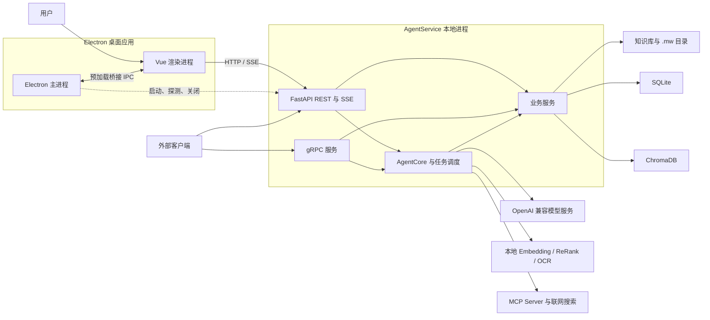

# MetaWeave（元织）总体架构

MetaWeave 采用 Electron 桌面壳、Vue 渲染层和本地 Python 服务三层结构。Electron 管理窗口、系统能力和后端进程；Vue 工作区承载编辑、资料管理和 Agent 交互；AgentService 负责业务接口、文件处理、检索、Agent 执行与持久化。

文档面向 MetaWeave 维护者与接口接入者，覆盖进程和模块边界，以及改动可能影响的接口与数据。具体功能、业务规则和 Agent 内部流程分别记录在 [FEATURES.md](FEATURES.md)、[SERVICES.md](SERVICES.md)、[AGENT_DESIGN.md](AGENT_DESIGN.md) 与 [WORKFLOW.md](WORKFLOW.md)。

## 架构目标与约束

| 目标 | 架构处理 |
| --- | --- |
| 用户掌握原始资料 | 知识库直接建立在用户选择的本地目录上，原文件不迁入专用数据库。 |
| 桌面功能集中交付 | 编辑器、资料管理、图谱和 Agent 共用一个 Vue 工作区，由 Electron 提供桌面能力。 |
| Agent 行为可核对 | 后端保存会话、工具轨迹、召回详情、耗时和模型用量，并通过流式事件交给前端。 |
| 索引可以失效和重建 | 原文件、结构化中间层、关系数据与向量索引分开保存；文件变化会使相关索引失效。 |
| 模型和工具可以替换 | 大小模型使用 OpenAI 兼容接口，工具由内置注册表和 MCP 扩展。 |

当前发布流程面向 Windows 桌面安装包。服务默认使用本地文件系统、SQLite 和 ChromaDB；模型接口、联网搜索及 MCP Server 可能访问外部网络。桌面版把后端作为本机服务运行，HTTP 与 gRPC 仍是可访问的网络端口，部署边界见“安全与信任边界”。

## 系统组成



### Electron 主进程

`editor/electron/main.cjs` 管理主窗口、悬浮窗口、托盘和单实例锁。安装包运行时，它检查 `127.0.0.1:8002`；端口没有服务时再启动内置的 `AgentService.exe`，退出应用时关闭自己启动的后端进程。

渲染进程不启用 Node.js 集成。文件选择、系统剪贴板、打开路径、窗口控制和跨窗口同步经 `preload.cjs` 暴露的有限接口进入主进程。

### Vue 工作区

`editor/src` 是用户操作入口。页面组件负责编辑器、文件树、搜索、业务面板和 Agent 面板；Pinia store 保存当前工作区、会话与设置状态；`api/` 根据 `router/api_routes.ts` 中的登记调用后端。桌面环境使用 Hash 路由，普通浏览器环境使用 History 路由。

### AgentService

`main.py` 在同一个 Python 进程中启动 FastAPI 和 gRPC，随后创建领域服务、AgentCore、自动化调度器与任务队列调度器。服务实例在应用生命周期内共用配置和 Agent 运行时，并访问同一个 SQLite 文件。这是一套按模块拆分的本地服务，业务模块不会分别启动独立进程。

FastAPI 处理前端使用的 REST 接口、SSE 流和静态资源。gRPC 复用同一批业务服务，为外部客户端提供 Agent、会话、知识库、设置、Git、密码库等调用入口。

### 业务服务与 Agent 运行时

`agent_service/services` 保存知识库、图书馆、智能表单、组件库、密码库、Git、会话、设置和检索等业务规则。REST 与 gRPC 适配层主要处理参数转换、错误映射和响应格式，持久化与文件操作集中在服务层。

`agent_service/agent_core` 使用 LangGraph 组织 Agent 状态图。工具注册、执行、记忆、检索、安全审核、子 Agent 与模型任务调度位于 Agent 运行时一侧。其内部节点和状态转移见 [AGENT_DESIGN.md](AGENT_DESIGN.md)，工具清单见 [TOOLS.md](TOOLS.md)。

Embedding、ReRank 和 OCR 模型由 AgentService 进程加载，不另设本地模型服务。模型下载与加载可以在后台执行，推理仍占用后端进程的内存和计算资源。

## 技术基线

| 层次 | 当前技术 |
| --- | --- |
| 桌面运行时 | Electron，Windows 安装包使用 NSIS |
| 前端 | Vue 3、TypeScript、Pinia、Vite |
| 编辑与呈现 | Vditor、Marked、DOMPurify、KaTeX、Mermaid、ECharts、D3 Force |
| 后端接口 | Python 3.12、FastAPI、gRPC |
| Agent | LangGraph、LangChain、OpenAI 兼容模型接口 |
| 结构化存储 | SQLModel、SQLite |
| 检索 | ChromaDB、Sentence Transformers、关键词召回、ReRank |
| 多模态处理 | PyMuPDF、Mammoth、Pillow、PaddleOCR 及 Office 文件解析库 |

依赖版本以 `agent_service/requirements.txt` 和 `editor/package.json` 为准。技术名称出现在这里表示源码已经接入；规划中的组件不列入架构基线。

## 通信边界

| 通道 | 调用双方 | 用途 |
| --- | --- | --- |
| Electron IPC | Vue 渲染进程与 Electron 主进程 | 窗口、托盘、文件选择、剪贴板和有限的系统路径操作 |
| REST/HTTP | Vue 或外部客户端与 FastAPI | 业务查询、文件操作、设置和非流式 Agent 调用 |
| SSE | Vue 或其他 HTTP 客户端与 FastAPI | Agent 输出、知识入库进度和文件变化通知 |
| gRPC | 外部客户端与 AgentService | 服务端流式 Agent 调用及结构化业务接口 |
| MCP stdio | AgentService 与 MCP Server 子进程 | 发现和调用外部工具 |

开发模式下，Vue 由 `127.0.0.1:5173` 的 Vite 服务提供，API 请求代理到 `127.0.0.1:8002`。Agent SSE 经过开发代理时会关闭响应压缩，避免中间事件被缓冲。

安装包内的 Vue 静态文件随 `AgentService.exe` 打包。Electron 等待后端端口就绪后，从 `http://127.0.0.1:8002` 加载页面；页面与 API 处于同一来源。后端还挂载知识库预览、下载、图书馆资产和可视化结果的静态路径。

REST 契约记录在 [OpenAPI 文档](api/metaweave.openapi.json)，gRPC 契约记录在 [agent_service.proto](../protos/agent_service.proto)。两套接口共享服务层，但协议定义分别维护。修改服务能力时，需要分别检查 REST 路由、前端 API 登记、gRPC 协议和 servicer 是否受影响。

## 数据与持久化

### 数据归属

| 位置 | 内容 | 性质 |
| --- | --- | --- |
| 用户选择的知识库目录 | Markdown、PDF、Office 文档、图片、代码及其他原始资料 | 用户原始数据，是知识内容的主要来源 |
| `<知识库>/.mw/md` | 非 Markdown 文件转换出的 Markdown 中间层 | 派生数据，可由原文件重新生成 |
| `<知识库>/.mw/frontmatter` | 解析后的结构化 JSON | 派生数据，是切片、图谱和入库的输入 |
| `<知识库>/.mw/library` | 图书馆导入文件和集锦目录 | 应用管理的数据，备份知识库时应一并保留 |
| `<知识库>/.mw/forms`、`<知识库>/.mw/components` | 智能表单与组件库文件 | 应用管理的数据 |
| `runtime/db/relation/agent_service.db` | 会话、消息、设置、业务记录、长期记忆、图谱和索引元数据 | 应用状态的主要关系存储 |
| `runtime/db/vector/chroma` | 长期记忆和知识切片的向量索引 | 检索索引 |
| `runtime/assets` | 预览、下载、图书馆封面和密码库附件等运行资产 | 同时包含可再生文件与需保留的业务资产 |
| `runtime/uploads` | 会话附件原文件，以及 `read_file` 首次读取后生成的解析缓存 | 会话范围内的输入资料；上传阶段不自动解析 |
| `runtime/visualizations` | Markdown 转换生成的可视化文件 | 生成结果，是否保留取决于使用场景 |
| `runtime/models` | Embedding、ReRank 与 OCR 模型 | 可重新下载的本地模型 |
| `runtime/logs` | 文本或 JSON 日志及轮转文件 | 诊断数据 |
| `runtime/trash` | 从知识库移入“最近删除”的文件 | 待恢复或清理的数据 |

知识库目录和 `runtime/` 承担的职责不同，完整备份需要覆盖两处。清空整个 `runtime/` 会丢失会话、设置、密码库资产和其他应用状态，不能把它整体视为缓存目录。

### 入库与一致性

后端扫描原文件后生成 `.mw/md` 与 `.mw/frontmatter`，再把切片及元数据写入 SQLite，并把向量写入 ChromaDB。每条知识记录保留来源路径等信息，检索结果可以回到原文件。

服务启动时不会自动重建全部知识索引。前端可触发全库、目录或单文件入库；外部程序修改文件时，文件监听会通知前端并使相关索引失效。`watchdog` 不可用时，事件流退回文件树签名轮询。

ChromaDB 是向量查询入口，SQLite 的长期记忆表同时保存长期记忆、知识切片和 JSON 向量。ChromaDB 不可用或没有返回有效结果时，检索服务会在这些记录上计算余弦相似度，然后继续关键词召回与 ReRank。

### 用户与知识库隔离

SQLite 记录使用 `user_id` 区分用户设置、会话和记忆。一个用户可以登记多个知识库，当前活动知识库决定文件操作、入库和业务资产的根目录；索引路径还带有知识库标识。这里的 `user_id` 是逻辑分区键，不承担登录认证职责。

## 配置

服务级配置集中在 `agent_service/core/agent_config.py`。通用配置的覆盖顺序从高到低为：调用方显式传入的 `overrides`、已有进程环境变量、项目根目录 `.env`、dataclass 默认值。`.env` 只补充进程中尚未存在的变量。MCP Server 列表还会读取 `resources/mcp/*.json`，环境变量可以覆盖文件结果。

用户设置保存在 SQLite。模型 API、模型名、知识库选择、外观、检索、联网搜索、工具开关和终端策略等设置在请求执行时读取；没有用户记录时才回退到服务级默认值。对于模型配置，SQLite 中的用户记录优先于最终的 `AgentConfig`，环境变量和 `.env` 不会覆盖已经保存的用户模型配置。前端 store 保存当前界面状态，并以服务端设置为持久化来源。

安装包由 Electron 设置 `AGENT_PROJECT_ROOT` 和 `AGENT_BASE_DATA_DIR`，把可写资源与运行数据放到用户数据目录。存储设置页只允许切换知识库根目录；`.mw` 与 `runtime/` 的内部路径由应用管理。

## 运行与部署

### 开发模式

开发环境分别运行 FastAPI、Vite 和 Electron。FastAPI 默认监听 HTTP `8002`，并在同一生命周期内启动 gRPC `50051`；Vite 监听 `5173`；Electron 加载 Vite 页面。具体命令和依赖安装见 [DEVELOPMENT.md](DEVELOPMENT.md)。

开发模式默认使用仓库中的 `resources/`，运行数据写入根目录下的 `runtime/`。用户在设置中选择新的知识库后，文件和业务操作会切到该目录。

### Windows 安装包

安装包包含 Electron 文件、`AgentService.exe` 和默认资源模板。首次启动会在 `%APPDATA%/MetaWeave` 建立 `resources/` 与 `runtime/`，复制 MCP 示例、安全规则和内置 Skill，并创建空的 `resources/knowledge`。模型文件、用户知识库和运行数据库不会写入安装目录。

`AgentService.exe` 内含构建后的 Vue 静态文件。若 `8002` 已有服务监听，Electron 直接连接该服务，不再启动内置后端；这种情况下 Electron 也不会负责关闭已有进程。端口探测只检查 TCP 是否可连接，不校验服务身份、版本或健康响应，因此 `8002` 被其他程序占用时桌面端可能加载失败。后端可以脱离 Electron 单独运行，同时提供 API 和前端页面。

### 后台任务与关闭

自动化调度器和 Agent 任务队列使用后台线程轮询 SQLite。模型任务调度器默认使用进程内队列和 worker，并按大小模型分别限制并发；配置 Redis 后可改用 Redis Stream 传递任务并共享熔断状态。

应用关闭时会停止自动化调度器、Agent 队列调度器和 gRPC 服务。Electron 只终止自己创建的后端进程，避免误杀用户预先启动的 AgentService。

## 故障处理与可观测性

Agent 流式事件包含节点状态、工具开始与结束、召回信息、模型用量和耗时。消息与部分轨迹写入 SQLite，前端将其显示在对话和观测面板中。服务日志使用 Python `logging`，支持控制台输出、JSON 文件、按大小或日期轮转；日志目录由 `AgentConfig` 指定。

模型调度器对可恢复错误执行超时控制、退避重试和熔断，并对前台任务、摘要和事实处理分别设队列。队列满载、超时和熔断会返回明确错误，调用方不能假定任务一定执行。

部分依赖允许降级：gRPC 启动失败时 HTTP 服务继续运行；ChromaDB 查询失败时改用 SQLite 中的 JSON 向量；`watchdog` 缺失时改用轮询；本地模型后台加载失败会记入日志，后端仍可处理不依赖该模型的接口。这些降级会减少协议、性能或检索能力，日志中的警告需要保留。

## 安全与信任边界

MetaWeave 当前按可信本机桌面应用设计。生产前端带有内容安全策略，Markdown 和预览 HTML 在进入页面前使用 DOMPurify 清洗；Vue 渲染进程关闭 Node.js 集成，桌面操作经预加载桥接进入主进程。Electron 的渲染沙箱当前没有启用，因此渲染层仍应视为受信任代码，不能直接加载未审查的远程应用页面。

知识库接口会把相对路径解析到活动知识库根目录，并拒绝越界路径。终端工具另有工作区根目录、可用 shell、程序白名单、禁止程序和超时限制；这些规则可以由用户设置修改。密码库接口使用独立的解锁会话与 Bearer token，密码库数据规则见 [SERVICES.md](SERVICES.md)。

HTTP 默认监听 `0.0.0.0:8002`，gRPC 默认监听全接口的 `50051`，gRPC 使用明文端口。除密码库等专用接口外，多数接口依靠 `user_id` 分区，没有通用登录认证。CORS 只允许 `localhost`、`127.0.0.1` 和 `null` 来源，但 CORS 不能阻止非浏览器客户端访问。当前服务不适合直接暴露到不可信网络；需要远程部署时，应先限制监听地址，并在服务前增加认证、TLS 和访问控制。

调用外部模型、联网搜索或 MCP 工具时，查询、上下文或文件内容可能离开本机。启用这些能力前需要核对服务提供方和 MCP Server 的数据处理范围。MCP 配置决定要启动的命令和传入的环境变量，子进程继承当前用户权限，只应使用可信配置。

## 扩展位置

- 新业务领域在 `agent_service/services` 增加服务，在 `api/rest` 或 gRPC servicer 接入；前端调用路径登记到 `editor/src/router/api_routes.ts`。
- 新 Agent 工具登记到工具注册表。独立工具服务优先使用 MCP，接入格式见 [MCP.md](MCP.md)。
- 新 Agent 节点和推理模式在 `agent_service/agent_core` 内扩展，并同步状态图、事件格式和 [AGENT_DESIGN.md](AGENT_DESIGN.md)。
- 新前端业务页由 `views`、`components`、`stores` 和 `api` 组成，交互规则遵循 [DESIGN.md](DESIGN.md)。
- REST 接口变更需要更新 OpenAPI 文件；gRPC 接口变更需要修改 proto 并重新生成 Python 代码。

## 源码目录

```text
MetaWeave/
├── main.py                    # FastAPI 与 gRPC 启动入口
├── AgentService.spec          # 后端 exe 与前端静态资源构建配置
├── agent_service/
│   ├── agent_core/            # Agent 状态图、节点和执行循环
│   ├── api/rest/              # REST 与 SSE 适配层
│   ├── api/grpc/              # gRPC servicer 与生成代码
│   ├── core/                  # 统一配置
│   ├── models/                # SQLModel 表模型
│   ├── schemas/               # 接口 DTO
│   ├── services/              # 业务、记忆、安全和调度服务
│   └── tools/                 # 内置工具、执行器与 MCP
├── editor/
│   ├── electron/              # Electron 主进程和预加载桥接
│   ├── src/                   # Vue 工作区
│   └── scripts/               # 前端与安装包脚本
├── protos/                    # gRPC 协议
├── resources/                 # MCP、安全规则、Skill 和开发知识库
├── runtime/                   # 数据库、模型、资产、日志和最近删除
├── tests/                     # 后端测试
└── docs/                      # 项目文档
```

`build/`、`dist/`、`editor/dist/` 和 `editor/release/` 是构建产物，不属于源码边界。`runtime/` 是运行数据目录，是否纳入备份由数据类型决定。

## 已采用的架构取舍

| 取舍 | 直接影响 |
| --- | --- |
| 后端使用单个模块化进程 | 桌面部署和共享状态较简单；一个模块的阻塞或进程退出会影响全部后端能力。 |
| 用户文件与检索索引分开保存 | 原文件可由其他编辑器直接修改；索引必须处理失效、迁移和重新入库。 |
| 前端主要使用 REST 与 SSE，外部调用另提供 gRPC | 浏览器接入直接；相同业务的两套协议需要同步维护。 |
| 安装包由本地 HTTP 服务托管前端 | Electron、浏览器和独立后端可以复用同一页面；运行时需要占用固定端口。 |
| 默认使用进程内模型队列，Redis 按需启用 | 单机无需额外服务；跨进程共享队列和熔断状态时需要部署 Redis。 |
| `user_id` 用作逻辑分区 | 单机可保存多组用户状态；它不能替代认证和租户隔离。 |

## 相关文档

- 功能范围：[FEATURES.md](FEATURES.md)
- 业务领域：[SERVICES.md](SERVICES.md)
- Agent 设计：[AGENT_DESIGN.md](AGENT_DESIGN.md)
- Agent 工具：[TOOLS.md](TOOLS.md)
- 业务与 Agent 流程图：[WORKFLOW.md](WORKFLOW.md)
- 前端 UI/UX：[DESIGN.md](DESIGN.md)
- 启动、构建与部署：[DEVELOPMENT.md](DEVELOPMENT.md)
- REST/OpenAPI：[metaweave.openapi.json](api/metaweave.openapi.json)
- MCP 接入：[MCP.md](MCP.md)
- gRPC 协议：[agent_service.proto](../protos/agent_service.proto)
