# MetaWeave(元织) 核心链路工作原理流程图
### 核心Agent结构设计

##### Agent宏观结构

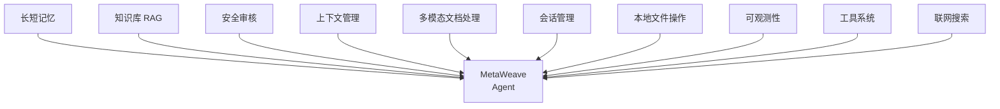
```mermaid
flowchart TD
    长短记忆["长短记忆"] & 知识库RAG["知识库 RAG"] & 安全审核["安全审核"] & 上下文管理["上下文管理"] & 多模态文档处理["多模态文档处理"] --> agent
    agent["MetaWeave<br/>Agent"]
    会话管理["会话管理"] & 规划与编排["本地文件操作"] & 可观测性["可观测性"] & 工具系统["工具系统"] & 联网搜索["联网搜索"] --> agent
```

#### Agent状态转移图
##### Simple模式

```mermaid
flowchart LR
    START -->|"小模型判别: 无需工具"| agent_simple["agent (直答)\n小模型直接生成回答"]
    agent_simple --> END
```

Simple 模式走轻量直答路径。不经过 LangGraph 循环，直接用小模型输出回答。适用于问候、短答等明显无需调用工具的输入。

##### ReAct模式

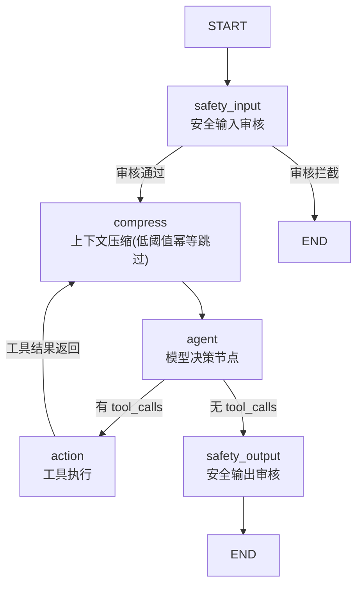
```mermaid
flowchart TD
    START --> safety_input["safety_input\n安全输入审核"]

    safety_input -->|"审核通过"| compress_react["compress\n上下文压缩(低阈值幂等跳过)"]
    safety_input -->|"审核拦截"| END_intercept["END"]

    compress_react --> agent_react["agent\n模型决策节点"]
    agent_react -->|"有 tool_calls"| action_react["action\n工具执行"]
    agent_react -->|"无 tool_calls"| safety_output_react["safety_output\n安全输出审核"]

    action_react -->|"工具结果返回"| compress_react
    safety_output_react --> END_react["END"]
```

ReAct 模式是标准的"思考-行动-观察"循环。agent 节点同时充当决策者和观察者，每轮只调用一次 LLM。有工具调用就执行并回到 agent，没有工具调用就输出审核后结束。每次进入决策前与工具回环后都经 `compress` 节点估算上下文长度：低于阈值幂等跳过，高于阈值用小模型把早期消息压成重要事实摘要（写入长期记忆），防止长循环上下文单调膨胀。

##### Plan模式(Plan-and-Execute)

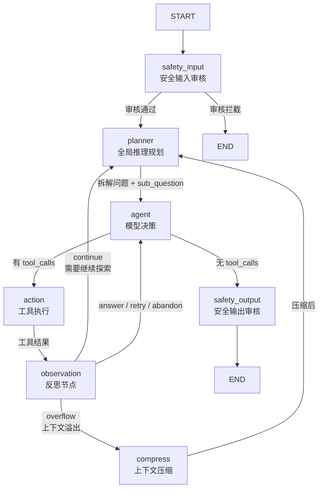
```mermaid
flowchart TD
    START --> safety_input["safety_input\n安全输入审核"]

    safety_input -->|"审核通过"| planner["planner\n全局推理规划"]
    safety_input -->|"审核拦截"| END_intercept["END"]

    planner -->|"拆解问题 + sub_question"| agent_plan["agent\n模型决策"]

    agent_plan -->|"有 tool_calls"| action["action\n工具执行"]
    agent_plan -->|"无 tool_calls"| safety_output["safety_output\n安全输出审核"]

    action -->|"工具结果"| observation["observation\n反思节点"]

    observation -->|"continue\n需要继续探索"| planner
    observation -->|"answer / retry / abandon"| agent_plan
    observation -->|"overflow\n上下文溢出"| compress["compress\n上下文压缩"]

    compress -->|"压缩后"| planner
    safety_output --> END["END"]
```

Plan 模式经过"规划→执行→观察"的循环，每轮会调用 2~3 次 LLM。planner 负责拆解问题，observation 根据工具结果判断要继续执行、重试、给出答案，还是先压缩上下文再接续规划。

### 记忆机制
##### 多模态文件的完整生命周期
**一个文件的完整生命周期**: 入文件夹,多模态解析,json化,语义切块,重叠切片,入向量库,混合检索向量库,合并去重,rerank,联合评分,阈值过滤,最新优先排序,四路记忆合并,注入系统提示词.

```mermaid
flowchart LR
    subgraph ingest["入库阶段"]
        direction LR
        A["文件入知识库"] --> B["多模态解析<br/>按格式提取结构化内容"]
        B --> C["结构化 JSON 落盘"]
        C --> D["语义切块<br/>section 级别分割"]
        D --> E["重叠切片<br/>512/128 char"]
        E --> F["Embedding 向量化"]
        F --> G["ChromaDB 入库"]
    end

    subgraph recall["召回阶段"]
        direction LR
        G --> H_vector["向量召回<br/>ChromaDB 余弦距离"]
        G --> H_keyword["关键词召回<br/>ILIKE + 词频加权"]
        H_vector --> H_merge["合并去重<br/>merge_candidates"]
        H_keyword --> H_merge
        H_merge --> I["CrossEncoder ReRank<br/>BAAI/bge-reranker-v2-m3"]
        I --> J["三维联合评分<br/>0.5rel + 0.3fresh + 0.2auth"]
        J --> K["阈值过滤<br/>score_threshold"]
        K --> L["最新优先排序<br/>updated_at DESC"]
        L --> M["四路记忆合并截断 topK"]
        M --> N["注入系统提示词"]
    end
```

##### 长期记忆 / 知识库入库流程

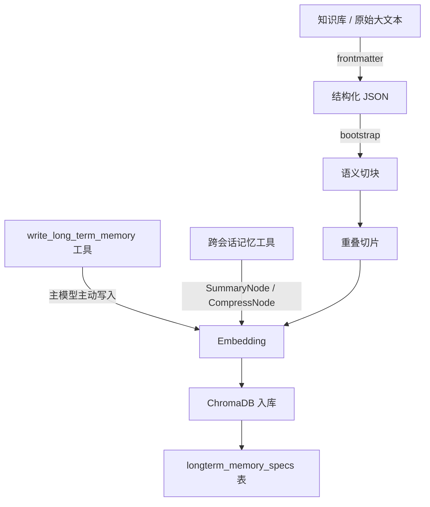
```mermaid
flowchart TD
    A["write_long_term_memory 工具"] -->|"主模型主动写入"| H["Embedding"]
    B["跨会话记忆工具"] -->|"SummaryNode / CompressNode"| H
    C["知识库 / 原始大文本"] -->|"frontmatter"| G["结构化 JSON"]
    G -->|"bootstrap"| D["语义切块"]
    D --> E["重叠切片"]
    E --> H
    H --> F["ChromaDB 入库"]
    F --> I["longterm_memory_specs 表"]
```

##### RAG 召回流程

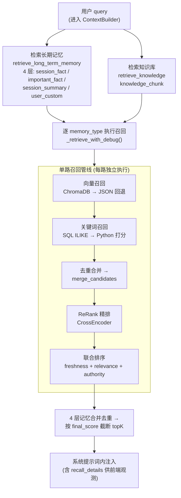
```mermaid
flowchart TD
    A["用户 query<br/>(进入 ContextBuilder)"] --> B["检索长期记忆<br/>retrieve_long_term_memory<br/>4 层: session_fact / important_fact /<br/>session_summary / user_custom"]
    A --> C["检索知识库<br/>retrieve_knowledge<br/>knowledge_chunk"]

    B --> D["逐 memory_type 执行召回<br/>_retrieve_with_debug()"]
    C --> D

    subgraph recall_pipeline["单路召回管线 (每路独立执行)"]
        direction LR
        E["向量召回<br/>ChromaDB → JSON 回退"] --> F["关键词召回<br/>SQL ILIKE → Python 打分"]
        F --> G["去重合并 →<br/>merge_candidates"]
        G --> H["ReRank 精排<br/>CrossEncoder"]
        H --> I["联合排序<br/>freshness + relevance + authority"]
    end

    D --> recall_pipeline
    I --> J["4 层记忆合并去重 →<br/>按 final_score 截断 topK"]
    J --> K["系统提示词内注入<br/>(含 recall_details 供前端观测)"]
```

##### 记忆时效性机制

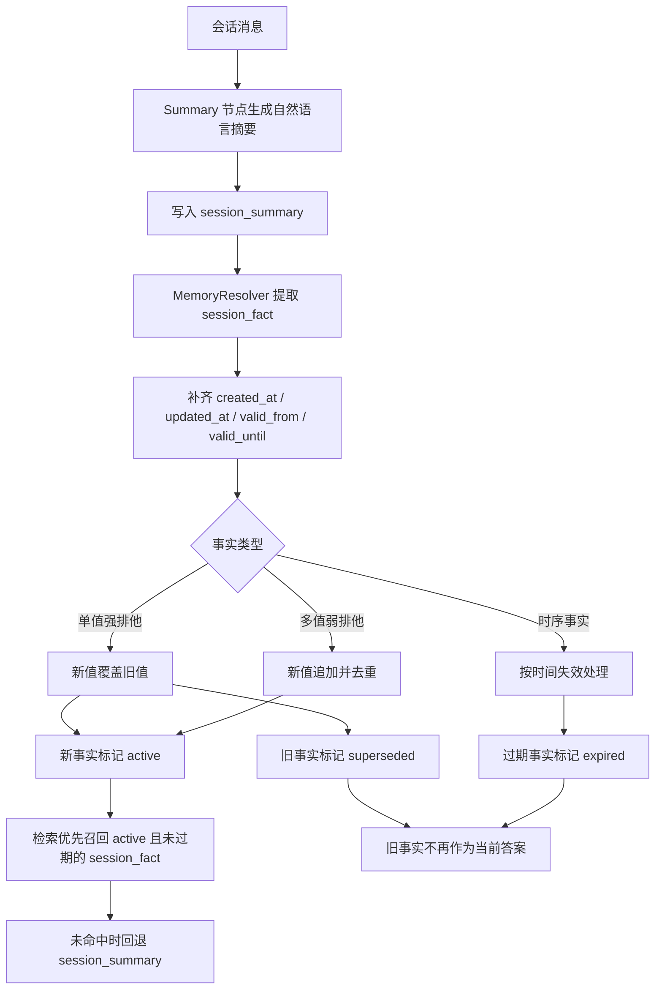
```mermaid
flowchart TD
    A[会话消息] --> B[Summary 节点生成自然语言摘要]
    B --> C[写入 session_summary]
    C --> D[MemoryResolver 提取 session_fact]
    D --> E[补齐 created_at / updated_at / valid_from / valid_until]
    E --> F{事实类型}
    F -->|单值强排他| G[新值覆盖旧值]
    F -->|多值弱排他| H[新值追加并去重]
    F -->|时序事实| I[按时间失效处理]
    G --> J[旧事实标记 superseded]
    G --> K[新事实标记 active]
    H --> K
    I --> L[过期事实标记 expired]
    K --> M[检索优先召回 active 且未过期的 session_fact]
    J --> N[旧事实不再作为当前答案]
    L --> N
    M --> O[未命中时回退 session_summary]
```

##### 混合检索与ReRank机制

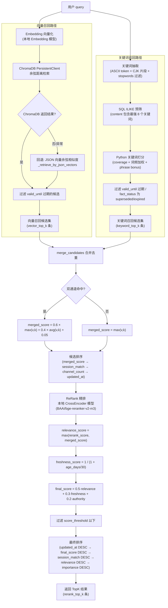
```mermaid
flowchart TD
    A["用户 query"] --> B["Embedding 向量化<br/>(本地 Embedding 模型)"]
    A --> C["关键词抽取<br/>(ASCII token + CJK 片段 + stopwords 过滤)"]

    subgraph vector_path["向量召回路径"]
        B --> D["ChromaDB PersistentClient<br/>余弦距离检索"]
        D --> DA{"ChromaDB 返回结果?"}
        DA -->|"是"| E["过滤 valid_until 过期的候选"]
        DA -->|"否/异常"| DB["回退: JSON 向量余弦相似度<br/>_retrieve_by_json_vectors"]
        DB --> E
        E --> F["向量召回候选集<br/>(vector_top_k 条)"]
    end

    subgraph keyword_path["关键词召回路径"]
        C --> G["SQL ILIKE 预筛<br/>(content 包含最强 8 个关键词)"]
        G --> H["Python 关键词打分<br/>(coverage + 词频加权 + phrase bonus)"]
        H --> I["过滤 valid_until 过期 /<br/>fact_status 为 superseded/expired"]
        I --> J["关键词召回候选集<br/>(keyword_top_k 条)"]
    end

    F --> K["merge_candidates 合并去重"]
    J --> K

    K --> L{"双通道命中?"}
    L -->|"是"| M["merged_score = 0.6 × max(v,k) + 0.4 × avg(v,k) + 0.05"]
    L -->|"否"| N["merged_score = max(v,k)"]
    M --> O["候选排序<br/>(merged_score → session_match → channel_count → updated_at)"]
    N --> O

    O --> P["ReRank 精排<br/>本地 CrossEncoder 模型<br/>(BAAI/bge-reranker-v2-m3)"]

    P --> Q1["relevance_score = max(rerank_score, merged_score)"]
    Q1 --> Q2["freshness_score = 1 / (1 + age_days/30)"]
    Q2 --> Q3["final_score = 0.5·relevance + 0.3·freshness + 0.2·authority"]
    Q3 --> R["过滤 score_threshold 以下"]
    R --> S["最终排序<br/>(updated_at DESC → final_score DESC →<br/> session_match DESC → relevance DESC → importance DESC)"]
    S --> T["返回 TopK 结果<br/>(rerank_top_k 条)"]
```

### 上下文与状态机制

##### 上下文构建器

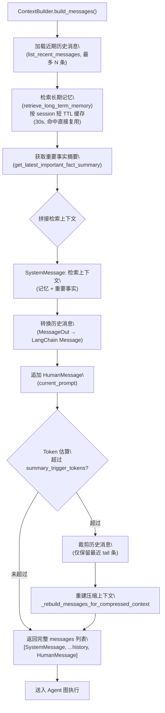
```mermaid
flowchart TD
    A["ContextBuilder.build_messages()"] --> B["加载近期历史消息\\n(list_recent_messages, 最多 N 条)"]
    B --> C["检索长期记忆\\n(retrieve_long_term_memory)<br/>按 session 短 TTL 缓存<br/>(30s, 命中直接复用)"]
    C --> D["获取重要事实摘要\\n(get_latest_important_fact_summary)"]
    D --> E{"拼接检索上下文"}
    E --> F["SystemMessage: 检索上下文\\n(记忆 + 重要事实)"]
    F --> G["转换历史消息\\n(MessageOut → LangChain Message)"]
    G --> H["追加 HumanMessage\\n(current_prompt)"]
    H --> I{"Token 估算\\n超过 summary_trigger_tokens?"}
    I -->|"未超过"| J["返回完整 messages 列表\\n[SystemMessage, ...history, HumanMessage]"]
    I -->|"超过"| K["裁剪历史消息\\n(仅保留最近 tail 条)"]
    K --> L["重建压缩上下文\\n_rebuild_messages_for_compressed_context"]
    L --> J
    J --> M["送入 Agent 图执行"]
```

**消息角色优先级（上下文拼装顺序）：**  
`SystemMessage(检索上下文)` → `历史消息按时间正序` → `HumanMessage(当前输入)`  
检索上下文内部优先级：`important_fact_summary > 长期记忆(已附原文) > 当前 session 摘要`。知识库不再自动召回进上下文，由 Agent 需要时自行调用 `get_knowledge_context` / `search_knowledge` 等工具获取，避免首 token 前重复跑完整 embedding+rerank 链路。

##### 上下文压缩机制

###### compress 路径: 上下文压缩 / 重要事实摘要流程

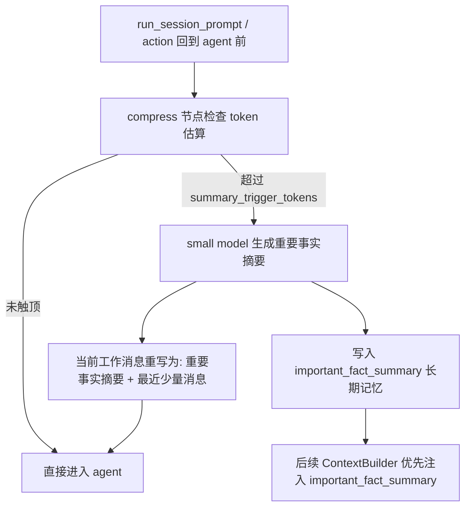
```mermaid
flowchart TD
    A["run_session_prompt / action 回到 agent 前"] --> B["compress 节点检查 token 估算"]
    B -->|"未触顶"| C["直接进入 agent"]
    B -->|"超过 summary_trigger_tokens"| D["small model 生成重要事实摘要"]
    D --> E["写入 important_fact_summary 长期记忆"]
    D --> F["当前工作消息重写为: 重要事实摘要 + 最近少量消息"]
    F --> C
    E --> G["后续 ContextBuilder 优先注入 important_fact_summary"]
```

###### summary 路径: 长期记忆摘要流程

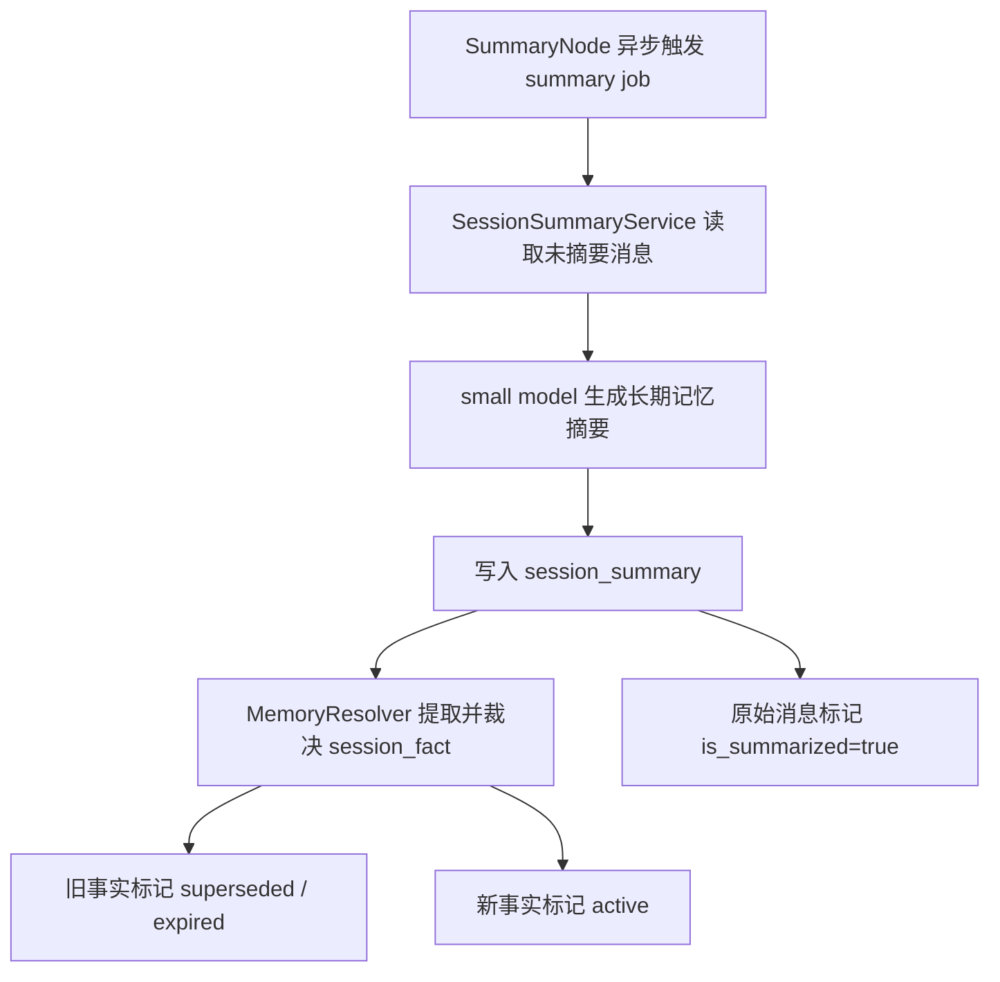
```mermaid
flowchart TD
    A["SummaryNode 异步触发 summary job"] --> B["SessionSummaryService 读取未摘要消息"]
    B --> C["small model 生成长期记忆摘要"]
    C --> D["写入 session_summary"]
    D --> E["MemoryResolver 提取并裁决 session_fact"]
    E --> F["旧事实标记 superseded / expired"]
    E --> G["新事实标记 active"]
    D --> H["原始消息标记 is_summarized=true"]
```

##### 探索状态机制

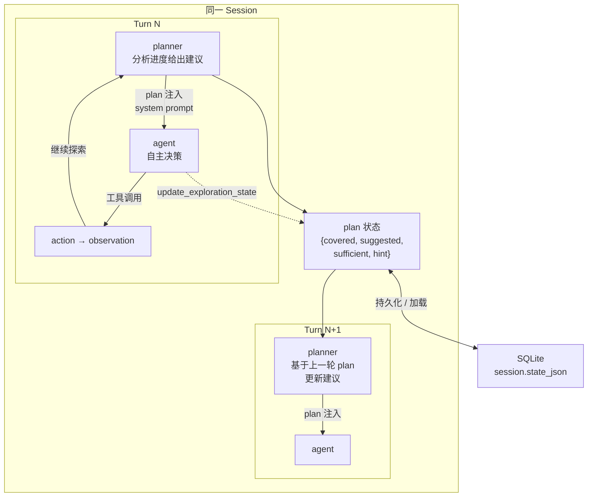
```mermaid
flowchart TD
    subgraph session["同一 Session"]
        subgraph turn1["Turn N"]
            P1["planner<br/>分析进度给出建议"] -->|"plan 注入<br/>system prompt"| A1["agent<br/>自主决策"]
            A1 -->|"工具调用"| T1["action → observation"]
            T1 -->|"继续探索"| P1
        end

        subgraph turn2["Turn N+1"]
            P2["planner<br/>基于上一轮 plan<br/>更新建议"] -->|"plan 注入"| A2["agent"]
        end

        plan["plan 状态<br/>{covered, suggested,<br/>sufficient, hint}"]

        P1 --> plan
        A1 -.->|"update_exploration_state"| plan
        plan --> P2
    end

    plan <-->|"持久化 / 加载"| DB["SQLite<br/>session.state_json"]
```

### 任务调度与节流机制

##### 模型路由与大/小模型池

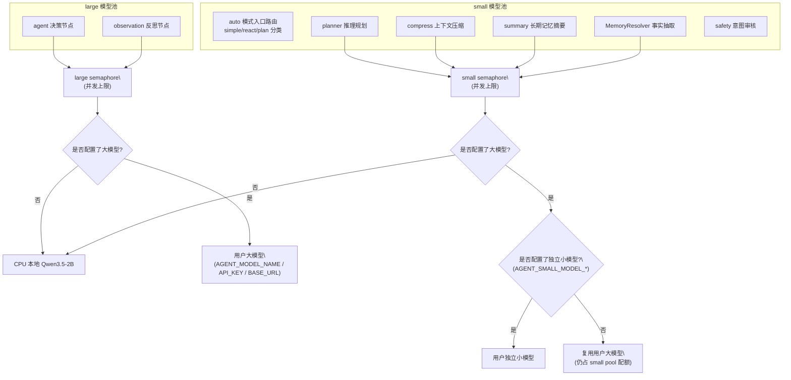
```mermaid
flowchart TD
    subgraph large_pool["large 模型池"]
        L1["agent 决策节点"]
        L2["observation 反思节点"]
    end

    subgraph small_pool["small 模型池"]
        S0["auto 模式入口路由<br/>simple/react/plan 分类"]
        S1["planner 推理规划"]
        S2["compress 上下文压缩"]
        S3["summary 长期记忆摘要"]
        S4["MemoryResolver 事实抽取"]
        S5["safety 意图审核"]
    end

    L1 --> LA["large semaphore\\n(并发上限)"]
    L2 --> LA
    S1 --> SA["small semaphore\\n(并发上限)"]
    S2 --> SA
    S3 --> SA
    S4 --> SA

    LA --> C1{"是否配置了大模型?"}
    C1 -->|"否"| LQ["CPU 本地 Qwen3.5-2B"]
    C1 -->|"是"| ML["用户大模型\\n(AGENT_MODEL_NAME / API_KEY / BASE_URL)"]
    SA --> C2{"是否配置了大模型?"}
    C2 -->|"否"| LQ
    C2 -->|"是"| M2{"是否配置了独立小模型?\\n(AGENT_SMALL_MODEL_*)"}
    M2 -->|"是"| ML2["用户独立小模型"]
    M2 -->|"否"| MF2["复用用户大模型\\n(仍占 small pool 配额)"]
```

##### (Redis)多级队列调度

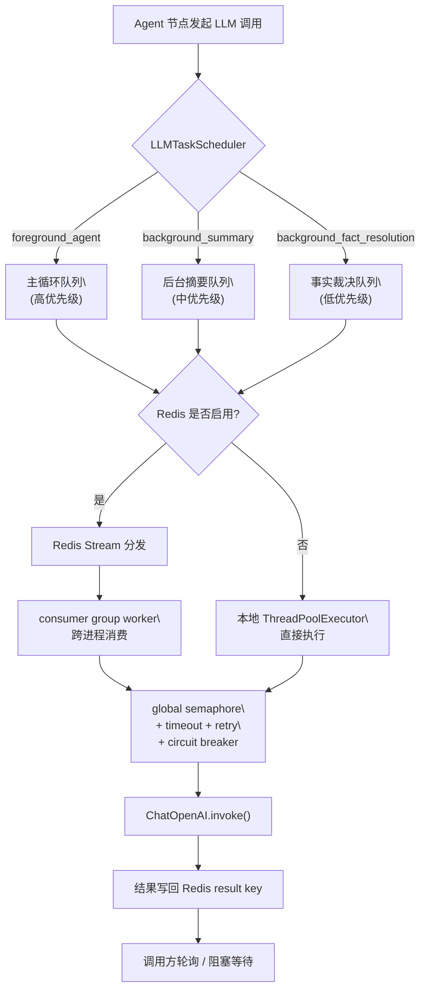
```mermaid
flowchart TD
    A["Agent 节点发起 LLM 调用"] --> B{"LLMTaskScheduler"}

    B -->|"foreground_agent"| C["主循环队列\\n(高优先级)"]
    B -->|"background_summary"| D["后台摘要队列\\n(中优先级)"]
    B -->|"background_fact_resolution"| E["事实裁决队列\\n(低优先级)"]

    C --> F{"Redis 是否启用?"}
    D --> F
    E --> F

    F -->|"否"| G["本地 ThreadPoolExecutor\\n直接执行"]
    F -->|"是"| H["Redis Stream 分发"]

    H --> I["consumer group worker\\n跨进程消费"]
    I --> J["global semaphore\\n+ timeout + retry\\n+ circuit breaker"]

    G --> J
    J --> K["ChatOpenAI.invoke()"]
    K --> L["结果写回 Redis result key"]
    L --> M["调用方轮询 / 阻塞等待"]
```

##### 节流机制

流式对话中每个 SSE token 都直接写入 Vue 响应式对象，触发完整响应链（`visibleMessages` 全量 reduce → 模板重渲染 → vdom diff → scroll 计算）。随会话消息累积（100+ 条），每秒 30~60 次的全量重算产生 ~3,000 个临时对象，GC 频繁停顿导致卡顿。

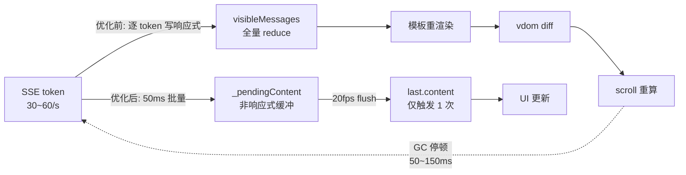
```mermaid
flowchart LR
    A["SSE token<br/>30~60/s"] -->|"优化前: 逐 token 写响应式"| B["visibleMessages<br/>全量 reduce"]
    B --> C["模板重渲染"]
    C --> D["vdom diff"]
    D --> E["scroll 重算"]
    E -.->|"GC 停顿<br/>50~150ms"| A

    A -->|"优化后: 50ms 批量"| F["_pendingContent<br/>非响应式缓冲"]
    F -->|"20fps flush"| G["last.content<br/>仅触发 1 次"]
    G --> H["UI 更新"]
```

**_pendingContent**（`src/stores/chat.js`）：非响应式字符串缓冲，`updateStreamContent` 存入最新累积内容（0 次响应链触发），`flushStreamContent` 每 50ms 写入 `last.content`（1 次响应链触发），`forceFlushContent` 在流结束/中断/异常时立即清空缓冲防丢字。

| 指标 | 优化前 | 优化后 |
|---|---|
| 每次 token 响应链触发 | 1 次 | 0 次 |
| 每秒响应链触发（100 条消息） | ~30 次 | ~20 次 |
| 每秒临时对象 | ~3,000 | ~1,000 |
| 长对话滚动 | 频繁卡顿，无法滚动 | 平滑跟随 |

### 安全机制

##### 三层审核设计

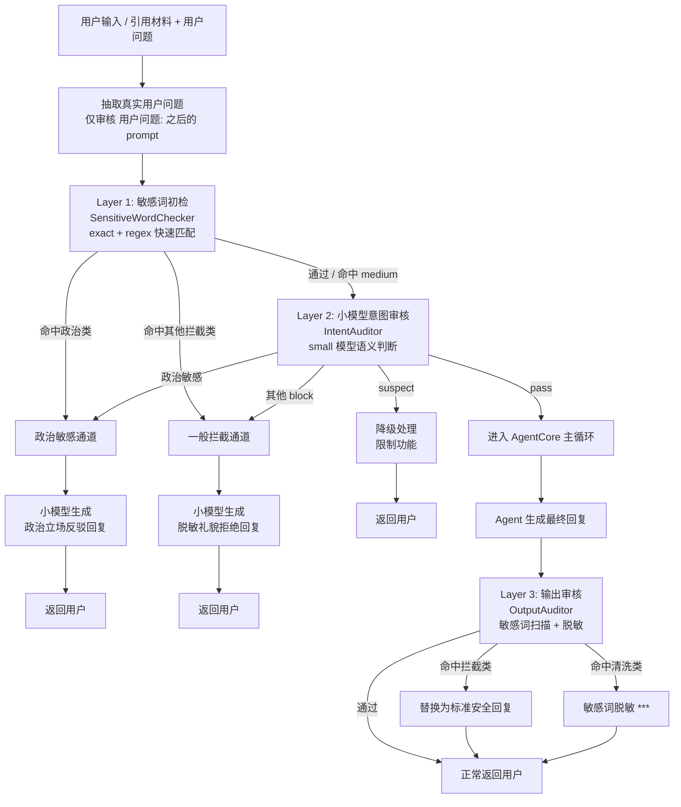
```mermaid
flowchart TD
    A[用户输入 / 引用材料 + 用户问题] --> A1[抽取真实用户问题<br/>仅审核 用户问题: 之后的 prompt]
    A1 --> B[Layer 1: 敏感词初检<br/>SensitiveWordChecker<br/>exact + regex 快速匹配]
    
    B -->|命中政治类| C1[政治敏感通道]
    B -->|命中其他拦截类| C2[一般拦截通道]
    B -->|通过 / 命中 medium| D[Layer 2: 小模型意图审核<br/>IntentAuditor<br/>small 模型语义判断]
    
    C1 --> G1[小模型生成<br/>政治立场反驳回复]
    C2 --> G2[小模型生成<br/>脱敏礼貌拒绝回复]
    
    G1 --> K1[返回用户]
    G2 --> K2[返回用户]
    
    D -->|政治敏感| C1
    D -->|其他 block| C2
    D -->|suspect| E[降级处理<br/>限制功能]
    D -->|pass| F[进入 AgentCore 主循环]
    
    E --> K3[返回用户]
    F --> G[Agent 生成最终回复]
    
    G --> H[Layer 3: 输出审核<br/>OutputAuditor<br/>敏感词扫描 + 脱敏]
    
    H -->|命中拦截类| I[替换为标准安全回复]
    H -->|命中清洗类| J[敏感词脱敏 ***]
    H -->|通过| K[正常返回用户]
    
    I --> K
    J --> K
```

`safety_input`的审核对象是用户真实请求,不是被用户引用或要求分析的文档正文。对于“用户问题引用了以下文档片段...用户问题: ...”这种由`ContextBuilder`包装后的输入,审核服务会先取最后的`用户问题:`段落再进入敏感词初检和小模型意图审核,避免知识库文件正文中的词触发入口误拦截。输出审核仍然作用于 Agent 最终回复,用于防止生成内容本身违规。

### 知识库业务设计

##### 多模态文件入库流程

系统扫描知识库中的多模态文件，先按原目录结构生成 `.mw/md/` Markdown 中间层，再将结构化 JSON 写入 `.mw/frontmatter/`，随后切片写入 ChromaDB 向量数据库供 Agent 使用。

###### 多模态扫描与格式解析

- `.md` / `.txt`：Markdown 按标题结构化，TXT 整体或按段落切分。
- `.json` / `.jsonl`：使用 `json.loads` 解析后格式化为可检索文本。
- `.csv` / `.tsv`：使用 Python `csv` 模块读取为表格行。
- `.html` / `.htm`：使用 `html.parser.HTMLParser` 提取正文，跳过 `script` 和 `style` 标签。
- `.xml`：使用 `xml.etree.ElementTree` 解析节点路径和值。
- `.docx`：将文件作为 ZIP 包读取，解析 `word/document.xml` 及图片关系引用。段落按标题样式或段落结构生成文本块；表格保留结构并生成检索摘要；图片优先使用替代文本，否则执行 OCR。提取出的图片保存到 `.mw/assets/`，并在 Markdown 中登记资源位置。
- `.pptx`：将文件作为 ZIP 包读取并解析 `ppt/slides/slide*.xml`。旧版 `.ppt` 不属于支持格式。
- `.xlsx`：将文件作为 ZIP 包读取，解析 `xl/sharedStrings.xml` 和 `xl/worksheets/sheet*.xml`。小表完整提取行列；大表提取结构、表头、样例、统计信息和工作表摘要；超大或不适合语义检索的表格只索引工作表名、列名、数据范围等元信息。
- 图片（`.jpg`、`.jpeg`、`.png`、`.webp`）：知识库入库使用 PP-StructureV3 识别版面、中英文文字、表格、公式和阅读顺序；OCR 默认关闭，在设置页开启后对后续灌库立即生效，无需重启，模型缓存位于 `runtime/models/paddleocr/`。直接上传到 Agent 会话的图片在统一解析器完成结构化 OCR 后，还会交给 CPU 本地 Qwen 补充对象、空间关系、图表趋势和其他视觉语义。
- `.pdf`：文档型 PDF 优先提取文本层、表格和图片；扫描型 PDF 按页渲染并执行 OCR；混合型 PDF 逐页判断是否存在文本层；表格无法稳定识别时至少输出文本块和页码范围。
- 文档内嵌图片：图片本体不作为独立语义文档写入向量库，结构化 JSON 记录图片引用、OCR 状态和识别结果。PDF 与 Office 文档提取的图片统一保存在 `.mw/assets/`，并结合相邻标题、段落、表格编号和图注形成检索上下文。
- 其他格式：系统先检查支持的后缀白名单；白名单外文件读取前 8192 字节，通过空字节、UTF-8/GBK 等编码解码结果和控制字符占比判断是文本还是二进制。可解码文本按普通文本处理；无法识别的二进制文件登记为资源占位并禁止入库。

#### 结构化 OCR 流水线

图片、扫描型 PDF 页面和 Office 内嵌图片共用 `ImageOcrService`，其底层是一个受管的 PP-StructureV3 高质量流水线。原生 DOCX/XLSX/PPTX 和带文本层 PDF 仍优先使用确定性格式解析器；只有需要理解像素内容的区域进入 OCR，避免重复识别已经存在的结构化正文。

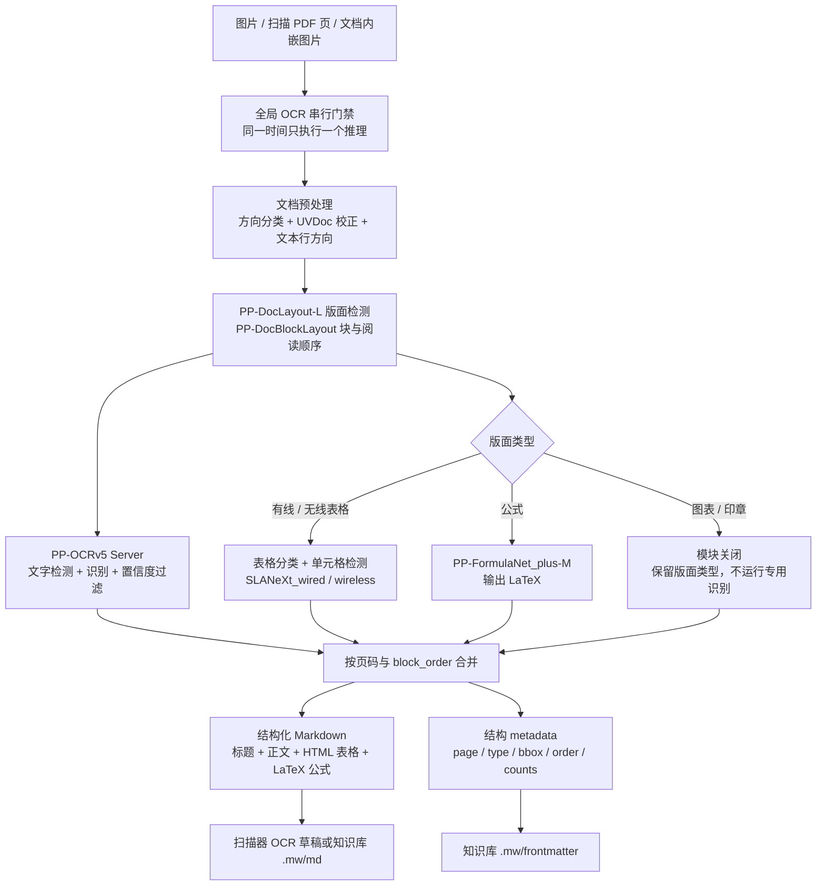
```mermaid
flowchart TD
    A["图片 / 扫描 PDF 页 / 文档内嵌图片"] --> B["全局 OCR 串行门禁<br/>同一时间只执行一个推理"]
    B --> C["文档预处理<br/>方向分类 + UVDoc 校正 + 文本行方向"]
    C --> D["PP-DocLayout-L 版面检测<br/>PP-DocBlockLayout 块与阅读顺序"]
    D --> E["PP-OCRv5 Server<br/>文字检测 + 识别 + 置信度过滤"]
    D --> F{"版面类型"}
    F -->|"有线 / 无线表格"| G["表格分类 + 单元格检测<br/>SLANeXt_wired / wireless"]
    F -->|"公式"| H["PP-FormulaNet_plus-M<br/>输出 LaTeX"]
    F -->|"图表 / 印章"| I["模块关闭<br/>保留版面类型，不运行专用识别"]
    E --> J["按页码与 block_order 合并"]
    G --> J
    H --> J
    I --> J
    J --> K["结构化 Markdown<br/>标题 + 正文 + HTML 表格 + LaTeX 公式"]
    J --> L["结构 metadata<br/>page / type / bbox / order / counts"]
    K --> M["扫描器 OCR 草稿或知识库 .mw/md"]
    L --> N["知识库 .mw/frontmatter"]
```

流水线模型由 `AgentConfig.ocr` 统一登记，下载器先让 PaddleX 获取全部启用组件，再逐个同步到 `runtime/models/paddleocr/<model_name>/`。只有 marker 版本、模型清单和所有 `inference.yml` 同时匹配时，存储管理才报告模型完整；旧版只有 Mobile det/rec 的 marker 会被判定为缺失。模型加载后由进程共享，删除模型时先等待当前推理结束、释放共享引用，再删除受管目录。

PP-StructureV3 的 Markdown 是 OCR 正文的正式来源，`parsing_res_list` 同时规整为稳定版面块。扫描器把 Markdown 持久化到 SQLite 草稿，OCR 版本删除图片节点但保留标题、表格 HTML 和公式 LaTeX；知识灌库则把版面块、页码、坐标、阅读顺序、表格数、公式数和实际标签写入 frontmatter。任何组件加载或推理失败都会返回明确的 `engine_unavailable`/失败状态，不会用空结构伪装成功。

OCR 进度由 PP-StructureV3 实际调用的八个顺序节点驱动：文档方向与展平、版面检测、区域检测、公式裁决、文字检测、文字行方向、文字识别、表格裁决与结构识别。节点返回后才增加已裁决数量；公式或表格没有命中区域时记为“裁决跳过”。文字检测返回后显示真实文字框数量，方向和识别阶段按模型实际返回的文字行持续推进。事件至少相差一个百分点才落库，不使用定时器模拟增长。

扫描器完成后将 OCR 块的页码、类型、内容、阅读顺序、页面尺寸和 bbox 持久化。图片与 PDF 的 Preview 在内容同一变换层中绘制 SVG 空间框；Markdown Preview 把相同 `page:block_id` 绑定到实际渲染节点。悬浮会同步高亮，点击会锁定并定位对应块。Edit/源码模式不渲染块，DOCX 的可重排左侧预览也不绘制空间框。

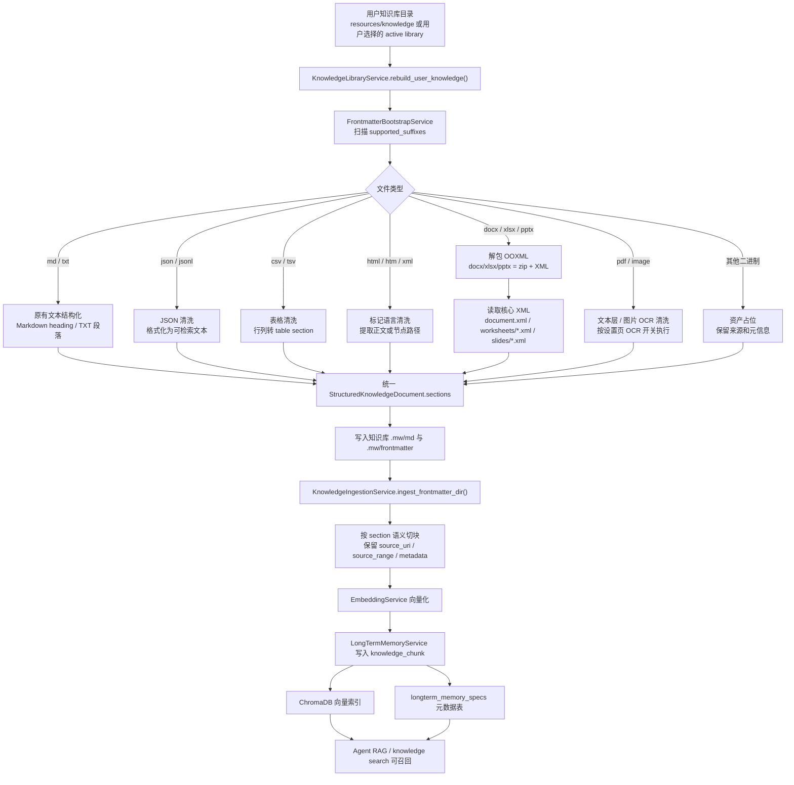
```mermaid
flowchart TD
    A["用户知识库目录<br/>resources/knowledge 或用户选择的 active library"] --> B["KnowledgeLibraryService.rebuild_user_knowledge()"]
    B --> C["FrontmatterBootstrapService<br/>扫描 supported_suffixes"]

    C --> D{"文件类型"}
    D -->|"md / txt"| E["原有文本结构化<br/>Markdown heading / TXT 段落"]
    D -->|"json / jsonl"| F["JSON 清洗<br/>格式化为可检索文本"]
    D -->|"csv / tsv"| G["表格清洗<br/>行列转 table section"]
    D -->|"html / htm / xml"| H["标记语言清洗<br/>提取正文或节点路径"]
    D -->|"docx / xlsx / pptx"| I0["解包 OOXML<br/>docx/xlsx/pptx = zip + XML"]
    I0 --> I["读取核心 XML<br/>document.xml / worksheets/*.xml / slides/*.xml"]
    D -->|"pdf / image"| J["文本层 / 图片 OCR 清洗<br/>按设置页 OCR 开关执行"]
    D -->|"其他二进制"| K["资产占位<br/>保留来源和元信息"]

    E --> L["统一 StructuredKnowledgeDocument.sections"]
    F --> L
    G --> L
    H --> L
    I --> L
    J --> L
    K --> L

    L --> M["写入知识库 .mw/md 与 .mw/frontmatter"]
    M --> N["KnowledgeIngestionService.ingest_frontmatter_dir()"]
    N --> O["按 section 语义切块<br/>保留 source_uri / source_range / metadata"]
    O --> P["EmbeddingService 向量化"]
    P --> Q["LongTermMemoryService 写入 knowledge_chunk"]
    Q --> R["ChromaDB 向量索引"]
    Q --> S["longterm_memory_specs 元数据表"]

    R --> T["Agent RAG / knowledge search 可召回"]
    S --> T
```

###### 语义切块与重叠切片

入库服务遍历每个文档的节（section），对正文按默认 512 字符窗口、128 字符重叠进行切片。窗口结束位置优先回退到距离游标至少 80 个字符或窗口大小三分之一处的段落分隔符，避免从段落中间截断；没有合适分隔符时才在字符边界切断。每个切片记录节内及原文中的起止偏移，用于定位原始内容。

切片在送入 Embedding 前会附加文档标题和章节标题路径，使同源内容在向量空间中保留文档上下文。包装后的文本以 `knowledge_chunk` 类型写入长期记忆元数据，并记录 `source_hash` 供增量入库判断使用。

##### 三路并行搜索

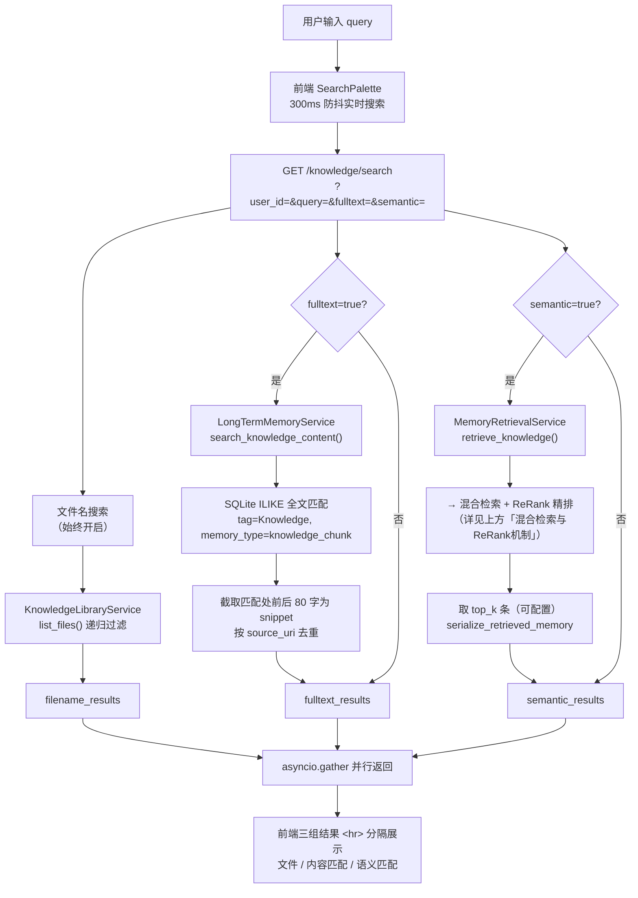
```mermaid
flowchart TD
    A["用户输入 query"] --> B["前端 SearchPalette<br/>300ms 防抖实时搜索"]

    B --> C["GET /knowledge/search<br/>?user_id=&query=&fulltext=&semantic="]

    C --> D["文件名搜索<br/>（始终开启）"]
    C --> E{"fulltext=true?"}
    C --> F{"semantic=true?"}

    D --> G["KnowledgeLibraryService<br/>list_files() 递归过滤"]
    G --> H["filename_results"]

    E -->|是| I["LongTermMemoryService<br/>search_knowledge_content()"]
    I --> J["SQLite ILIKE 全文匹配<br/>tag=Knowledge, memory_type=knowledge_chunk"]
    J --> K["截取匹配处前后 80 字为 snippet<br/>按 source_uri 去重"]
    K --> L["fulltext_results"]
    E -->|否| L

    F -->|是| M["MemoryRetrievalService<br/>retrieve_knowledge()"]
    M --> N["→ 混合检索 + ReRank 精排<br/>（详见上方「混合检索与ReRank机制」）"]
    N --> R["取 top_k 条（可配置）<br/>serialize_retrieved_memory"]
    R --> S["semantic_results"]
    F -->|否| S

    H --> T["asyncio.gather 并行返回"]
    L --> T
    S --> T

    T --> U["前端三组结果 &lt;hr&gt; 分隔展示<br/>文件 / 内容匹配 / 语义匹配"]
```

##### 文件上传

```mermaid
flowchart TD
    A["用户拖拽文件到 Agent 页面"] --> B["前端 FormData<br/>POST /agent/attachments/upload"]
    B --> C["SessionAttachmentService<br/>校验 user_id/session_id/active library"]
    C --> D["保存原文件<br/>runtime/uploads/{user_id}/{library}/{session_id}/"]
    D --> E["统一解析器<br/>FrontmatterBootstrapService + MultimodalDocumentCleaner"]
    E --> E1{"是否为直接上传图片?"}
    E1 -->|"否"| F["抽取结构化章节/正文<br/>写入 .attachments/{attachment_id}.txt"]
    E1 -->|"是"| V1["PP-StructureV3 结构化 OCR<br/>版面、文字、表格、公式与阅读顺序"]
    V1 --> V2["CPU 本地 Qwen 读取原图 + OCR<br/>补充对象、空间关系和图表语义"]
    V2 --> F
    F --> G["SQLite: session_attachments<br/>保存 uri、路径、摘要、metadata"]
    G --> H["ContextBuilder.build_messages()"]
    H --> I{"当前问题是否指向上传附件?"}
    I -->|"文件名/最近上传/这个文件"| J["注入相关附件正文片段"]
    I -->|"无明确指向"| K["仅注入会话附件目录摘要"]
    J --> L["Agent LLM 上下文"]
    K --> L
    D -. "不执行" .-> M["KnowledgeIngestionService / ChromaDB"]
```

- 上传附件是 session-scoped context asset, 不是知识库资产; 它不写入知识库目录, 不生成可灌库 frontmatter, 不进入 Embedding/ChromaDB。
- 解析链路复用文件树/知识库的同一套结构化解析器。差别只在消费端: 知识库文件解析后进入灌库, 上传附件解析后只登记到会话附件表并供 ContextBuilder 注入。
- 图片附件的 OCR 文本和本地 Qwen 视觉描述写入同一份附件正文；OCR 负责精确文字，本地模型补充非文字视觉信息。视觉模型异常时保留已完成的 OCR 结果，不让附件上传整体失败。
- 同一个 session 的后续提问会保留附件目录; 当用户说“这个文件”“刚才上传的文件”或直接提到文件名时, ContextBuilder 会把相关附件正文片段放进本轮 system context。
- `understand_image`（界面显示为“识图”）允许 Agent 按 attachment_id、文件名或关键词重新读取当前会话图片，并向同一 CPU 本地 Qwen 提出新的视觉问题。

##### 知识图谱实体提取

```mermaid
flowchart TB
    accTitle: 本地优先的增量图谱抽取
    accDescr: 文档先按文档和章节哈希复用已有结果，变化章节由本地模型抽取，仅将无法确定的最小证据片段交给联网模型裁决，最后本地去重并原子写入数据库。

    start(["多模态文档已结构化"]) --> document_cache{"文档指纹未变化?"}
    document_cache -->|"是"| reuse_document["复用整篇图谱"]
    document_cache -->|"否"| section_cache{"章节缓存仍有效?"}

    subgraph local_extract ["本地抽取与校验"]
        section_cache -->|"是"| reuse_section["复用章节候选"]
        section_cache -->|"否"| local_scan["本地模型扫描正文"]
        local_scan --> local_rules["规则过滤与证据校验"]
        local_rules --> confidence_route{"候选是否明确?"}
        confidence_route -->|"高置信"| accepted_local["接受本地结果"]
        confidence_route -->|"低置信"| discard_candidate["丢弃无证据候选"]
    end

    subgraph remote_judge ["联网灰区裁决"]
        confidence_route -->|"灰区"| minimal_context["组装最短证据片段"]
        minimal_context --> remote_model["联网小模型裁决"]
        remote_model --> accepted_remote["返回确定候选"]
        remote_model -.->|"超时或熔断"| pending_retry["保留本地结果并待重试"]
    end

    subgraph local_dedup ["本地分层去重"]
        reuse_section --> normalize_entities["规范名称与明确别名"]
        accepted_local --> normalize_entities
        accepted_remote --> normalize_entities
        pending_retry --> normalize_entities
        normalize_entities --> embedding_match["Embedding 相似候选检索"]
        embedding_match --> dedup_route{"相似度是否明确?"}
        dedup_route -->|"高或低"| remap_edges["本地合并或保持独立"]
        dedup_route -->|"灰区"| dedup_remote["最小候选集联网裁决"]
        dedup_remote --> remap_edges
        remap_edges --> clean_edges["重映射并清理重复边"]
    end

    subgraph persistence ["原子持久化"]
        clean_edges --> commit_graph["校验通过后原子替换"]
        commit_graph --> graph_tables["节点、关系、章节缓存<br/>去重判定与状态"]
    end

    reuse_document --> done(["图谱可查询"])
    discard_candidate --> normalize_entities
    graph_tables --> done

    classDef cache fill:#e8eefc,stroke:#476bf7,stroke-width:2px,color:#172554
    classDef local fill:#ecfdf3,stroke:#16845b,stroke-width:2px,color:#12372a
    classDef remote fill:#fff7db,stroke:#b7791f,stroke-width:2px,color:#4a2d08
    classDef result fill:#f4f4f5,stroke:#52525b,stroke-width:2px,color:#18181b

    class document_cache,section_cache,reuse_document,reuse_section cache
    class local_scan,local_rules,accepted_local,discard_candidate,normalize_entities,embedding_match,dedup_route,remap_edges,clean_edges local
    class confidence_route,minimal_context,remote_model,accepted_remote,pending_retry,dedup_remote remote
    class start,commit_graph,graph_tables,done result

```

流程中的联网模型不承担全文扫描。实体关系抽取和去重都先在本地完成确定性部分,联网请求只包含灰区候选及其最短证据。文档和章节缓存共同保证重复执行不产生费用,单段修改也不会触发整篇重算;联网服务不可用时,系统继续保存本地高置信结果并仅记录待重试候选。

### Agent 内置业务工具

内置工具按职责拆分，避免单个 `builtin.py` 持续膨胀：知识灌库与图谱位于 `builtin_knowledge_ops.py`，Skill、反馈、图书馆、组件和收藏位于 `builtin_business_ops.py`，智能表格位于 `builtin_smart_forms.py`，后台任务状态位于 `builtin_jobs.py`，注册元数据集中在 `extended_definitions.py`。

当前扩展工具覆盖以下完整链路：

- 知识库：编辑器多选文件读取、选定文件灌库、全量灌库、文件管线状态、任务查询/取消/失败重试、最近删除查询/恢复/永久删除。
- 语义图谱：选定文件抽取、全量抽取、节点及邻接关系搜索、最短关系路径、单文件图谱删除、失败重试。
- 业务资源：用户 Skill 定制/修改/删除/启停/校验/试用，用户反馈增删改查，图书馆查询筛选与单项读取，组件增删改查/按类型筛选/校验，收藏增查删。
- 智能表格：创建智能文献表或普通表、列表/结构/完整内容读取、整表与行级编辑、表项文献读取、CSV/Markdown/JSON 导出、CSV/JSON 导入、智能填充预览与持久化填充。

`rebuild_knowledge_base` 已由语义明确的 `ingest_all_knowledge_files` 替代；文件正文统一通过 `read_knowledge_file` 读取 Markdown 中间层，缺失或过期时自动触发单文件灌库。

### 其他设计
##### 引用溯源

```mermaid
flowchart TD
    A["用户提问"] --> B["自动RAG召回"]
    B --> C["系统上下文注入<br/>[1]/[2] 来源 + 片段"]
    B --> D["初始 citation_map<br/>数字编号 1/2/3..."]

    A --> E["Agent 主动调用工具"]
    E --> F["知识库工具<br/>get/read/search"]
    F --> G["register_tool_citation()<br/>工具编号 K1/K2..."]
    G --> H["工具返回文本携带<br/>Citation ID / [Kx]"]
    G --> I["工具 trace.citation_map"]
    F --> Q{"来源类型"}
    Q -->|"get_knowledge_context<br/>read_knowledge_file"| R["adopted_by_default=true<br/>明确读入正文"]
    Q -->|"search_knowledge"| S["仅搜索候选<br/>不默认采纳"]

    E --> X["联网搜索工具<br/>web_search"]
    X --> Y["register_network_citation()<br/>网络编号 N1/N2..."]
    Y --> Z["搜索结果携带<br/>Citation ID: [N#]<br/>source_uri = URL"]

    D --> J["AgentCore 合并本轮 citation_map"]
    I --> J
    R --> J
    S --> J
    Y --> J
    C --> K["LLM 最终回答"]
    H --> K
    Z --> K

    K --> L["清理无映射伪引用<br/>删除不存在的 [x]"]
    J --> L
    L --> M{"正文是否已有<br/>有效 [1]/[K1]/[N1]"}
    M -->|"有"| N["按正文锚点过滤来源"]
    M -->|"部分/全部漏写工具锚点"| O["保守行级补锚点<br/>匹配文件名/标题才补 [Kx]"]
    O --> P["不做末尾 citation-only 堆叠"]
    N --> T["保存 assistant metadata<br/>used_citations + citation_map"]
    P --> T
    T --> U["前端 Markdown 渲染<br/>[1]/[K1]/[N1] 可点击"]
    U --> U1["本地来源: 跳转文件树"]
    U --> U2["网络来源: 默认浏览器打开 URL"]
    T --> V["气泡下方来源列表<br/>只显示实际引用文档/网页"]
    T --> W["历史消息使用自身 metadata<br/>不复用当前轮全局来源"]
```

##### 联网搜索工具

Agent 通过 `web_search` 和 `web_image_search` 两个内置工具访问 DuckDuckGo 搜索引擎，需要代理地址才能正常使用。

**工具一览：**

| 工具名 | 用途 | 底层接口 | 返回内容 |
|---|---|---|---|
| `web_search` | 搜索文字信息 | `ddgs.text()` | 标题 + URL + 页面摘要 |
| `web_image_search` | 搜索图片 | `ddgs.images()` | 标题 + 图片 URL + 缩略图 URL + 来源页面 |

**搜索流程：**

```mermaid
flowchart TD
    A["用户提问"] --> B{"是否需要联网搜索?"}
    B -->|"文字信息"| C["web_search<br/>ddgs.text(query)"]
    B -->|"图片展示"| D["web_image_search<br/>ddgs.images(query)"]

    C --> E["DuckDuckGo 返回<br/>搜索结果列表"]
    E --> F["register_network_citation()<br/>生成 [N1][N2] 编号"]
    F --> G["Agent 收到结果<br/>阅读摘要决定是否再搜"]

    D --> H["DuckDuckGo 返回<br/>图片 URL 列表"]
    H --> I["register_network_citation()<br/>生成 [N1][N2] 编号"]
    I --> J["Agent 用热链接展示<br/>![描述](图片URL)"]

    G --> K{"信息足够?"}
    J --> K
    K -->|"不足"| B
    K -->|"足够"| L["组织最终回复"]
    L --> M["任务终止"]
```

**行为规则：**

- 搜索图片必须使用 `web_image_search`，不能用 `web_search` 反复搜文字
- `web_search` 返回的摘要是搜索引擎截断片段，完整内容需访问链接
- 图片直接用 Markdown 热链接展示，不调 `download_file` 下载
- 每次搜索用 `max_results` 参数一次性获取足够多结果，减少搜索轮次
- 信息足够后立即停止搜索，直接生成回复
