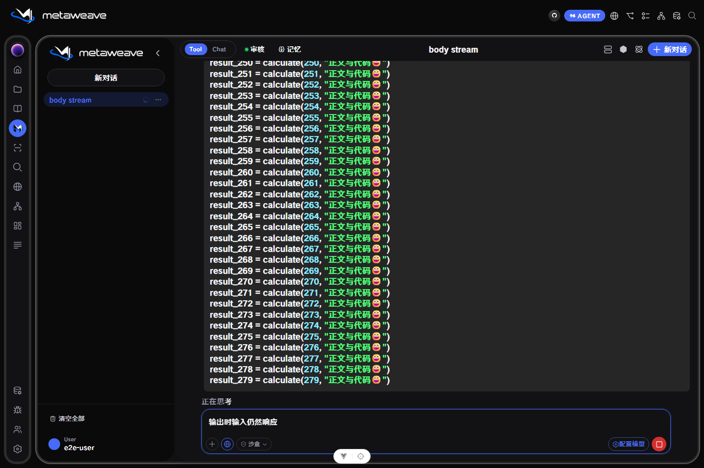

# Agent 长文、代码流式输出卡顿修复验收

用户 TODO：彻底修理 agent 输出流卡顿的问题；思考条正常，流式文字和“正在思考”扫描式发光卡顿。

## TODO—实现—实际验收

| TODO 语句 | 实现对应 | 验收 |
| --- | --- | --- |
| 彻底修理 agent 输出流卡顿 | chat.ts 固定首字延迟 metadata；窗口同步改浅监听；不可变模型请求数组跳过 DevTools 深遍历；MessageList 复用历史 props、每帧合并滚动 | 三个状态/监听回归及两个历史气泡/滚动回归，修改前均失败，修改后通过；跨窗口 seq、终态、销毁兼容 |
| 思考条输出正常 | 保留 Thinking 的原有增量摘要和 transform 扫光，SSE 协议不变 | 真实 Agent 界面正文输出期间，思考条 transform 持续变化 12–17 个不同采样值 |
| 流式文字卡顿，尤其主 Agent 长文和代码 | 净化后的活跃 Markdown DOM 增量修补；原生 Text 小后缀追加，避免重排超长前缀；保留代码高亮、列表、表格、链接、公式及最终完整解析 | 56,000 字单段、280 行 Python、330 项列表、330 行表格；已显示前缀 DOM 替换 0 次，全部最终文字一致；中断保留全部已接收文字，且无取消产生的未处理错误 |
| “正在思考”扫描式发光也卡 | 消除正文引起的主线程冗余工作，保留原来的字形裁剪扫光样式 | 实际底部标签 backgroundPosition 连续变化 12–17 个不同采样值；输出时输入与会话侧栏保持响应 |

## 实际界面性能

Chromium，1440×960，真实 Vite 开发页面；受控 SSE 回放走生产 fetch 解码、chat store 与 Markdown 组件，包含 6 份大模型请求快照和首字延迟 metadata。数据仅在测试夹具中，生产接口及模型输出不变。测量稳定增量阶段，初次大块装载与终态完整解析不计入帧统计。

| 输出 | P95 帧间隔 | 最大帧间隔 | 最长 Long Task | 侧栏响应 |
| --- | ---: | ---: | ---: | ---: |
| 56,000 字单段正文 | 33.4ms | 66.7ms | 53ms | 21.1ms |
| 280 行 Python 代码 | 16.8ms | 33.4ms | 无 | 11.3ms |
| 330 项列表 | 16.7ms | 16.8ms | 无 | 14.3ms |
| 330 行表格 | 16.8ms | 16.8ms | 无 | 15.5ms |

所有案例均满足 P95 <40ms、最长帧 <80ms、最长任务 <80ms、交互 <200ms；无 pageerror。极长单段仍有浏览器排版成本，不宣称所有硬件下恒定 60fps。原始摘要：[agent_text_stream_metrics.json](agent_text_stream_metrics.json)。

## 验证与限制

- 定向单 worker 串行回归：chat 31、Markdown 25、MessageList 5、Agent 请求 4、SSE 解码/取消 5；共 70 项通过；新增的图标加载成功/失败、长文本前缀和行内格式净化回归均通过。
- 实际界面冒烟：长正文、长代码、列表、表格、中断共 5 项通过。
- 生产 Vite 构建通过，5,222 modules。
- vue-tsc 全仓检查仍有 ImagePreviewer、OcrBlockOverlay、SmartForms、CarouselBlock、MarkdownPreview 等既有/其他任务范围错误；本次修改的 store、MessageList、MarkdownContent 与 DOM helper 未报错。
- 本次未连接外部模型提供商，不用于证明用户设备、提供商网络或所有输出长度的帧率。
- 工作期间出现其他任务的后端/API/输入框修改，全部保留；本任务不改后端业务和代理配置。

- 收尾资源验证发现取消 reader 的 Promise 拒绝及终态残留 abort listener；先通过 client.spec 复现 1 失败及 1 unhandled rejection，再修复共享 streamLines 取消回调和 finally 监听释放；5 项 decoder/取消回归通过。加强后的界面中断测试也断言无 pageerror，最终 5 项冒烟全部通过。

- 已关闭本任务自启及 Playwright 托管的 5173 服务，确认无 LISTEN；自建临时脚本和测试输出目录已清理。
